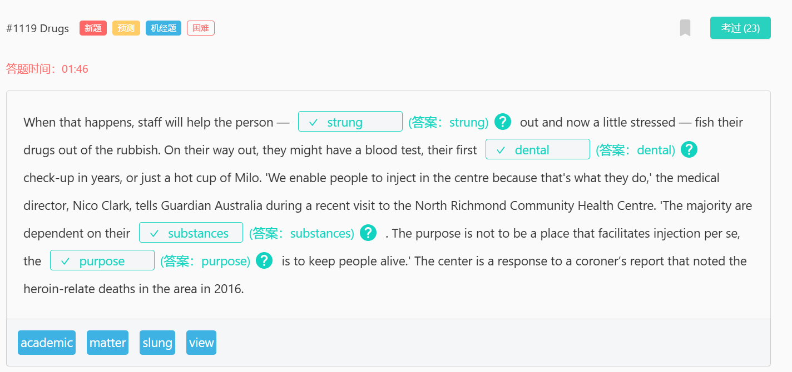
strung out
吸毒成瘾：长期吸毒导致身体虚弱的状态。
strung string 的过去式
slung sling 的过去式
sling
10077
英
/ slɪŋ /
抛掷、吊起

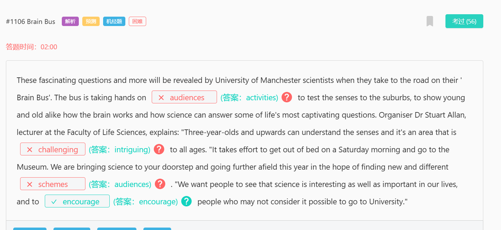
captivating
adj.
迷人的；有魅力的
v.
使……着迷（captivate 的 ing 形式）

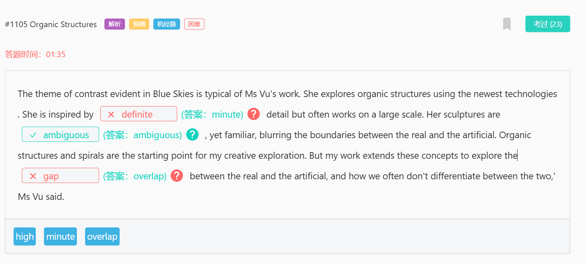
minute
[adj] 细小的；琐碎的；极少的；精密的
definite
[adj] 肯定；肯定的；确定的；不会改变的

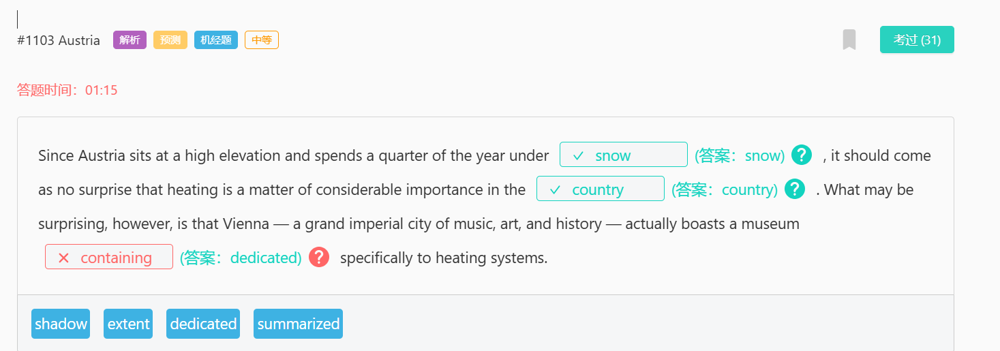
dedicated to
致力于：

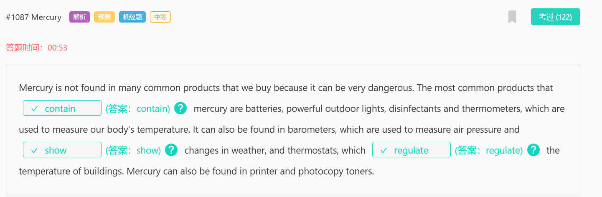
regulate
[v] 调节；控制
[网络] 管理；调整；管制
mercury
[n] 汞；水银

an extended period of time
长时间：指一段较长的时间段，通常超过正常或预期的时间。
definite 确定的，无疑的
timely 及时的

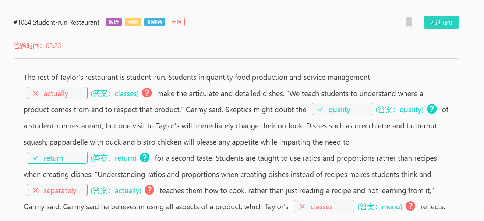

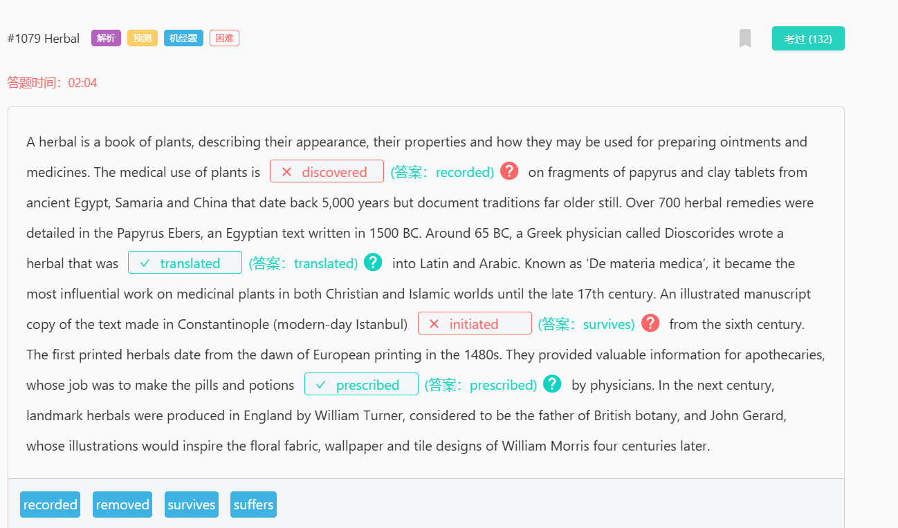

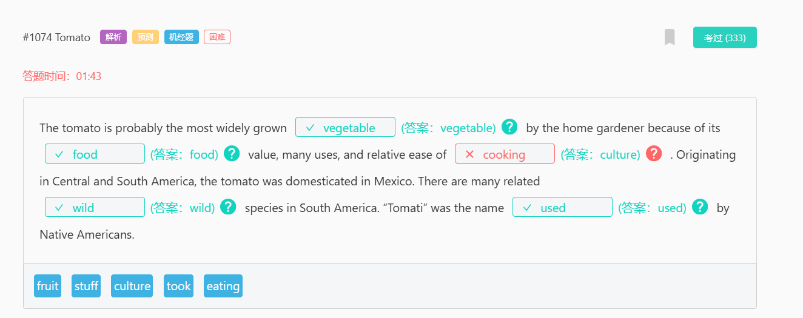
culture
[n] 文化；栽培；养殖；培育
[v] 培养（细胞或细菌）
food value
食物营养价值

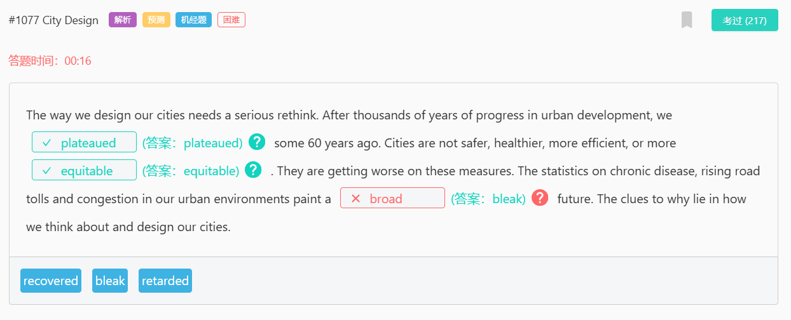
#1077 City Design
plateau 8498/ ˈplætəʊ / (英), / plæˈtoʊ / (美) n. 高原；（发展、增长后的）稳定期，停滞期；高原印第安人；托盘；v. （在一段时间的发展之后）趋于平稳，进入停滞期
equitable 10149/ ˈekwɪtəb(ə)l / adj. 公平合理的，公正的；衡平法上有效的
bleak 7427/ bliːk / adj. 不乐观的，无望的；无遮掩的，荒凉的；阴冷的，寒冷的
retard 17829/ rɪˈtɑːd / (英), / rɪˈtɑːrd / (美) v. <正式>阻碍，减缓；减慢，受到阻滞；n. <非正式>弱智，笨蛋；延迟，阻止
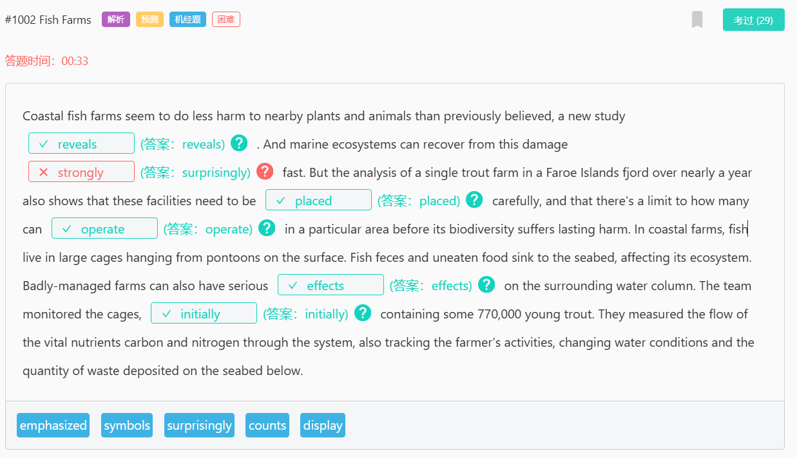
#1002 Fish Farms
surprisingly 3398/ səˈpraɪzɪŋli / (英), / sərˈpraɪzɪŋli / (美) adv. 惊人地，出人意料地

#867 David Lynch
campus 校区

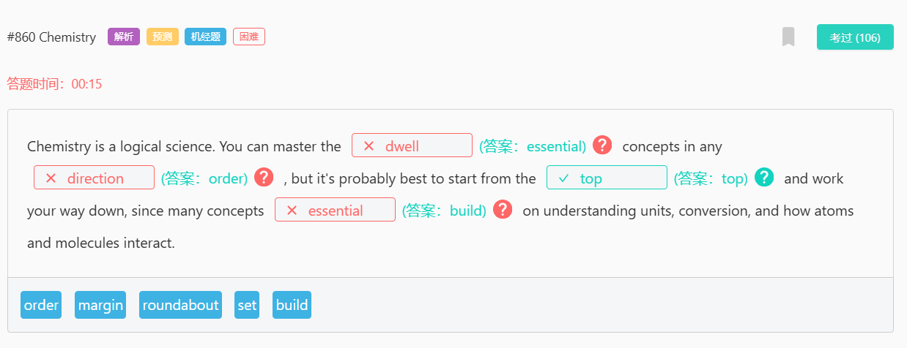
#860 Chemistry
dwell 7296/ dwel / v. 居住，栖身

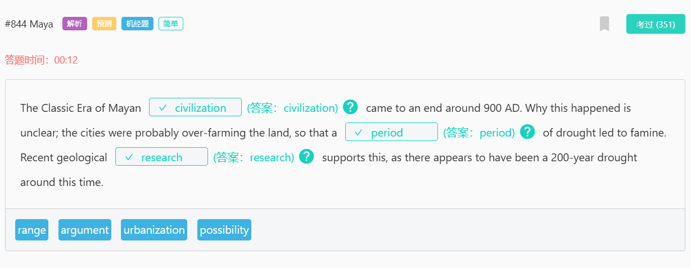
#844 Maya
argument 1189/ ˈɑːɡjumənt / (英), / ˈɑːrɡjumənt / (美) n. 争论，争吵；论据，理由；辩论，讨论

#618 Accounting and Finance
editorial 5068/ ˌedɪˈtɔːriəl / adj. 编辑的，主编的；社论的；n. 社论，社评
project
/ ˈprɒdʒekt / (英, 名词), / ˈprɑːdʒekt / (美, 名词)
/ prəˈdʒekt / (英, 动词), / prəˈdʒekt / (美, 动词)
n. 项目，计划；（学校的）课题，研究项目；<美>廉租房区，公共房屋区
v. 预计，推算；计划，规划；伸出，突出；投掷，喷射；投射，投影

#615 Bioenergy
forsake 15036/ fəˈseɪk / (英), / fərˈseɪk / (美) v. 抛弃，离开（尤指不履行责任）；摒弃，离开
forsook / fəˈsʊk / (英), / fərˈsʊk / (美) v. 抛弃；放弃，戒掉（喜爱的食物）（forsake 的过去式）
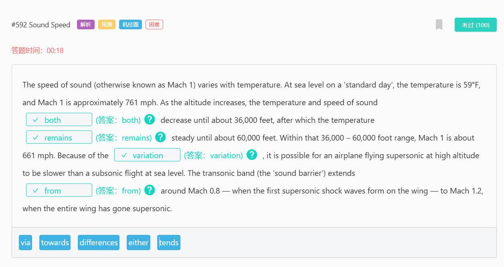
#592 Sound Speed
supersonic 18185/ ˌsuːpəˈsɒnɪk / (英), / ˌsuːpərˈsɑːnɪk / (美) adj. 超音速的；n. 超音速，超声波；超音速飞机
subsonic / ˌsʌbˈsɒnɪk / (英), / ˌsʌbˈsɑːnɪk / (美) adj. 次音速的；比音速稍慢的；n. 亚音速飞机
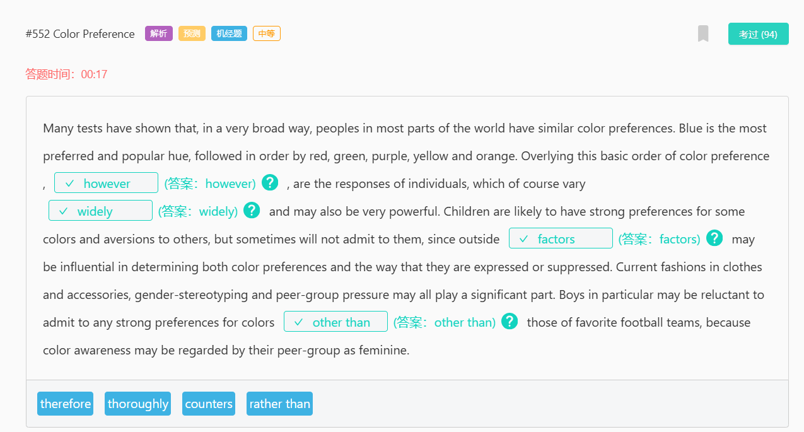
#552 Color Preference

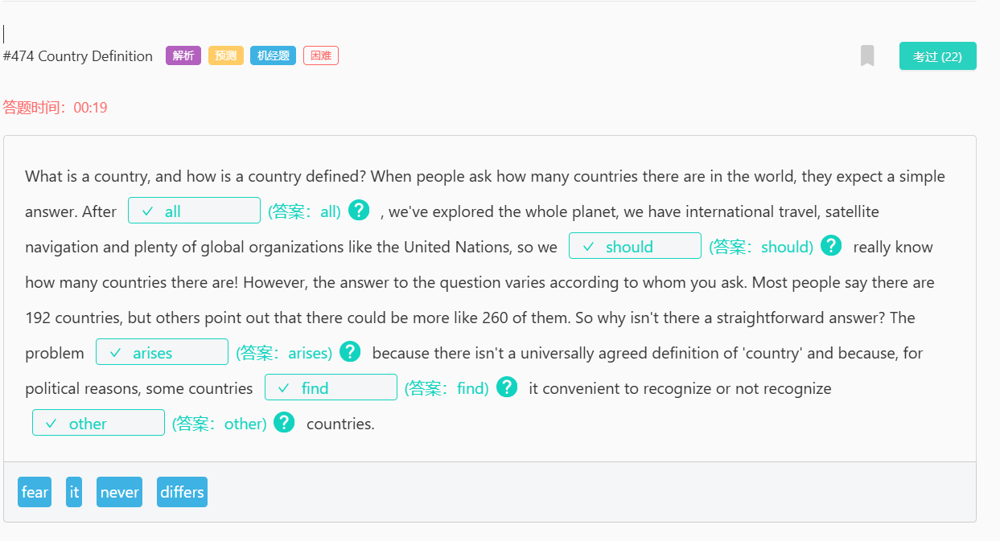
#474 Country Definition

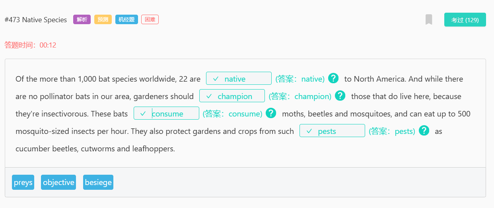
#473 Native Species
besiege 15405/ bɪˈsiːdʒ / v. 包围，围困；打扰，纠缠
prey 5574/ preɪ / n. 猎物，捕获物；受害者，受骗者；<古>掠夺品；v. 捕食；欺凌，坑害（尤指弱者）；不断困扰，折磨

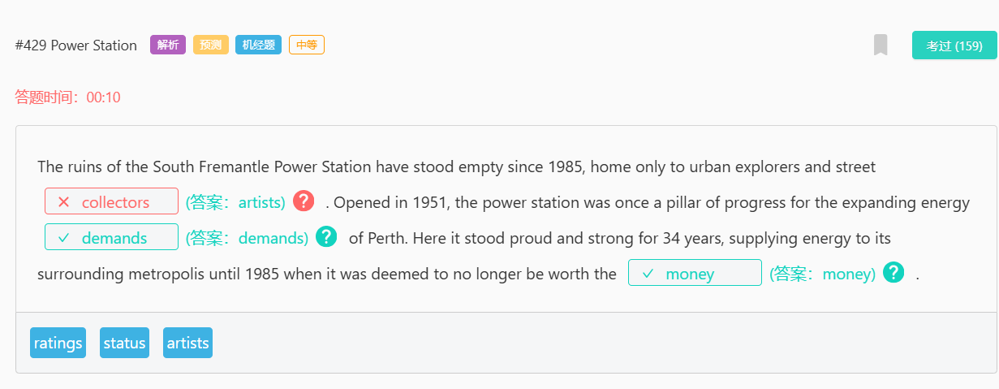
#429 Power Station
street artist n. 街头艺术家
pillar 6619/ ˈpɪlə(r) / (英), / ˈpɪlər / (美) n. 柱子，支柱；主心骨，栋梁
deem to 认为
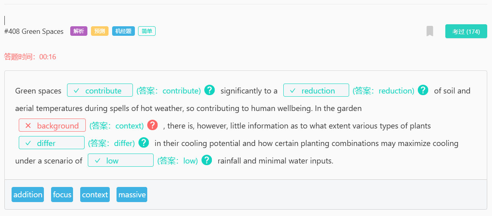
#408 Green Spaces
aerial 7468/ ˈeəriəl / (英), / ˈeriəl / (美)
n. 天线；（滑雪等运动的）空中腾越
adj. 航空的，从飞机上的；空中的

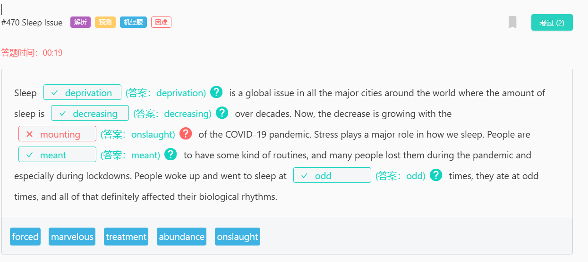
#470 Sleep Issue
onslaught 11406/ ˈɒnslɔːt / (英), / ˈɑːnslɔːt / (美) n. 攻击，猛攻；（常指难以应付的）大批，大量；猛烈抨击
odd 2762/ ɒd / (英), / ɑːd / (美) adj. 奇怪的，反常的；偶然出现的

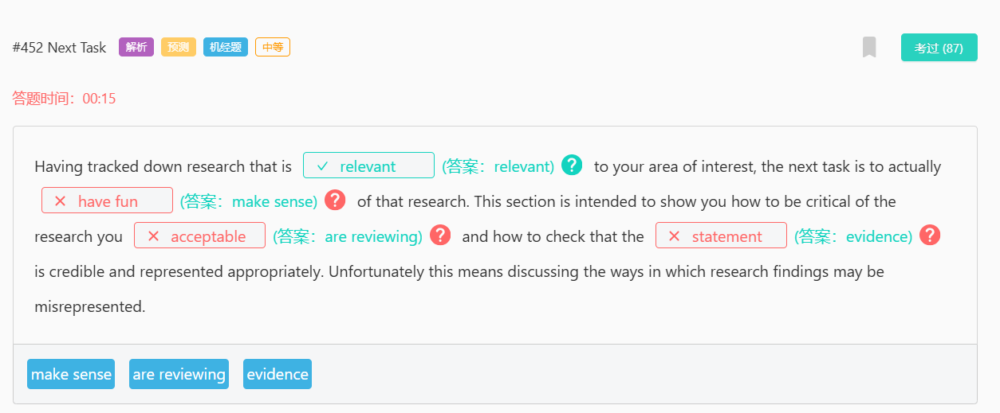
#452 Next Task
statement 924/ ˈsteɪtmənt / n. 声明，报告；说明，说法
credible 6077/ ˈkredəb(ə)l / adj. 可信的，可靠的
incredible 3054/ ɪnˈkredəb(ə)l / adj. 不可思议的，难以置信的
misrepresent 16897/ ˌmɪsˌreprɪˈzent / vt. 歪曲，误传；不合适地代表；vi. 虚伪陈述；歪曲报道

marking

#451 William Shakespeare
ubiquitous / juːˈbɪkwɪtəs / adj. 普遍存在的，无所不在的
entitlement / ɪnˈtaɪtlmənt / n. 有权得到的东西，应得的数额；权利，资格

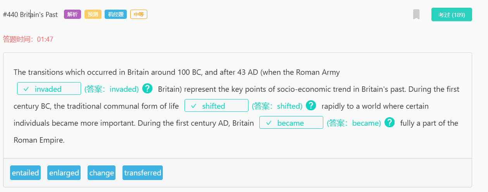
#440 Britain's Past
entail / ɪnˈteɪl /
v. 使必要，需要；限定继承；使人承担
n. 限定继承，限嗣继承的财产

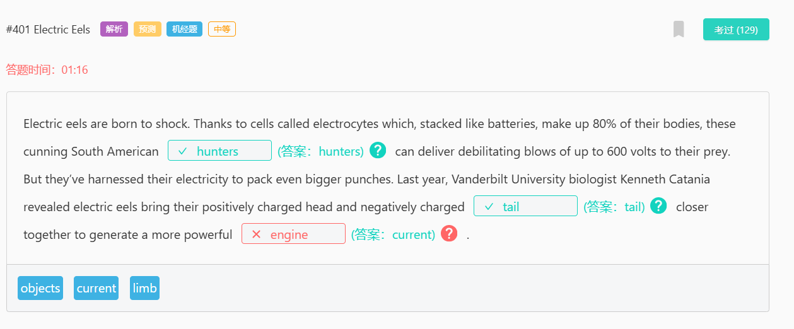
#401 Electric Eels
current / ˈkʌrənt / (英), / ˈkɜːrənt / (美)
adj. 现行的，当前的；通用的，流行的；最近的
n. 水流，气流；电流；思潮，趋势

#385 Sandra Lousada
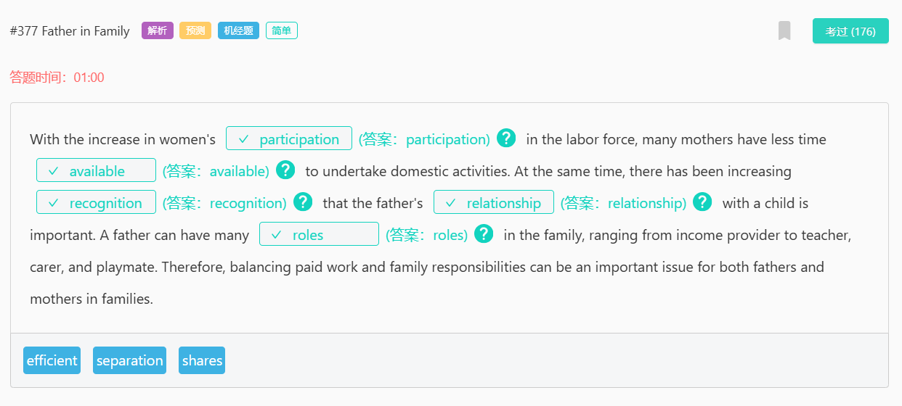
#377 Father in Family
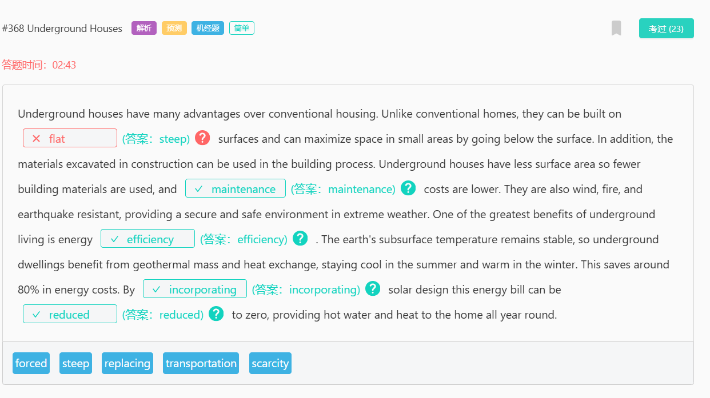
#368 Underground Houses
incorporate / ɪnˈkɔːpəreɪt / (英), / ɪnˈkɔːrpəreɪt / (美)
v. 包含，合并；组成公司；掺和，混合（成分）；使具体化，体现
adj. 合成一体的，合并的；具体化的；组成公司（或社团）的
steep / stiːp /
adj. （路、山等）陡峭的；（价格，需求）难以接受的，过高的；（增加或减少）急剧的，大幅度的
v. 浸泡（食物）；使沉浸，使沉湎
scarcity / ˈskeəsəti / (英), / ˈskersəti / (美) n. 不足，缺乏
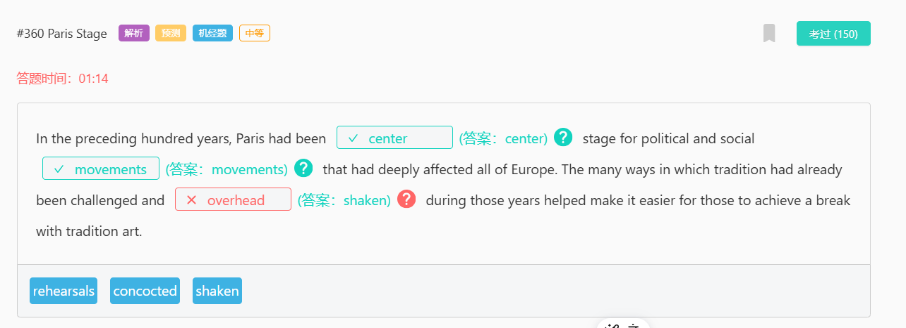
#360 Paris Stage
shake / ʃeɪk /
v. 摇动，抖动；削弱，动摇；发抖，哆嗦；握手；使震惊，使烦乱；使改变（态度、信念）；摆脱，克服；舞动（拳头、棍子等）；抖掉，抖出；使劲甩动，急剧晃动；摇头（以示否定）；（声音）颤抖
n. 摇动，摇晃；奶昔；（摇动容器后的）撒出物；<非正式>哆嗦，颤抖（the shakes）；<美>木制墙面板；<非正式>地震；（乐）颤音
rehearsal / rɪˈhɜːs(ə)l / (英), / rɪˈhɜːrs(ə)l / (美) n. 排练，排演；预演，演习；复述，重复
concoct / kənˈkɒkt / (英), / kənˈkɑːkt / (美) vt. 编造；调制（食物或饮品）
overhead / ˌəʊvəˈhed / (英), / ˌoʊvərˈhed / (美)
adv. 在头顶上方，在空中
adj. 头顶上的，在空中的，高架的

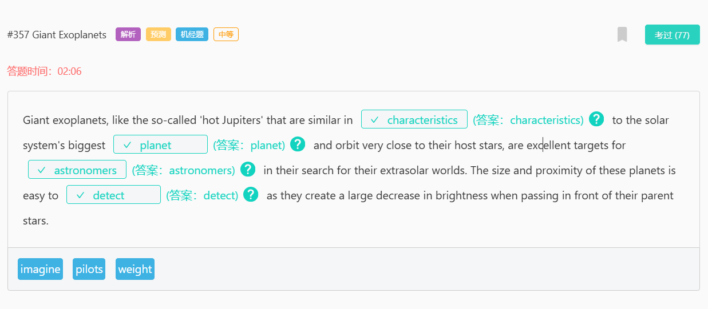
#357 Giant Exoplanets

#344 DNA
predicts sb = sb predicts
says sb = sb says
says who = who says

#342 E-Learning
proportionately / prəˈpɔːʃənətli / (英), / prəˈpɔːrʃənətli / (美) adv. 相称地，成比例地
passion / ˈpæʃ(ə)n /
n. 爱恋，情欲；激情，热情；酷爱，热衷的爱好

#332 Eutrophication
deplete / dɪˈpliːt / v. 大量减少，耗尽
fatigue / fəˈtiːɡ /
n. 疲乏，厌倦；（金属部件的）疲劳；（士兵穿的）工作服；士兵杂役（尤指作为惩罚，如做打扫、帮厨）
v. 使疲劳，使劳累
oust / aʊst / vt. 罢免，撤职；淘汰；驱逐；取代；撤销
algae / ˈældʒiː / n. 水藻，海藻

#327 Clear Plan
build in 包含、构建
valuation / ˌvæljuˈeɪʃn /
n. 评价，估价；计算
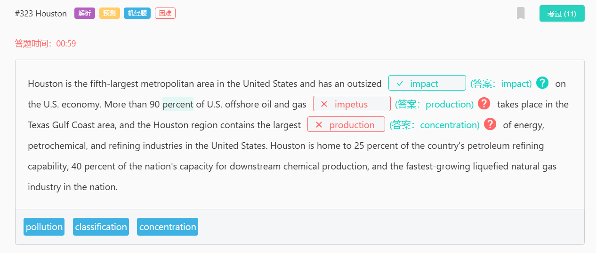
#323 Houston
impetus / ˈɪmpɪtəs /
n. 动力，促进；动量，冲力
concentration / ˌkɒns(ə)nˈtreɪʃ(ə)n / (英), / ˌkɑːns(ə)nˈtreɪʃ(ə)n / (美)
n. 专心，专注；关注，重视；集中，聚集；含量，浓度

#319 Food Prices
deterioration / dɪˌtɪəriəˈreɪʃ(ə)n / (英), / dɪˌtɪriəˈreɪʃn / (美)
n. 恶化
fluctuate / ˈflʌktʃueɪt /
v. 波动，起伏不定
dip / dɪp /
v. 浸，蘸；下降，下沉；伸进，伸入

#317 Following Tips

#316 Research
equivocal / ɪˈkwɪvək(ə)l /
adj. 模棱两可的；可疑的
discipline / ˈdɪsəplɪn /
n. 纪律，风纪；惩罚，处分；训导，管教；训练，锻炼；自制力，自律能力；（尤指大学的）科目，学科
discretion / dɪˈskreʃn / (英), / dɪˈskreʃ(ə)n / (美)
n. 自行决定权，判断力；谨慎，慎重
insight / ˈɪnsaɪt /
n. 洞悉，了解；洞察力

#309 Dance
plot / plɒt / (英), / plɑːt / (美)
n. 阴谋，密谋；情节；（专用的）小块地；（表现两个变量关系的）图表；<美>图表，地图；<美>底层平面图
punctuate / ˈpʌŋktʃueɪt /
vt. 不时打断；强调；加标点于
vi. 加标点
itinerary / aɪˈtɪnərəri / (英), / aɪˈtɪnəreri / (美)
n. 行程，旅行路线；游记，旅行日记
adj. 旅程的

#303 Talking
vocal cords 声带
practitioner / prækˈtɪʃənə(r) / (英), / prækˈtɪʃənər / (美)
n. （医学界或法律界的）从业人员，执业者；<正式>从事者，实践者
tract / trækt /
n. （尤指宣扬宗教、伦理或政治的）短文，传单，小册子；大片土地，地带；（身体的）道，束；<文>大量，许多；咏唱

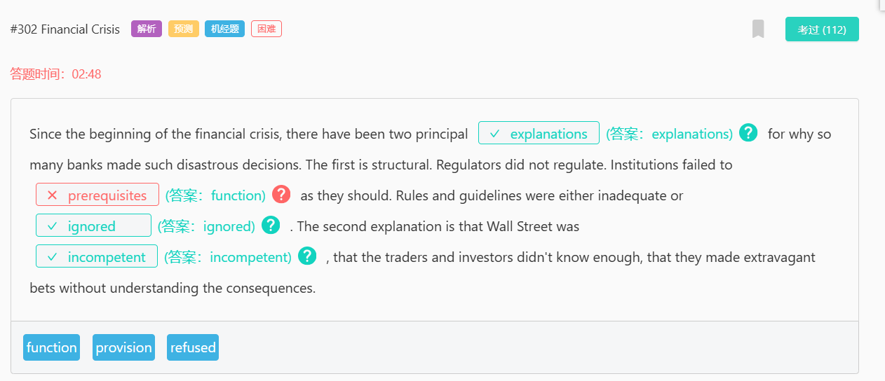
#302 Financial Crisis
function 运行/起作用
prerequisite / ˌpriːˈrekwəzɪt /
n. 先决条件，前提；预备课程
adj. 先决的，必备的
provision / prəˈvɪʒ(ə)n /
n. 提供，供应；准备，预备；（尤指为旅行准备的）食物，必需品（provisions）；条款，规定；赡养，供养

#300 Accounting
allegation / ˌæləˈɡeɪʃn /
n. （无证据的）说法，指控

虽然会计专注于商业世界中日常的财务报告和记录管理，但金融则利用这些相同的信息来预测未来的增长并分析支出，以便制定公司财务策略。因此，金融专业的学生可能更关注财务战略和控制，而会计专业的学生则更专注于使用专业原则和流程来管理数字，而不是影响它们。
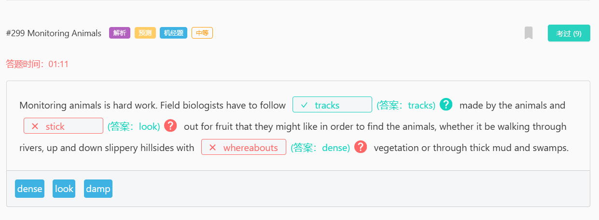
#299 Monitoring Animals
whereabouts / ˈweərəbaʊts / (英), / ˈwerəbaʊts / (美)
n. 下落，去向，所在之处
adv. 在何处，靠近什么地方
vegetation / ˌvedʒəˈteɪʃ(ə)n / (英), / ˌvedʒəˈteɪʃn / (美)
n. （总称）植物，植被；（植物的）生长

监测动物是一项艰苦的工作。野外生物学家必须跟踪动物留下的踪迹，并留意它们可能喜欢的水果，以便找到这些动物。无论是在河流中行走，还是在植被茂密的滑坡上上下攀爬，或是穿越厚厚的泥泞沼泽地，都是他们需要面对的挑战。

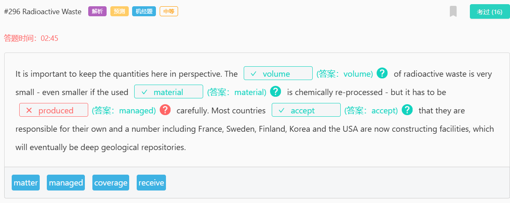
#296 Radioactive Waste
volume / ˈvɒljuːm / (英), / ˈvɑːljəm / (美)
n. 体积，容积；总数，总量；音量，响度
coverage / ˈkʌvərɪdʒ /
n. 覆盖范围；新闻报道；保险范围；课程内容；防守，盯守

#292 An Artist's Life
irrelevant / ɪˈreləvənt /
adj. 不相关的，不相干的
outhouse / ˈaʊthaʊs /
n. 外屋；屋外厕所；附属建筑物
sprawl / sprɔːl /
v. 伸开四肢坐（或躺）；蔓延
n. （城市）杂乱无序拓展的地区；四肢摊开的姿势；随意扩展，蔓延物