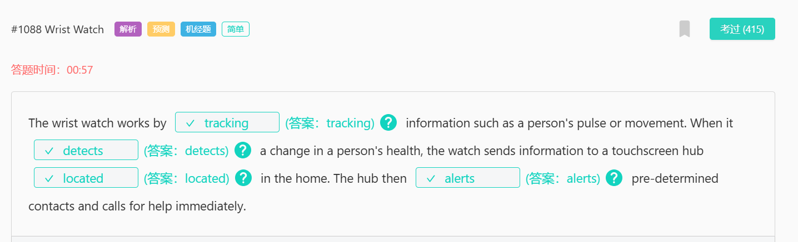
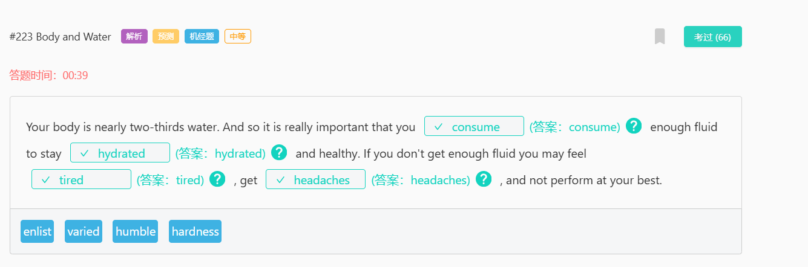

strung out
吸毒成瘾：长期吸毒导致身体虚弱的状态。
strung string 的过去式
slung sling 的过去式
sling
10077
英
/ slɪŋ /
抛掷、吊起

captivating
adj.
迷人的；有魅力的
v.
使……着迷（captivate 的 ing 形式）

minute
[adj] 细小的；琐碎的；极少的；精密的
definite
[adj] 肯定；肯定的；确定的；不会改变的

dedicated to
致力于：

regulate
[v] 调节；控制
[网络] 管理；调整；管制
mercury
[n] 汞；水银

an extended period of time
长时间：指一段较长的时间段，通常超过正常或预期的时间。
definite 确定的，无疑的
timely 及时的

culture
[n] 文化；栽培；养殖；培育
[v] 培养（细胞或细菌）
food value
食物营养价值

#1077 City Design
plateau 8498/ ˈplætəʊ / (英), / plæˈtoʊ / (美) n. 高原；（发展、增长后的）稳定期，停滞期；高原印第安人；托盘；v. （在一段时间的发展之后）趋于平稳，进入停滞期
equitable 10149/ ˈekwɪtəb(ə)l / adj. 公平合理的，公正的；衡平法上有效的
bleak 7427/ bliːk / adj. 不乐观的，无望的；无遮掩的，荒凉的；阴冷的，寒冷的
retard 17829/ rɪˈtɑːd / (英), / rɪˈtɑːrd / (美) v. <正式>阻碍，减缓；减慢，受到阻滞；n. <非正式>弱智，笨蛋；延迟，阻止

#1002 Fish Farms
surprisingly 3398/ səˈpraɪzɪŋli / (英), / sərˈpraɪzɪŋli / (美) adv. 惊人地，出人意料地

#867 David Lynch
campus 校区

#860 Chemistry
dwell 7296/ dwel / v. 居住，栖身

#844 Maya
argument 1189/ ˈɑːɡjumənt / (英), / ˈɑːrɡjumənt / (美) n. 争论，争吵；论据，理由；辩论，讨论

#618 Accounting and Finance
editorial 5068/ ˌedɪˈtɔːriəl / adj. 编辑的，主编的；社论的；n. 社论，社评
project
/ ˈprɒdʒekt / (英, 名词), / ˈprɑːdʒekt / (美, 名词)
/ prəˈdʒekt / (英, 动词), / prəˈdʒekt / (美, 动词)
n. 项目，计划；（学校的）课题，研究项目；<美>廉租房区，公共房屋区
v. 预计，推算；计划，规划；伸出，突出；投掷，喷射；投射，投影

#615 Bioenergy
forsake 15036/ fəˈseɪk / (英), / fərˈseɪk / (美) v. 抛弃，离开（尤指不履行责任）；摒弃，离开
forsook / fəˈsʊk / (英), / fərˈsʊk / (美) v. 抛弃；放弃，戒掉（喜爱的食物）（forsake 的过去式）

#592 Sound Speed
supersonic 18185/ ˌsuːpəˈsɒnɪk / (英), / ˌsuːpərˈsɑːnɪk / (美) adj. 超音速的；n. 超音速，超声波；超音速飞机
subsonic / ˌsʌbˈsɒnɪk / (英), / ˌsʌbˈsɑːnɪk / (美) adj. 次音速的；比音速稍慢的；n. 亚音速飞机

#552 Color Preference

#474 Country Definition

#473 Native Species
besiege 15405/ bɪˈsiːdʒ / v. 包围，围困；打扰，纠缠
prey 5574/ preɪ / n. 猎物，捕获物；受害者，受骗者；<古>掠夺品；v. 捕食；欺凌，坑害（尤指弱者）；不断困扰，折磨

#429 Power Station
street artist n. 街头艺术家
pillar 6619/ ˈpɪlə(r) / (英), / ˈpɪlər / (美) n. 柱子，支柱；主心骨，栋梁
deem to 认为

#408 Green Spaces
aerial 7468/ ˈeəriəl / (英), / ˈeriəl / (美)
n. 天线；（滑雪等运动的）空中腾越
adj. 航空的，从飞机上的；空中的

#470 Sleep Issue
onslaught 11406/ ˈɒnslɔːt / (英), / ˈɑːnslɔːt / (美) n. 攻击，猛攻；（常指难以应付的）大批，大量；猛烈抨击
odd 2762/ ɒd / (英), / ɑːd / (美) adj. 奇怪的，反常的；偶然出现的

#452 Next Task
statement 924/ ˈsteɪtmənt / n. 声明，报告；说明，说法
credible 6077/ ˈkredəb(ə)l / adj. 可信的，可靠的
incredible 3054/ ɪnˈkredəb(ə)l / adj. 不可思议的，难以置信的
misrepresent 16897/ ˌmɪsˌreprɪˈzent / vt. 歪曲，误传；不合适地代表；vi. 虚伪陈述；歪曲报道