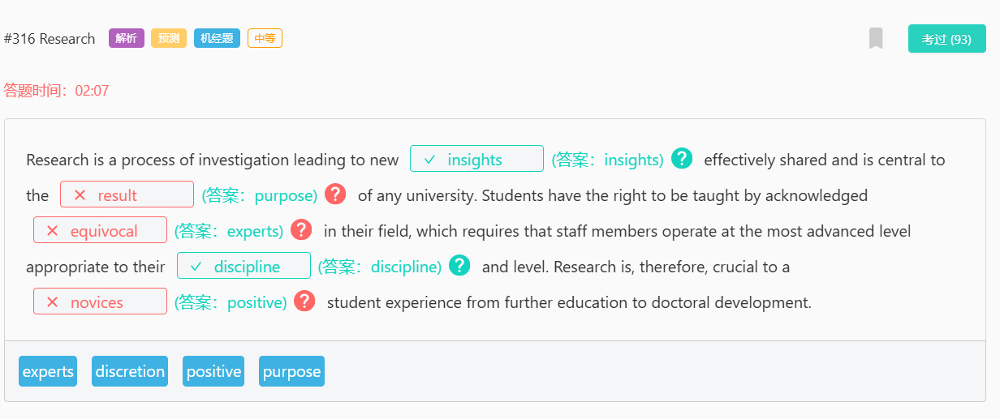
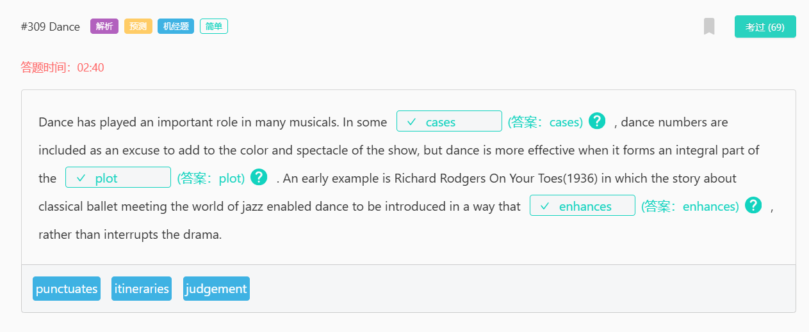

strung out
吸毒成瘾：长期吸毒导致身体虚弱的状态。
strung string 的过去式
slung sling 的过去式
sling
10077
英
/ slɪŋ /
抛掷、吊起

captivating
adj.
迷人的；有魅力的
v.
使……着迷（captivate 的 ing 形式）

minute
[adj] 细小的；琐碎的；极少的；精密的
definite
[adj] 肯定；肯定的；确定的；不会改变的

dedicated to
致力于：

regulate
[v] 调节；控制
[网络] 管理；调整；管制
mercury
[n] 汞；水银

an extended period of time
长时间：指一段较长的时间段，通常超过正常或预期的时间。
definite 确定的，无疑的
timely 及时的

culture
[n] 文化；栽培；养殖；培育
[v] 培养（细胞或细菌）
food value
食物营养价值

#1077 City Design
plateau 8498/ ˈplætəʊ / (英), / plæˈtoʊ / (美) n. 高原；（发展、增长后的）稳定期，停滞期；高原印第安人；托盘；v. （在一段时间的发展之后）趋于平稳，进入停滞期
equitable 10149/ ˈekwɪtəb(ə)l / adj. 公平合理的，公正的；衡平法上有效的
bleak 7427/ bliːk / adj. 不乐观的，无望的；无遮掩的，荒凉的；阴冷的，寒冷的
retard 17829/ rɪˈtɑːd / (英), / rɪˈtɑːrd / (美) v. <正式>阻碍，减缓；减慢，受到阻滞；n. <非正式>弱智，笨蛋；延迟，阻止

#1002 Fish Farms
surprisingly 3398/ səˈpraɪzɪŋli / (英), / sərˈpraɪzɪŋli / (美) adv. 惊人地，出人意料地

#867 David Lynch
campus 校区

#860 Chemistry
dwell 7296/ dwel / v. 居住，栖身

#844 Maya
argument 1189/ ˈɑːɡjumənt / (英), / ˈɑːrɡjumənt / (美) n. 争论，争吵；论据，理由；辩论，讨论

#618 Accounting and Finance
editorial 5068/ ˌedɪˈtɔːriəl / adj. 编辑的，主编的；社论的；n. 社论，社评
project
/ ˈprɒdʒekt / (英, 名词), / ˈprɑːdʒekt / (美, 名词)
/ prəˈdʒekt / (英, 动词), / prəˈdʒekt / (美, 动词)
n. 项目，计划；（学校的）课题，研究项目；<美>廉租房区，公共房屋区
v. 预计，推算；计划，规划；伸出，突出；投掷，喷射；投射，投影

#615 Bioenergy
forsake 15036/ fəˈseɪk / (英), / fərˈseɪk / (美) v. 抛弃，离开（尤指不履行责任）；摒弃，离开
forsook / fəˈsʊk / (英), / fərˈsʊk / (美) v. 抛弃；放弃，戒掉（喜爱的食物）（forsake 的过去式）

#592 Sound Speed
supersonic 18185/ ˌsuːpəˈsɒnɪk / (英), / ˌsuːpərˈsɑːnɪk / (美) adj. 超音速的；n. 超音速，超声波；超音速飞机
subsonic / ˌsʌbˈsɒnɪk / (英), / ˌsʌbˈsɑːnɪk / (美) adj. 次音速的；比音速稍慢的；n. 亚音速飞机

#552 Color Preference

#474 Country Definition

#473 Native Species
besiege 15405/ bɪˈsiːdʒ / v. 包围，围困；打扰，纠缠
prey 5574/ preɪ / n. 猎物，捕获物；受害者，受骗者；<古>掠夺品；v. 捕食；欺凌，坑害（尤指弱者）；不断困扰，折磨

#429 Power Station
street artist n. 街头艺术家
pillar 6619/ ˈpɪlə(r) / (英), / ˈpɪlər / (美) n. 柱子，支柱；主心骨，栋梁
deem to 认为

#408 Green Spaces
aerial 7468/ ˈeəriəl / (英), / ˈeriəl / (美)
n. 天线；（滑雪等运动的）空中腾越
adj. 航空的，从飞机上的；空中的

#470 Sleep Issue
onslaught 11406/ ˈɒnslɔːt / (英), / ˈɑːnslɔːt / (美) n. 攻击，猛攻；（常指难以应付的）大批，大量；猛烈抨击
odd 2762/ ɒd / (英), / ɑːd / (美) adj. 奇怪的，反常的；偶然出现的

#452 Next Task
statement 924/ ˈsteɪtmənt / n. 声明，报告；说明，说法
credible 6077/ ˈkredəb(ə)l / adj. 可信的，可靠的
incredible 3054/ ɪnˈkredəb(ə)l / adj. 不可思议的，难以置信的
misrepresent 16897/ ˌmɪsˌreprɪˈzent / vt. 歪曲，误传；不合适地代表；vi. 虚伪陈述；歪曲报道

marking

#451 William Shakespeare
ubiquitous / juːˈbɪkwɪtəs / adj. 普遍存在的，无所不在的
entitlement / ɪnˈtaɪtlmənt / n. 有权得到的东西，应得的数额；权利，资格

#440 Britain's Past
entail / ɪnˈteɪl /
v. 使必要，需要；限定继承；使人承担
n. 限定继承，限嗣继承的财产

#401 Electric Eels
current / ˈkʌrənt / (英), / ˈkɜːrənt / (美)
adj. 现行的，当前的；通用的，流行的；最近的
n. 水流，气流；电流；思潮，趋势

#385 Sandra Lousada

#377 Father in Family

#368 Underground Houses
incorporate / ɪnˈkɔːpəreɪt / (英), / ɪnˈkɔːrpəreɪt / (美)
v. 包含，合并；组成公司；掺和，混合（成分）；使具体化，体现
adj. 合成一体的，合并的；具体化的；组成公司（或社团）的
steep / stiːp /
adj. （路、山等）陡峭的；（价格，需求）难以接受的，过高的；（增加或减少）急剧的，大幅度的
v. 浸泡（食物）；使沉浸，使沉湎
scarcity / ˈskeəsəti / (英), / ˈskersəti / (美) n. 不足，缺乏

#360 Paris Stage
shake / ʃeɪk /
v. 摇动，抖动；削弱，动摇；发抖，哆嗦；握手；使震惊，使烦乱；使改变（态度、信念）；摆脱，克服；舞动（拳头、棍子等）；抖掉，抖出；使劲甩动，急剧晃动；摇头（以示否定）；（声音）颤抖
n. 摇动，摇晃；奶昔；（摇动容器后的）撒出物；<非正式>哆嗦，颤抖（the shakes）；<美>木制墙面板；<非正式>地震；（乐）颤音
rehearsal / rɪˈhɜːs(ə)l / (英), / rɪˈhɜːrs(ə)l / (美) n. 排练，排演；预演，演习；复述，重复
concoct / kənˈkɒkt / (英), / kənˈkɑːkt / (美) vt. 编造；调制（食物或饮品）
overhead / ˌəʊvəˈhed / (英), / ˌoʊvərˈhed / (美)
adv. 在头顶上方，在空中
adj. 头顶上的，在空中的，高架的

#357 Giant Exoplanets

#344 DNA
predicts sb = sb predicts
says sb = sb says
says who = who says

#342 E-Learning
proportionately / prəˈpɔːʃənətli / (英), / prəˈpɔːrʃənətli / (美) adv. 相称地，成比例地
passion / ˈpæʃ(ə)n /
n. 爱恋，情欲；激情，热情；酷爱，热衷的爱好

#332 Eutrophication
deplete / dɪˈpliːt / v. 大量减少，耗尽
fatigue / fəˈtiːɡ /
n. 疲乏，厌倦；（金属部件的）疲劳；（士兵穿的）工作服；士兵杂役（尤指作为惩罚，如做打扫、帮厨）
v. 使疲劳，使劳累
oust / aʊst / vt. 罢免，撤职；淘汰；驱逐；取代；撤销
algae / ˈældʒiː / n. 水藻，海藻

#327 Clear Plan
build in 包含、构建
valuation / ˌvæljuˈeɪʃn /
n. 评价，估价；计算

#323 Houston
impetus / ˈɪmpɪtəs /
n. 动力，促进；动量，冲力
concentration / ˌkɒns(ə)nˈtreɪʃ(ə)n / (英), / ˌkɑːns(ə)nˈtreɪʃ(ə)n / (美)
n. 专心，专注；关注，重视；集中，聚集；含量，浓度

#319 Food Prices
deterioration / dɪˌtɪəriəˈreɪʃ(ə)n / (英), / dɪˌtɪriəˈreɪʃn / (美)
n. 恶化
fluctuate / ˈflʌktʃueɪt /
v. 波动，起伏不定
dip / dɪp /
v. 浸，蘸；下降，下沉；伸进，伸入

#317 Following Tips

#316 Research
equivocal / ɪˈkwɪvək(ə)l /
adj. 模棱两可的；可疑的
discipline / ˈdɪsəplɪn /
n. 纪律，风纪；惩罚，处分；训导，管教；训练，锻炼；自制力，自律能力；（尤指大学的）科目，学科
discretion / dɪˈskreʃn / (英), / dɪˈskreʃ(ə)n / (美)
n. 自行决定权，判断力；谨慎，慎重
insight / ˈɪnsaɪt /
n. 洞悉，了解；洞察力

#309 Dance
plot / plɒt / (英), / plɑːt / (美)
n. 阴谋，密谋；情节；（专用的）小块地；（表现两个变量关系的）图表；<美>图表，地图；<美>底层平面图
punctuate / ˈpʌŋktʃueɪt /
vt. 不时打断；强调；加标点于
vi. 加标点
itinerary / aɪˈtɪnərəri / (英), / aɪˈtɪnəreri / (美)
n. 行程，旅行路线；游记，旅行日记
adj. 旅程的

#303 Talking
vocal cords 声带
practitioner / prækˈtɪʃənə(r) / (英), / prækˈtɪʃənər / (美)
n. （医学界或法律界的）从业人员，执业者；<正式>从事者，实践者
tract / trækt /
n. （尤指宣扬宗教、伦理或政治的）短文，传单，小册子；大片土地，地带；（身体的）道，束；<文>大量，许多；咏唱

#302 Financial Crisis
function 运行/起作用
prerequisite / ˌpriːˈrekwəzɪt /
n. 先决条件，前提；预备课程
adj. 先决的，必备的
provision / prəˈvɪʒ(ə)n /
n. 提供，供应；准备，预备；（尤指为旅行准备的）食物，必需品（provisions）；条款，规定；赡养，供养

#300 Accounting
allegation / ˌæləˈɡeɪʃn /
n. （无证据的）说法，指控

虽然会计专注于商业世界中日常的财务报告和记录管理，但金融则利用这些相同的信息来预测未来的增长并分析支出，以便制定公司财务策略。因此，金融专业的学生可能更关注财务战略和控制，而会计专业的学生则更专注于使用专业原则和流程来管理数字，而不是影响它们。

#299 Monitoring Animals
whereabouts / ˈweərəbaʊts / (英), / ˈwerəbaʊts / (美)
n. 下落，去向，所在之处
adv. 在何处，靠近什么地方
vegetation / ˌvedʒəˈteɪʃ(ə)n / (英), / ˌvedʒəˈteɪʃn / (美)
n. （总称）植物，植被；（植物的）生长

监测动物是一项艰苦的工作。野外生物学家必须跟踪动物留下的踪迹，并留意它们可能喜欢的水果，以便找到这些动物。无论是在河流中行走，还是在植被茂密的滑坡上上下攀爬，或是穿越厚厚的泥泞沼泽地，都是他们需要面对的挑战。

#296 Radioactive Waste
volume / ˈvɒljuːm / (英), / ˈvɑːljəm / (美)
n. 体积，容积；总数，总量；音量，响度
coverage / ˈkʌvərɪdʒ /
n. 覆盖范围；新闻报道；保险范围；课程内容；防守，盯守

#292 An Artist's Life
irrelevant / ɪˈreləvənt /
adj. 不相关的，不相干的
outhouse / ˈaʊthaʊs /
n. 外屋；屋外厕所；附属建筑物
sprawl / sprɔːl /
v. 伸开四肢坐（或躺）；蔓延
n. （城市）杂乱无序拓展的地区；四肢摊开的姿势；随意扩展，蔓延物

#288 Sea Turtles
disoriented
英
/ dɪsˈɔːrientɪd /
美
/ dɪsˈɔːrientɪd /
简明柯林斯
adj.
分不清方向或目标的；无判断力的
v.
使……迷惑（disorient 的过去式和过去分词）

drawn
英
/ drɔːn /
美
/ drɔːn /
简明柯林斯
adj.
（因身体不适、疲倦或忧虑）憔悴的，苍白的
v.
画，绘制；拖，拉；拔出；排出（液体）（draw 的过去分词）

dislocate
英
/ ˈdɪsləkeɪt /
美
/ ˈdɪsloʊkeɪt /
简明柯林斯
vt.
使脱臼；使混乱

juggle
英
/ ˈdʒʌɡl /
美
/ ˈdʒʌɡl /
简明柯林斯
v.
玩杂耍（连续向空中抛接多个物体）；力图使平衡，尽力应付；歪曲，篡改；有效地组织，有效利用（信息、数字、开支等）
n.
手技杂耍；平衡；虚报，谎报

dawn
英
/ dɔːn /
美
/ dɑːn /
简明柯林斯
v.
变得明朗，开始清楚；破晓，开始
n.
拂晓，黎明；曙光，开端

disinterested
英
/ dɪsˈɪntrəstɪd /
美
/ dɪsˈɪntrəstɪd /
简明柯林斯
adj.
无私的；公正的；冷漠的；廉洁的
v.
使不再有利害关系；使无兴趣

torn
英
/ tɔːn /
美
/ tɔːrn /
简明柯林斯
adj.
犹豫的
v.
撕碎，撕裂；撕破，划破；撕掉，扯掉（tear 的过去分词）

#277 Trees
variation
英
/ ˌveəriˈeɪʃ(ə)n /
美
/ ˌveriˈeɪʃ(ə)n /
简明柯林斯
n.
变化，变动；变奏曲；变化，变异；

#275 Australian Dwellings
evolve
英
/ ɪˈvɒlv /
美
/ ɪˈvɑːlv /
简明柯林斯
v.
进化，演化；逐步发展，逐渐演变

stagnate
英
/ stæɡˈneɪt /
美
/ ˈstæɡneɪt /
简明柯林斯
v.
停滞，不发展，不进步；因不流动而变得污浊；使淤塞，使沉滞，使萧条

stagnating
简明柯林斯
v.
停滞，不发展；因不流动而变得污浊；

#273 Musical
technician
英
/ tekˈnɪʃ(ə)n /
美
/ tekˈnɪʃ(ə)n /
简明柯林斯
n.
技师，技术人员；（体育、艺术等方面）技巧精湛者，精于技巧者

#272 Shakespeare's Work
genre
英
/ ˈʒɒnrə /
美
/ ˈʒɑːnrə /

#270 Pupil Charity
charity appeal
简明
慈善募捐：

tenacity
英
/ təˈnæsəti /
美
/ təˈnæsəti /
简明柯林斯
n.
顽强，执着，坚持；黏性

pupil
英
/ ˈpjuːp(ə)l /
美
/ ˈpjuːp(ə)l /
简明柯林斯
n.
学生，（尤指）小学生；
注意音标

#266 Trackway
fossilized
英
/ ˈfɒsəlaɪzd /
美
/ ˈfɑːsəlaɪzd /
简明柯林斯
adj.
石化的；僵化的；老化的（fossilised 的美式拼写）
v.
石化；僵化（fossilize 的过去式与过去分词）

mammoth
英
/ ˈmæməθ /
美
/ ˈmæməθ /
简明柯林斯
n.
猛犸，毛象；庞然大物
adj.
巨大的，庞大的

excavate
英
/ ˈekskəveɪt /
美
/ ˈekskəveɪt /
简明柯林斯
v.
发掘，挖掘（古物）；挖（洞），开凿

juvenile
英
/ ˈdʒuːvɪˌnaɪl /
美
/ ˈdʒuvənəl; ˈdʒuːvənaɪl /
简明柯林斯
adj.
青少年的，未成年的；少年犯的；幼稚的，孩子气的；（鸟或动物）幼年的
n.
青少年，未成年人；扮演青少年角色的演员；幼鸟，幼兽

#264 Global Ecosystems
alleviate
英
/ əˈliːvieɪt /
美
/ əˈliːvieɪt /
简明柯林斯
v.
减轻，缓和

sound 健全的

#261 Revision

#189 Chimpanzee Posture
subordinate
英
/ səˈbɔːdɪnət /
美
/ səˈbɔːrdɪnət /
简明柯林斯
adj.
从属的，下级的；次要的
n.
部属，下级；从属，次要
v.
使从属于，使处于次要地位；使隶属，使服从

reassurance
英
/ ˌriːəˈʃʊərəns; ˌriːəˈʃɔːrəns /
美
/ ˌriːəˈʃʊrəns /
简明柯林斯
n.
安慰，慰藉；能消除疑虑的说话（或行动），保证

dominant
英
/ ˈdɒmɪnənt /
美
/ ˈdɑːmɪnənt /
简明柯林斯
adj.
占支配地位的，占优势的；（基因）显性的
n.
显性（性状），显性基因

submissive
英
/ səbˈmɪsɪv /
美
/ səbˈmɪsɪv /
简明柯林斯
adj.
顺从的，服从的，卑躬屈膝的

黑猩猩的姿势、手势和面部表情在不同个体之间传递许多信息和情感。当在一段时间的缺席后向一个占主导地位的个体问候，或对一个攻击性的手势做出反应时，紧张的下属可能会以顺从的信号接近——如蹲伏、展示臀部、伸出一只手——并伴有喘息声或尖叫声。作为回应，占主导地位的个体可能会做出一些表示安抚的手势，比如触摸、亲吻或拥抱。

#253 Lake Turkana
notch
英
/ nɒtʃ /
美
/ nɑːtʃ /
简明柯林斯
n.
（表面或边缘的）V形刻痕，圆形切口；等级，档次；<美>山峡，峡谷；皮带上（搭扣插入）的孔
vt.
<非正式>赢得，获取；（在表面或边缘）刻V形痕，刻下切口

#252 Corn People

metaphor
英
/ ˈmetəfə(r) /
美
/ ˈmetəfər /
简明柯林斯
n.
隐喻，暗喻；象征，标志

manifestation
英
/ ˌmænɪfeˈsteɪʃ(ə)n /
美
/ ˌmænɪfəˈsteɪʃ(ə)n /
简明柯林斯
n.
表现，显现；表现形式；（鬼魂或神灵）出现，显灵；示威运动

staple
英
/ ˈsteɪp(ə)l /
美
/ ˈsteɪp(ə)l /
简明柯林斯
n.
（某国的）主要产品，支柱产品；主食；主要部份，重要内容；<史>（特定商品的）贸易中心；订书钉；U 形钉；（棉花、羊毛的）纤维（就其长度和细度而言）
adj.
主要生产的，大量生产的；主要的，常用的
v.
用订书钉订住；把……分级

#251 Linguistic Effects
corollary
英
/ kəˈrɒləri /
美
/ ˈkɔːrəleri /
简明柯林斯
n.
推论；必然的结果

discourse
英
/ ˈdɪskɔːs /
美
/ ˈdɪskɔːrs /
简明柯林斯
n.
演讲，论述；谈话，交流；话语，语篇
v.
高谈阔论，论述；交谈

#248 Fingerprint
embody
英
/ ɪmˈbɒdi /
美
/ ɪmˈbɑːdi /
简明柯林斯
v.
具体表现，体现；收录，包括；

#245 Durkheim
lead off
英
/ ˈliːd ɒf /
简明柯林斯
开始，首先表演：指首先开始或表演。
开始，着手：指开始做某事。

#244 Donors
generosity
英
/ ˌdʒenəˈrɒsəti /
美
/ ˌdʒenəˈrɑːsəti /
简明柯林斯
n.
慷慨，大方
注意音标

indebtedness
英
/ ɪnˈdetɪdnəs /
美
/ ɪnˈdetɪdnəs /
简明柯林斯
n.
债务；受恩惠

indebtedness to
简明
对……的感激和欠缺：表示对某人或某事物的感激之情，

donor
英
/ ˈdəʊnə(r) /
美
/ ˈdoʊnər /
简明柯林斯
n.
捐献者，捐赠者；

去年，美国人的慷慨接近创纪录水平。2005年捐赠给慈善机构的2602.8亿美元中，76.5%来自个人捐赠者。这些人向各种非营利机构捐款，从博物馆到宗教组织，并在亚洲海啸和美国飓风后的灾难救援方面给予了重点支持。总体而言，2005年美国人捐赠了其家庭收入的2.2%，略高于40年来的平均水平。

#238 Away from Home
retard 
bizarre
classification

#230 Darkness
shed
salvage
phosphorus
waxy
slimy

#226 Space
integrated
mass
deteriorated

#210 Two Norths
magnetic
gadget
spherical
sticking

#90 Low Fertility
gap
explor
低生育率是许多经合组织（OECD）国家面临人口老龄化前景时的一个重要问题。本文对澳大利亚与另外七个经合组织国家在1970年至2004年期间的生育率进行了比较。还对比了生育年龄模式的变化，结果显示，对于大多数国家来说，女性正在推迟生育并生育更少的孩子。女性教育水平和就业率与生育率之间的关联也得到了探讨。

#201 Canada Gallery
pull together
muster

redress

尽管交通问题经常成为餐桌上的话题，但对交通政策方向的全面评估在学术分析中却很少见。本章介绍了本书的范围，旨在帮助弥补这一不足。主要内容集中在城市交通政策上，重点在于政策分析而非政策过程的分析。重要的是，本章提出了一些关键命题，这些命题在塑造作者们处理后续章节中所考虑的具体问题的方法方面起到了重要作用。