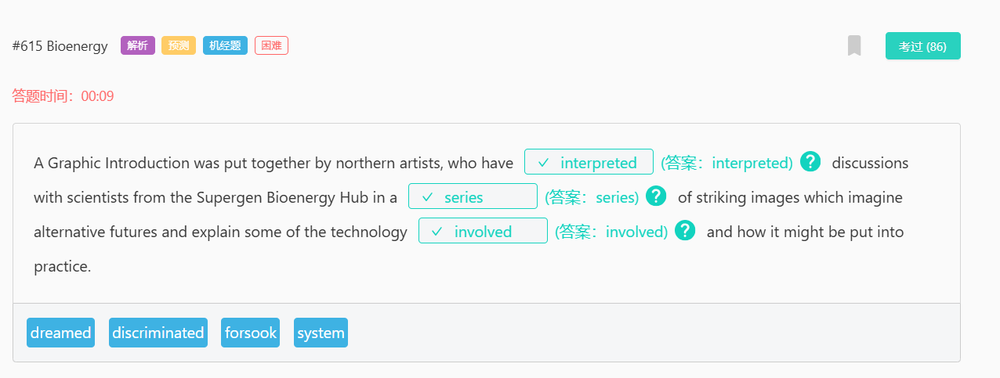
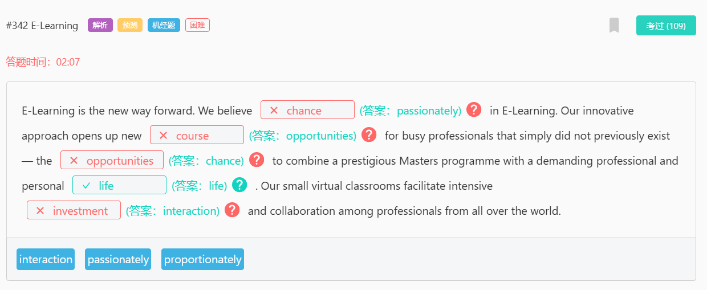
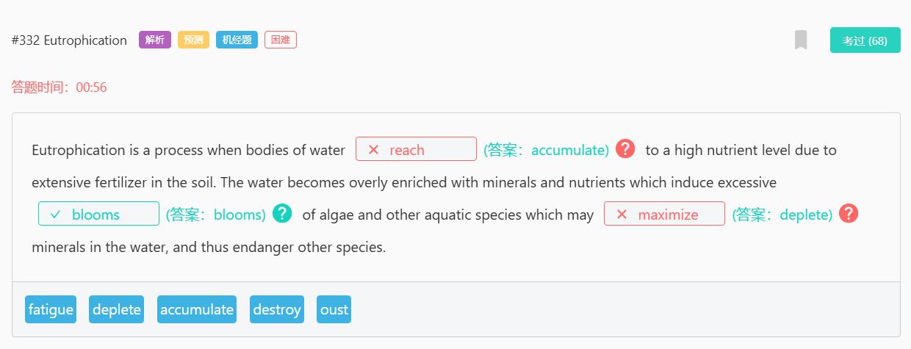
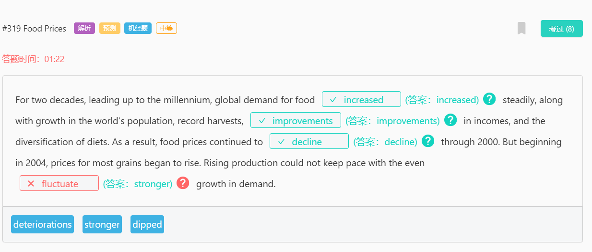
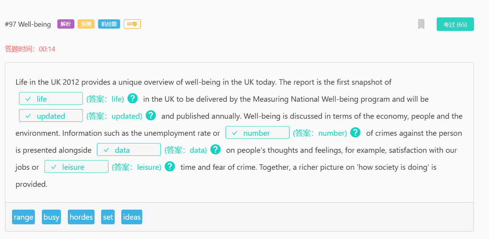
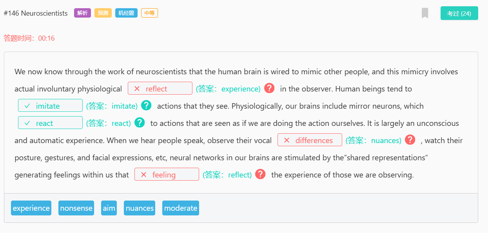
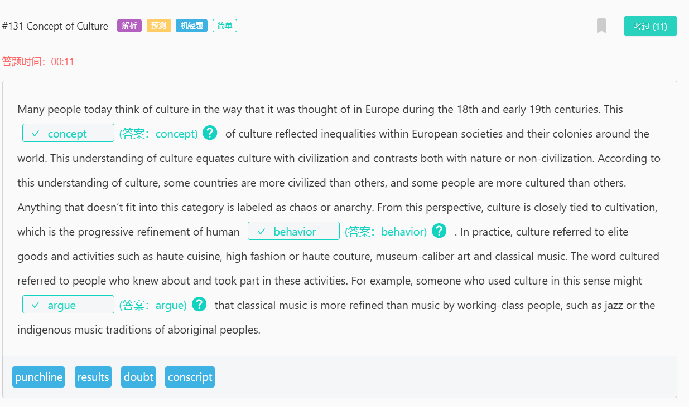

1119
strung out
吸毒成瘾：长期吸毒导致身体虚弱的状态。
strung string 的过去式
slung sling 的过去式
sling
10077
英
/ slɪŋ /
抛掷、吊起

1106
captivating
adj.
迷人的；有魅力的
v.
使……着迷（captivate 的 ing 形式）

1105
minute
[adj] 细小的；琐碎的；极少的；精密的
definite
[adj] 肯定；肯定的；确定的；不会改变的

1103
dedicated to
致力于：

1088

1087
regulate
[v] 调节；控制
[网络] 管理；调整；管制
mercury
[n] 汞；水银

1085
an extended period of time
长时间：指一段较长的时间段，通常超过正常或预期的时间。
definite 确定的，无疑的
timely 及时的

1084

223

1079

1074
culture
[n] 文化；栽培；养殖；培育
[v] 培养（细胞或细菌）
food value
食物营养价值

1077
#1077 City Design
plateau 8498/ ˈplætəʊ / (英), / plæˈtoʊ / (美) n. 高原；（发展、增长后的）稳定期，停滞期；高原印第安人；托盘；v. （在一段时间的发展之后）趋于平稳，进入停滞期
equitable 10149/ ˈekwɪtəb(ə)l / adj. 公平合理的，公正的；衡平法上有效的
bleak 7427/ bliːk / adj. 不乐观的，无望的；无遮掩的，荒凉的；阴冷的，寒冷的
retard 17829/ rɪˈtɑːd / (英), / rɪˈtɑːrd / (美) v. <正式>阻碍，减缓；减慢，受到阻滞；n. <非正式>弱智，笨蛋；延迟，阻止

1002
#1002 Fish Farms
surprisingly 3398/ səˈpraɪzɪŋli / (英), / sərˈpraɪzɪŋli / (美) adv. 惊人地，出人意料地

867
#867 David Lynch
campus 校区

860
#860 Chemistry
dwell 7296/ dwel / v. 居住，栖身

844
#844 Maya
argument 1189/ ˈɑːɡjumənt / (英), / ˈɑːrɡjumənt / (美) n. 争论，争吵；论据，理由；辩论，讨论

618
#618 Accounting and Finance
editorial 5068/ ˌedɪˈtɔːriəl / adj. 编辑的，主编的；社论的；n. 社论，社评
project
/ ˈprɒdʒekt / (英, 名词), / ˈprɑːdʒekt / (美, 名词)
/ prəˈdʒekt / (英, 动词), / prəˈdʒekt / (美, 动词)
n. 项目，计划；（学校的）课题，研究项目；<美>廉租房区，公共房屋区
v. 预计，推算；计划，规划；伸出，突出；投掷，喷射；投射，投影

615
#615 Bioenergy
forsake 15036/ fəˈseɪk / (英), / fərˈseɪk / (美) v. 抛弃，离开（尤指不履行责任）；摒弃，离开
forsook / fəˈsʊk / (英), / fərˈsʊk / (美) v. 抛弃；放弃，戒掉（喜爱的食物）（forsake 的过去式）

592
#592 Sound Speed
supersonic 18185/ ˌsuːpəˈsɒnɪk / (英), / ˌsuːpərˈsɑːnɪk / (美) adj. 超音速的；n. 超音速，超声波；超音速飞机
subsonic / ˌsʌbˈsɒnɪk / (英), / ˌsʌbˈsɑːnɪk / (美) adj. 次音速的；比音速稍慢的；n. 亚音速飞机

#552 Color Preference

#474 Country Definition

#473 Native Species
besiege 15405/ bɪˈsiːdʒ / v. 包围，围困；打扰，纠缠
prey 5574/ preɪ / n. 猎物，捕获物；受害者，受骗者；<古>掠夺品；v. 捕食；欺凌，坑害（尤指弱者）；不断困扰，折磨

#429 Power Station
street artist n. 街头艺术家
pillar 6619/ ˈpɪlə(r) / (英), / ˈpɪlər / (美) n. 柱子，支柱；主心骨，栋梁
deem to 认为

#408 Green Spaces
aerial 7468/ ˈeəriəl / (英), / ˈeriəl / (美)
n. 天线；（滑雪等运动的）空中腾越
adj. 航空的，从飞机上的；空中的

#470 Sleep Issue
onslaught 11406/ ˈɒnslɔːt / (英), / ˈɑːnslɔːt / (美) n. 攻击，猛攻；（常指难以应付的）大批，大量；猛烈抨击
odd 2762/ ɒd / (英), / ɑːd / (美) adj. 奇怪的，反常的；偶然出现的

#452 Next Task
statement 924/ ˈsteɪtmənt / n. 声明，报告；说明，说法
credible 6077/ ˈkredəb(ə)l / adj. 可信的，可靠的
incredible 3054/ ɪnˈkredəb(ə)l / adj. 不可思议的，难以置信的
misrepresent 16897/ ˌmɪsˌreprɪˈzent / vt. 歪曲，误传；不合适地代表；vi. 虚伪陈述；歪曲报道

marking

#451 William Shakespeare
ubiquitous / juːˈbɪkwɪtəs / adj. 普遍存在的，无所不在的
entitlement / ɪnˈtaɪtlmənt / n. 有权得到的东西，应得的数额；权利，资格

#440 Britain's Past
entail / ɪnˈteɪl /
v. 使必要，需要；限定继承；使人承担
n. 限定继承，限嗣继承的财产

#401 Electric Eels
current / ˈkʌrənt / (英), / ˈkɜːrənt / (美)
adj. 现行的，当前的；通用的，流行的；最近的
n. 水流，气流；电流；思潮，趋势

#385 Sandra Lousada

#377 Father in Family

#368 Underground Houses
incorporate / ɪnˈkɔːpəreɪt / (英), / ɪnˈkɔːrpəreɪt / (美)
v. 包含，合并；组成公司；掺和，混合（成分）；使具体化，体现
adj. 合成一体的，合并的；具体化的；组成公司（或社团）的
steep / stiːp /
adj. （路、山等）陡峭的；（价格，需求）难以接受的，过高的；（增加或减少）急剧的，大幅度的
v. 浸泡（食物）；使沉浸，使沉湎
scarcity / ˈskeəsəti / (英), / ˈskersəti / (美) n. 不足，缺乏

#360 Paris Stage
shake / ʃeɪk /
v. 摇动，抖动；削弱，动摇；发抖，哆嗦；握手；使震惊，使烦乱；使改变（态度、信念）；摆脱，克服；舞动（拳头、棍子等）；抖掉，抖出；使劲甩动，急剧晃动；摇头（以示否定）；（声音）颤抖
n. 摇动，摇晃；奶昔；（摇动容器后的）撒出物；<非正式>哆嗦，颤抖（the shakes）；<美>木制墙面板；<非正式>地震；（乐）颤音
rehearsal / rɪˈhɜːs(ə)l / (英), / rɪˈhɜːrs(ə)l / (美) n. 排练，排演；预演，演习；复述，重复
concoct / kənˈkɒkt / (英), / kənˈkɑːkt / (美) vt. 编造；调制（食物或饮品）
overhead / ˌəʊvəˈhed / (英), / ˌoʊvərˈhed / (美)
adv. 在头顶上方，在空中
adj. 头顶上的，在空中的，高架的

#357 Giant Exoplanets

#344 DNA
predicts sb = sb predicts
says sb = sb says
says who = who says

#342 E-Learning
proportionately / prəˈpɔːʃənətli / (英), / prəˈpɔːrʃənətli / (美) adv. 相称地，成比例地
passion / ˈpæʃ(ə)n /
n. 爱恋，情欲；激情，热情；酷爱，热衷的爱好

#332 Eutrophication
deplete / dɪˈpliːt / v. 大量减少，耗尽
fatigue / fəˈtiːɡ /
n. 疲乏，厌倦；（金属部件的）疲劳；（士兵穿的）工作服；士兵杂役（尤指作为惩罚，如做打扫、帮厨）
v. 使疲劳，使劳累
oust / aʊst / vt. 罢免，撤职；淘汰；驱逐；取代；撤销
algae / ˈældʒiː / n. 水藻，海藻

#327 Clear Plan
build in 包含、构建
valuation / ˌvæljuˈeɪʃn /
n. 评价，估价；计算

#323 Houston
impetus / ˈɪmpɪtəs /
n. 动力，促进；动量，冲力
concentration / ˌkɒns(ə)nˈtreɪʃ(ə)n / (英), / ˌkɑːns(ə)nˈtreɪʃ(ə)n / (美)
n. 专心，专注；关注，重视；集中，聚集；含量，浓度

#319 Food Prices
deterioration / dɪˌtɪəriəˈreɪʃ(ə)n / (英), / dɪˌtɪriəˈreɪʃn / (美)
n. 恶化
fluctuate / ˈflʌktʃueɪt /
v. 波动，起伏不定
dip / dɪp /
v. 浸，蘸；下降，下沉；伸进，伸入

#317 Following Tips

#316 Research
equivocal / ɪˈkwɪvək(ə)l /
adj. 模棱两可的；可疑的
discipline / ˈdɪsəplɪn /
n. 纪律，风纪；惩罚，处分；训导，管教；训练，锻炼；自制力，自律能力；（尤指大学的）科目，学科
discretion / dɪˈskreʃn / (英), / dɪˈskreʃ(ə)n / (美)
n. 自行决定权，判断力；谨慎，慎重
insight / ˈɪnsaɪt /
n. 洞悉，了解；洞察力

#309 Dance
plot / plɒt / (英), / plɑːt / (美)
n. 阴谋，密谋；情节；（专用的）小块地；（表现两个变量关系的）图表；<美>图表，地图；<美>底层平面图
punctuate / ˈpʌŋktʃueɪt /
vt. 不时打断；强调；加标点于
vi. 加标点
itinerary / aɪˈtɪnərəri / (英), / aɪˈtɪnəreri / (美)
n. 行程，旅行路线；游记，旅行日记
adj. 旅程的

#303 Talking
vocal cords 声带
practitioner / prækˈtɪʃənə(r) / (英), / prækˈtɪʃənər / (美)
n. （医学界或法律界的）从业人员，执业者；<正式>从事者，实践者
tract / trækt /
n. （尤指宣扬宗教、伦理或政治的）短文，传单，小册子；大片土地，地带；（身体的）道，束；<文>大量，许多；咏唱

#302 Financial Crisis
function 运行/起作用
prerequisite / ˌpriːˈrekwəzɪt /
n. 先决条件，前提；预备课程
adj. 先决的，必备的
provision / prəˈvɪʒ(ə)n /
n. 提供，供应；准备，预备；（尤指为旅行准备的）食物，必需品（provisions）；条款，规定；赡养，供养

#300 Accounting
allegation / ˌæləˈɡeɪʃn /
n. （无证据的）说法，指控

虽然会计专注于商业世界中日常的财务报告和记录管理，但金融则利用这些相同的信息来预测未来的增长并分析支出，以便制定公司财务策略。因此，金融专业的学生可能更关注财务战略和控制，而会计专业的学生则更专注于使用专业原则和流程来管理数字，而不是影响它们。

#299 Monitoring Animals
whereabouts / ˈweərəbaʊts / (英), / ˈwerəbaʊts / (美)
n. 下落，去向，所在之处
adv. 在何处，靠近什么地方
vegetation / ˌvedʒəˈteɪʃ(ə)n / (英), / ˌvedʒəˈteɪʃn / (美)
n. （总称）植物，植被；（植物的）生长

监测动物是一项艰苦的工作。野外生物学家必须跟踪动物留下的踪迹，并留意它们可能喜欢的水果，以便找到这些动物。无论是在河流中行走，还是在植被茂密的滑坡上上下攀爬，或是穿越厚厚的泥泞沼泽地，都是他们需要面对的挑战。

#296 Radioactive Waste
volume / ˈvɒljuːm / (英), / ˈvɑːljəm / (美)
n. 体积，容积；总数，总量；音量，响度
coverage / ˈkʌvərɪdʒ /
n. 覆盖范围；新闻报道；保险范围；课程内容；防守，盯守

#292 An Artist's Life
irrelevant / ɪˈreləvənt /
adj. 不相关的，不相干的
outhouse / ˈaʊthaʊs /
n. 外屋；屋外厕所；附属建筑物
sprawl / sprɔːl /
v. 伸开四肢坐（或躺）；蔓延
n. （城市）杂乱无序拓展的地区；四肢摊开的姿势；随意扩展，蔓延物

#288 Sea Turtles
disoriented /dɪsˈɔːrientɪd/ /dɪsˈɔːrientɪd/ adj. 分不清方向或目标的；无判断力的；v. 使……迷惑（disorient 的过去式和过去分词）
drawn /drɔːn/ /drɔːn/ adj. （因身体不适、疲倦或忧虑）憔悴的，苍白的；v. 画，绘制；拖，拉；拔出；排出（液体）（draw 的过去分词）
dislocate /ˈdɪsləkeɪt/ /ˈdɪsloʊkeɪt/ vt. 使脱臼；使混乱
juggle /ˈdʒʌɡl/ /ˈdʒʌɡl/ v. 玩杂耍（连续向空中抛接多个物体）；力图使平衡，尽力应付；歪曲，篡改；有效地组织，有效利用（信息、数字、开支等）；n. 手技杂耍；平衡；虚报，谎报
dawn /dɔːn/ /dɑːn/ v. 变得明朗，开始清楚；破晓，开始；n. 拂晓，黎明；曙光，开端
disinterested /dɪsˈɪntrəstɪd/ /dɪsˈɪntrəstɪd/ adj. 无私的；公正的；冷漠的；廉洁的；v. 使不再有利害关系；使无兴趣
torn /tɔːn/ /tɔːrn/ adj. 犹豫的；v. 撕碎，撕裂；撕破，划破；撕掉，扯掉（tear 的过去分词）

#277 Trees
variation /ˌveəriˈeɪʃ(ə)n/ /ˌveriˈeɪʃ(ə)n/ n. 变化，变动；变奏曲；变异

#275 Australian Dwellings
evolve /ɪˈvɒlv/ /ɪˈvɑːlv/ v. 进化，演化；逐步发展，逐渐演变
stagnate /stæɡˈneɪt/ /ˈstæɡneɪt/ v. 停滞，不发展，不进步；因不流动而变得污浊；使淤塞，使沉滞，使萧条
stagnating /stæɡˈneɪtɪŋ/ /ˈstæɡneɪtɪŋ/ v. 停滞，不发展；因不流动而变得污浊（stagnate 的现在分词形式）

#273 Musical
technician /tekˈnɪʃ(ə)n/ /tekˈnɪʃ(ə)n/ n. 技师，技术人员；（体育、艺术等方面）技巧精湛者，精于技巧者

#272 Shakespeare's Work
genre /ˈʒɒnrə/ /ˈʒɑːnrə/ n. 类型，体裁（用于艺术、文学、音乐等领域）

#270 Pupil Charity
charity appeal 慈善募捐
tenacity /təˈnæsəti/ /təˈnæsəti/ n. 顽强，执着，坚持；黏性
pupil /ˈpjuːp(ə)l/ /ˈpjuːp(ə)l/ n. 学生，（尤指）小学生 注意音标

#266 Trackway
fossilized /ˈfɒsəlaɪzd/ /ˈfɑːsəlaɪzd/ adj. 石化的；僵化的；老化的（fossilised 的美式拼写）；v. 石化；僵化（fossilize 的过去式与过去分词）
mammoth /ˈmæməθ/ /ˈmæməθ/ n. 猛犸，毛象；庞然大物；adj. 巨大的，庞大的
excavate /ˈekskəveɪt/ /ˈekskəveɪt/ v. 发掘，挖掘（古物）；挖（洞），开凿
juvenile /ˈdʒuːvɪˌnaɪl/ /ˈdʒuvənəl; ˈdʒuːvənaɪl/ adj. 青少年的，未成年的；少年犯的；幼稚的，孩子气的；（鸟或动物）幼年的；n. 青少年，未成年人；扮演青少年角色的演员；幼鸟，幼兽

#264 Global Ecosystems
alleviate /əˈliːvieɪt/ /əˈliːvieɪt/ v. 减轻，缓和
sound 健全的

#261 Revision

#189 Chimpanzee Posture
subordinate /səˈbɔːdɪnət/ /səˈbɔːrdɪnət/ adj. 从属的，下级的；次要的；n. 部属，下级；从属，次要；v. 使从属于，使处于次要地位；使隶属，使服从
reassurance /ˌriːəˈʃʊərəns; ˌriːəˈʃɔːrəns/ /ˌriːəˈʃʊrəns/ n. 安慰，慰藉；能消除疑虑的说话（或行动），保证
dominant /ˈdɒmɪnənt/ /ˈdɑːmɪnənt/ adj. 占支配地位的，占优势的；（基因）显性的；n. 显性（性状），显性基因
submissive /səbˈmɪsɪv/ /səbˈmɪsɪv/ adj. 顺从的，服从的，卑躬屈膝的

黑猩猩的姿势、手势和面部表情在不同个体之间传递许多信息和情感。当在一段时间的缺席后向一个占主导地位的个体问候，或对一个攻击性的手势做出反应时，紧张的下属可能会以顺从的信号接近——如蹲伏、展示臀部、伸出一只手——并伴有喘息声或尖叫声。作为回应，占主导地位的个体可能会做出一些表示安抚的手势，比如触摸、亲吻或拥抱。

#253 Lake Turkana
notch /nɒtʃ/ /nɑːtʃ/ n. （表面或边缘的）V形刻痕，圆形切口；等级，档次；<美>山峡，峡谷；皮带上（搭扣插入）的孔；vt. <非正式>赢得，获取；（在表面或边缘）刻V形痕，刻下切口

#252 Corn People

metaphor /ˈmetəfə(r)/ /ˈmetəfər/ n. 隐喻，暗喻；象征，标志
manifestation /ˌmænɪfeˈsteɪʃ(ə)n/ /ˌmænɪfəˈsteɪʃ(ə)n/ n. 表现，显现；表现形式；（鬼魂或神灵）出现，显灵；示威运动
staple /ˈsteɪp(ə)l/ /ˈsteɪp(ə)l/
n. （某国的）主要产品，支柱产品；主食；主要内容；<史>（特定商品的）贸易中心；订书钉；U形钉；（棉花、羊毛的）纤维（就其长度和细度而言）
adj. 主要生产的，大量生产的；主要的，常用的
v. 用订书钉订住；把……分级

#251 Linguistic Effects
corollary /kəˈrɒləri/ /ˈkɔːrəleri/ n. 推论；必然的结果
discourse /ˈdɪskɔːs/ /ˈdɪskɔːrs/
n. 演讲，论述；谈话，交流；话语，语篇
v. 高谈阔论，论述；交谈

#248 Fingerprint
embody /ɪmˈbɒdi/ /ɪmˈbɑːdi/ v. 具体表现，体现；收录，包括

#245 Durkheim
lead off /ˈliːd ɒf/
开始，首先表演：指首先开始或表演。
开始，着手：指开始做某事。

#244 Donors
generosity /ˌdʒenəˈrɒsəti/ /ˌdʒenəˈrɑːsəti/ n. 慷慨，大方
indebtedness /ɪnˈdetɪdnəs/ /ɪnˈdetɪdnəs/ n. 债务；受恩惠
indebtedness to 对……的感激和欠缺：表示对某人或某事物的感激之情
donor /ˈdəʊnə(r)/ /ˈdoʊnər/ n. 捐献者，捐赠者
去年，美国人的慷慨接近创纪录水平。2005年捐赠给慈善机构的2602.8亿美元中，76.5%来自个人捐赠者。这些人向各种非营利机构捐款，从博物馆到宗教组织，并在亚洲海啸和美国飓风后的灾难救援方面给予了重点支持。总体而言，2005年美国人捐赠了其家庭收入的2.2%，略高于40年来的平均水平。

#238 Away from Home
retard /rɪˈtɑːd/ /rɪˈtɑːrd/
v. <正式>阻碍，减缓；减慢，受到阻滞
n. <非正式>弱智，笨蛋；延迟，阻止
bizarre /bɪˈzɑː(r)/ /bɪˈzɑːr/ adj. 奇异的，古怪的
classification /ˌklæsɪfɪˈkeɪʃ(ə)n/ /ˌklæsɪfɪˈkeɪʃ(ə)n/ n. 分类，分级；类别，级别；（动植物等的）分类学，分类法

#230 Darkness
shed /ʃed/ /ʃed/
v. 去除，摆脱；（植物）落（叶），（动物）蜕（皮），脱（毛）；脱掉
n. 棚屋，小屋
salvage /ˈsælvɪdʒ/ /ˈsælvɪdʒ/
n. 抢救，救援；抢救出的物品
v. 打捞，抢救；挽救，挽回
phosphorus /ˈfɒsfərəs/ /ˈfɑːsfərəs/ n. 磷
waxy /ˈwæksi/ /ˈwæksi/ adj. 蜡制的；像蜡的，质地光滑的，柔软的；蜡色的，苍白的
slimy /ˈslaɪmi/ /ˈslaɪmi/ adj. 黏滑的；泥泞的；谄媚的，虚伪的

#226 Space
integrated /ˈɪntɪɡreɪtɪd/ /ˈɪntɪɡreɪtɪd/
adj. 各部分密切协调的，综合的；（机构、团体等）废止隔离（尤指种族隔离）的；（温度、面积等的）平均值的，总量的
v. （使）合并；（使）加入，融入群体；（使）取消种族隔离（integrate 的过去式和过去分词）
deteriorate /dɪˈtɪəriəreɪt/ /dɪˈtɪriəreɪt/ v. 恶化，变坏

#210 Two Norths
magnetic /mæɡˈnetɪk/ /mæɡˈnetɪk/ adj. 磁的，磁性的；磁化的；有吸引力的，有魅力的
gadget /ˈɡædʒɪt/ /ˈɡædʒɪt/ n. 小器具，小玩意儿
spherical /ˈsferɪkl/ /ˈsfɪrɪk(ə)l/ adj. 球形的，球状的；（与）球体（有关）的
sticking /ˈstɪkɪŋ/ /ˈstɪkɪŋ/
adj. 粘的；有粘性的
v. 刺入；伸出；（非正式）使支付；粘住；坚持（stick 的现在分词形式）

#90 Low Fertility
低生育率是许多经合组织（OECD）国家面临人口老龄化前景时的一个重要问题。本文对澳大利亚与另外七个经合组织国家在1970年至2004年期间的生育率进行了比较。还对比了生育年龄模式的变化，结果显示，对于大多数国家来说，女性正在推迟生育并生育更少的孩子。女性教育水平和就业率与生育率之间的关联也得到了探讨。

#201 Canada Gallery
pull together
齐心协力：指为了共同的目标而团结合作。
整理，收拾：指整理、收拾物品或情绪。
muster /ˈmʌstə(r)/ /ˈmʌstər/
v. 寻求，聚集（支持、勇气等）；召集，（尤指士兵）集合；<澳新>赶拢（牛、羊）
n. （尤指视察、检阅或演习时部队的）集合，集结

redress /rɪˈdres/ /rɪˈdres/
v. 纠正；重新放直；重新调整，使恢复（平衡）；赔偿；救济
n. 赔偿；矫正；救济

尽管交通问题经常成为餐桌上的话题，但对交通政策方向的全面评估在学术分析中却很少见。本章介绍了本书的范围，旨在帮助弥补这一不足。主要内容集中在城市交通政策上，重点在于政策分析而非政策过程的分析。重要的是，本章提出了一些关键命题，这些命题在塑造作者们处理后续章节中所考虑的具体问题的方法方面起到了重要作用。

#196 Pewter
consist of /kənˈsɪst ʌv/ v. 由……组成：指由指定的事物或人组成。
pewter /ˈpjuːtə(r)/ /ˈpjuːtər/ n. 白蜡；青灰色
tin /tɪn/ /tɪn/ n. 锡（一种化学元素，符号为 Sn）；<英>罐，罐头盒；（用于储存糕点或饼干的）有盖金属盒，金属食品盒；<英>（盛涂料、胶水等的）马口铁罐，白铁桶；<英>烤模，烤盘；镀锡铁皮，马口铁（tinplate 的简称）；<英>长方形面包；adj. 锡制的；v. 在……上镀锡（或包锡）
copper /ˈkɒpə(r)/ /ˈkɑːpər/ n. 铜；铜钱，铜币；<非正式>警察；灰蝶，铜色蝶；adj. 紫铜色的，红棕色的；vt. 用铜包，给……镀铜
antimony /ˈæntɪməni/ /ˈæntɪmoʊni/ n. （化学元素）锑元素（符号 Sb）
alloy /ˈælɔɪ/ /ˈælɔɪ/ n. 合金；（与贵金属混合的）劣等金属；v. 把（金属）铸成合金；<文>损坏，使（价值）降低

#194 McLuhan
preeminent /ˌpriːˈemɪnənt/ /ˌpriːˈemɪnənt/ adj. 卓越的；超群的
acoustic /əˈkuːstɪk/ /əˈkuːstɪk/ adj. 声音的，听觉的；（乐器）原声的；n. 音响效果，音质
literary /ˈlɪtərəri/ /ˈlɪtəreri/ adj. 文学的，书面的；爱好文学的
outline /ˈaʊtlaɪn/ /ˈaʊtlaɪn/ n. 轮廓，外形；提纲，大纲；v. 概述，勾勒
release /rɪˈliːs/ /rɪˈliːs/ v. 释放，公布，发行；n. 释放，发布
be characterized by /bi ˈkærəktəraɪzd baɪ/ 以……为特征

#193 Music
canonical /kəˈnɒnɪk(ə)l/ /kəˈnɑːnɪkl/ adj. 根据教规的，按照宗教法规的；真经的，正经的；标准的，典范的

#192 Pullman
land /lænd/ /lænd/ n. 陆地，地面；土地（尤指耕地或建筑用地）；地产，地皮；农耕，农村生活；国度，国土
建于1880年的普尔曼（Pullman），位于芝加哥市界限外的4000英亩土地上，是美国第一个工业规划社区。普尔曼铁路车厢公司的乔治·普尔曼首先建造了公司城镇的南住宅区，该区域包含531座房屋，其中一些房屋至今仍然基本保持原貌。

#136 Octopus
consciousness /ˈkɒnʃəsnəs/ /ˈkɑːnʃəsnəs/ n. 知觉，清醒；思想，意识；（群体的）观念体系；感知，察觉
consensus /kənˈsensəs/ /kənˈsensəs/ n. 一致看法，共识
spectrum /ˈspektrəm/ /ˈspektrəm/ n. 范围，幅度；光谱；波谱，频谱；余象
octopus /ˈɒktəpəs/ /ˈɑːktəpʊs/ n. 章鱼；章鱼肉
sophisticated /səˈfɪstɪkeɪtɪd/ /səˈfɪstɪkeɪtɪd/ adj. 见多识广的，老练的；复杂巧妙的，先进的；水平高的，在行的；时尚的，精致的
complex /ˈkɒmpleks/ /kəmˈpleks/ adj. 复杂的，难懂的；组合的，合成的；（句子）复合的；复数的，复的；配合的，络合的
complicated /ˈkɒmplɪkeɪtɪd/ /ˈkɑːmplɪkeɪtɪd/ adj. 复杂的，难处理的
acute /əˈkjuːt/ /əˈkjuːt/ adj. 严重的，危险的；急性的，剧烈的；灵敏的；敏锐的；锐角的
transmission /trænzˈmɪʃ(ə)n/ /trænzˈmɪʃ(ə)n/ n. （信号的）播送，发送；信息，广播；传递，传播，传染
transition /trænˈzɪʃ(ə)n/ /trænˈzɪʃ(ə)n/ n. 过渡，转变；（分子生物）转换；（乐）临时转调；（物理）跃迁，转变

#164 Gauss
on a regular basis 定期地，经常地：指按照固定的时间间隔或频率进行的活动。
reputation /ˌrepjuˈteɪʃ(ə)n/ /ˌrepjuˈteɪʃ(ə)n/ n. 名誉，名声
basis /ˈbeɪsɪs/ /ˈbeɪsɪs/ n. 基础，要素；基准，方式；理由，根据

#97 Well-being
horde /hɔːd/ /hɔːrd/ n. 一大群，群；游牧部落

#142 Shanghai International Studies University
global public opinion 全球舆论

#143 Plates
tectonics /tekˈtɒnɪks/ /tekˈtɑːnɪks/ n. 构造学，构造地质学
fragment /ˈfræɡmənt/ /ˈfræɡmənt/ n. 碎片；片段；残存部分；v. （使）破碎，分裂
从地质学的角度来看，板块是指一大块坚硬的固体岩石。“构造”（tectonics）一词来源于希腊语中的“构建”。将这两个词结合起来，我们得到了“板块构造论”这一术语，它指的是地球表面是如何由多个板块构成的。板块构造理论指出，地球最外层被分割成十几个或更多的大板块和小板块，这些板块相互之间在相对移动。

#146 Neuroscientists
experience /ɪkˈspɪəriəns/ /ɪkˈspɪriəns/ n. 经历，往事；经验，阅历；传统；v. 经历，遭遇；体会到，感受到
physiological /ˌfɪziəˈlɒdʒɪk(ə)l/ /ˌfɪziəˈlɑːdʒɪk(ə)l/ adj. 生理的，生理机能的；生理学的
involuntary /ɪnˈvɒləntri/ /ɪnˈvɑːlənteri/ adj. 无意识的；自然而然的；不知不觉的
nuance /ˈnjuːɑːns/ /ˈnuːɑːns/ n. 细微差别；v. 使产生细微差别
我们现在通过神经科学家的研究了解到，人类大脑天生会模仿他人的行为，这种模仿涉及观察者实际的、不由自主的生理体验。人们倾向于模仿他们看到的动作。从生理学角度来看，我们的大脑中包含镜像神经元，这些神经元会对看到的动作作出反应，仿佛我们自己在执行那些动作一样。这在很大程度上是一种无意识且自动的体验。当我们听到人们说话时，观察他们的语音细微差别、姿势、手势和面部表情等，我们大脑中的神经网络会被“共享表征”所刺激，从而产生反映我们所观察对象体验的感受。

#131 Concept of Culture
cultivation /ˌkʌltɪˈveɪʃ(ə)n/ /ˌkʌltɪˈveɪʃ(ə)n/ n. 开垦，耕作；栽培，种植
progressive /prəˈɡresɪv/ /prəˈɡresɪv/ adj. 进步的，先进的；逐步发生的；向前移动的；（音乐）现代的；（税制）累进的；（动词）进行式的；n. 进步分子，改革派人士；进行时（或体）
refined /rɪˈfaɪnd/ /rɪˈfaɪnd/ adj. 精炼的；有教养的，文雅的；精确的；v. 精炼，提纯；改进，改善；使文雅（refine 的过去式和过去分词）
inequality /ˌɪnɪˈkwɒləti/ /ˌɪnɪˈkwɑːləti/ n. （大小、程度、情况等的）不同，不平等；（数学）不等式
今天许多人对文化的理解与18世纪和19世纪初欧洲的文化观念相似。这种概念反映了欧洲社会及其全球殖民地内部的不平等。根据这种文化理解，文化等同于文明，并与自然或非文明形成对比。按照这种观点，有些国家比其他国家更文明，有些人比其他人更有教养。任何不符合这一类别的事物都被标记为混乱或无政府状态。从这个角度来看，文化与修养紧密相关，而修养是指人类行为的逐步精炼。在实践中，文化指的是精英商品和活动，如高级美食、高端时尚或高级定制服装、博物馆级别的艺术和古典音乐。"有教养的"这个词指的是那些了解并参与这些活动的人。例如，用这种意义上的文化，有人可能会争辩说，古典音乐比工人阶级的音乐（如爵士乐或原住民的传统音乐）更加精致。

#128 Health Professionals
proportion /prəˈpɔːʃ(ə)n/ /prəˈpɔːrʃ(ə)n/ n. 部分，份额；比例；正确的比例，均衡；大小，程度（proportions）
contrast /ˈkɒntrɑːst/ /ˈkɑːntræst/ n. 差异，对比；对照物，明显不同的事物；（摄影或绘画中的）颜色反差，明暗对比；（电视屏幕的）图像明暗对比度，反差；v. 对比，对照；显出明显的差异，形成对比
complementary /ˌkɒmplɪˈment(ə)ri/ /ˌkɑːmplɪˈment(ə)ri/ adj. 相互补充的，相辅相成的；互补色的；（基因序列、核苷酸等）互补的

#127 Australia
intriguing /ɪnˈtriːɡɪŋ/ /ɪnˈtriːɡɪŋ/ adj. 非常有趣的，引人入胜的；v. 引起……的兴趣；策划阴谋
intrigue /ɪnˈtriːɡ/ /ɪnˈtriːɡ/ v. 激起……的兴趣，引发……的好奇心；密谋；n. 密谋策划，阴谋；秘密的恋情；神秘力量
emerge /ɪˈmɜːdʒ/ /ɪˈmɜːrdʒ/ v. 浮现，出现；显露，知悉；恢复过来，幸存下来；形成，兴起
convict /kənˈvɪkt/ /kənˈvɪkt/ v. 定罪，宣判……有罪；n. 已决犯，服刑囚犯
settlement /ˈset(ə)lmənt/ /ˈset(ə)lmənt/ n. （解决争端的）协议，和解；定居点，聚居地；殖民，开拓
revive /rɪˈvaɪv/ /rɪˈvaɪv/ v. （使）复原，（使）复苏；重新唤起，重新记起；重新使用，使复兴
retain /rɪˈteɪn/ /rɪˈteɪn/ v. 保持，保留；保存，储存
remain /rɪˈmeɪn/ /rɪˈmeɪn/ v. 逗留，留下；剩余，遗留；保持不变，一直是；仍需去做（或处理）；n. 剩余（物），遗迹；遗体，残骸
澳大利亚是一个充满活力的多元文化社会，被许多人视为世界上最理想的生活之地。在这里，弗兰克·威尔士追溯了澳大利亚丰富多彩的历史，以探讨这个社会是如何形成的——从古老的原住民部落和最早的英国流放定居点，到今天的现代国家——这个国家仍然保留着与殖民地过去的紧密联系，但同时变得越来越独立和多样化。

#117 Colorful Poison Frogs
accordant /əˈkɔːdənt/ /əˈkɔːrdənt/ adj. 一致的；调和的
reservoir /ˈrezəvwɑː(r)/ /ˈrezərvwɑːr/ n. 水库，蓄水池；储藏，蓄积

#95 White Paper
derive /dɪˈraɪv/ /dɪˈraɪv/ v. 获得，取得；起源于，来自；提取，衍生（化学物质）

#93 Sex-biased Hiring
conceal /kənˈsiːl/ /kənˈsiːl/ v. 隐匿，隐藏；隐瞒（真实感情或真相）；遮盖，遮住
recruit /rɪˈkruːt/ /rɪˈkruːt/ v. 招聘，招收（新成员）；招募（新兵）；说服，动员
symphony orchestra /ˈsɪmfəni ɔːkɪstrə/ 交响乐团

#68 Sportswomen
not to put too fine a point on it    直言不讳、毫不掩饰地说
frankly speaking 毫不掩饰地说

#14 University Science
这些关闭被归咎于学生申请数量的下降，但资金也是一个因素：提供化学学位的成本较高——与英语等学科相比——有些科学家认为，政府将资金集中在少数顶尖院系（如布里斯托尔）的方式增加了风险。

#184 History

#80 Ice Storm
blackout /ˈblækaʊt/ /ˈblækaʊt/ n. 断电；灯火熄灭；暂时的意识丧失
icy /ˈaɪsi/ /ˈaɪsi/ adj. 冰冷的；结冰的；不友好的，冷漠的

#96 Allure of Book
prey /preɪ/ /preɪ/ n. 猎物，捕获物；受害者，受骗者；<古>掠夺品；v. 捕食；欺凌，坑害（尤指弱者）；不断困扰，折磨
pleasurable /ˈpleʒərəbl/ /ˈpleʒərəbl/ adj. 快乐的；心情舒畅的；令人愉快的
书籍的魅力始终是正面的和（答案：负面的），因为封面上下的文字和图片帮助许多年轻读者以愉悦且有意义的方式（答案：发现）并理解周围的世界。但这种魅力也让作者和出版商得以（答案：利用）年轻读者的倾向和愿望，向他们（答案：推销）一份最终被证明是“垃圾食品”的菜单。

#102 Volcanoes
火山每年向大气中喷发超过一亿吨的二氧化碳，但这种气体通常是（答案：无害的）。当火山喷发时，二氧化碳会扩散到大气中，并不会（答案：集中）在一个地方。但有时，这种气体会在巨大的压力下被困（答案：地下）。如果它以浓密的（答案：云团）形式逃逸到地表，就可能将富含氧气的空气推开，从而变得致命。

#1 Botswana
stratify /ˈstrætɪfaɪ/ /ˈstrætɪfaɪ/ vt. 分层；成层；使形成阶层；vi. 分层；成层；阶层化
slump /slʌmp/ /slʌmp/ v. （价格、价值、数量等）骤降，猛跌；惨败，猛跌；（因无力站立而）倒下，倚，靠；（肩或脑袋）耷拉着；n. （价格、销售额、利润等的）突然下跌；（经济的）不景气，萧条