1106
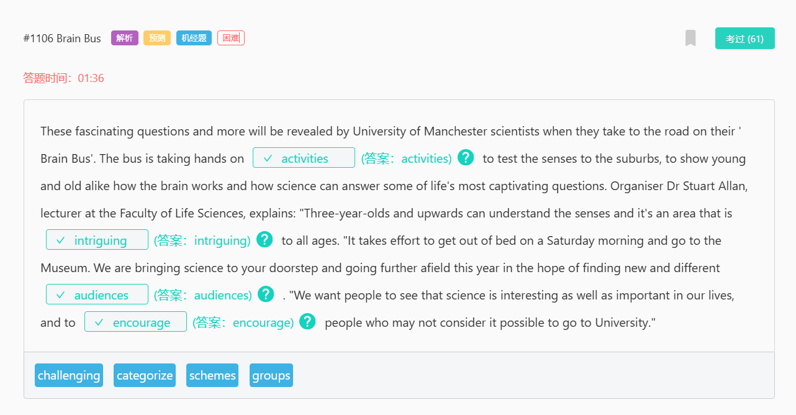
当曼彻斯特大学的科学家们乘坐他们的“大脑巴士”上路时，他们将揭示这些有趣的问题以及更多的问题。这辆巴士正在郊区开展测试感官的【活动 activities】，向年轻人和老年人展示大脑是如何工作的，以及科学如何回答生活中一些最迷人的问题。组织者、生命科学学院讲师斯图尔特·艾伦博士解释说：“三岁及以上的孩子可以理解感官，这是一个对所有年龄段的人都【有吸引力的 intriguing】领域。“周六早上起床去博物馆需要努力。今年，我们将把科学带到你的家门口，并走向更远的地方，希望找到新的和不同的【观众 audiences】。“我们希望人们看到科学在我们的生活中既有趣又重要，并【鼓励 encourage】那些可能认为不可能上大学的人。”
1105
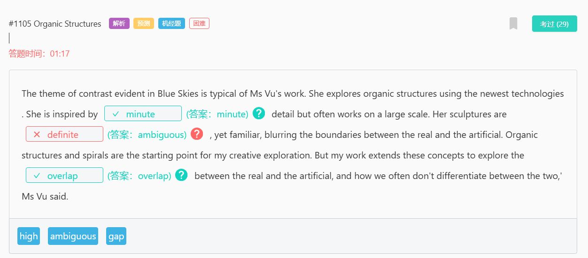
蓝天中明显的对比主题是武女士作品的典型主题。她从【微小的minute】细节中获得灵感，但经常大规模工作。她的雕塑【模棱两可ambiguous】，却又熟悉，模糊了真实与人工之间的界限。但我的工作扩展了这些概念，以探索真实和人工之间的【重叠overlap】。
1085
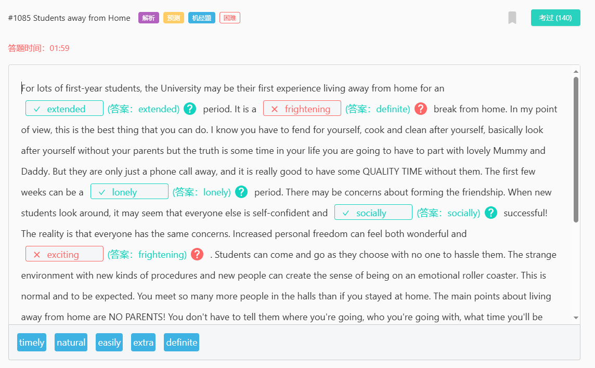
对于一年级的学生，大学是他们第一次离开家【很长一段时间 an extended period】。它是【绝对意义的 definite】离家。前几周是【孤独的 loney】阶段。当开始交新朋友，每一个人都是自信的，【社交 socially】成功！增加了个人的自由能感到美好和【惊吓 frightening】。困难增加当你的室友来自不同的【背景 backgrounds】。
1084
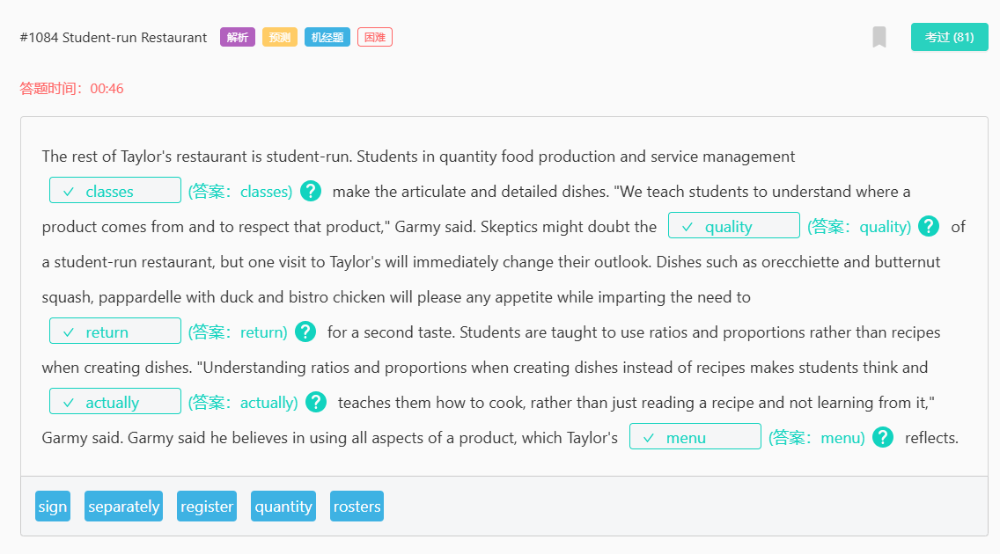
Taylor'餐厅是学生经营的，学生有定量食品生产和服务管理的课程【classes】，怀疑者怀疑质量【quality】，但只要吊起了胃口【appetite】后就会回头【return】再去第二次，学生被教做菜的比例【ratios】和份额【proportions】，是让学生思考并且实际上【actually】教他们如何烹饪，他相信，Taylor的菜单【menu】反映了【reflects】这一点。
1079
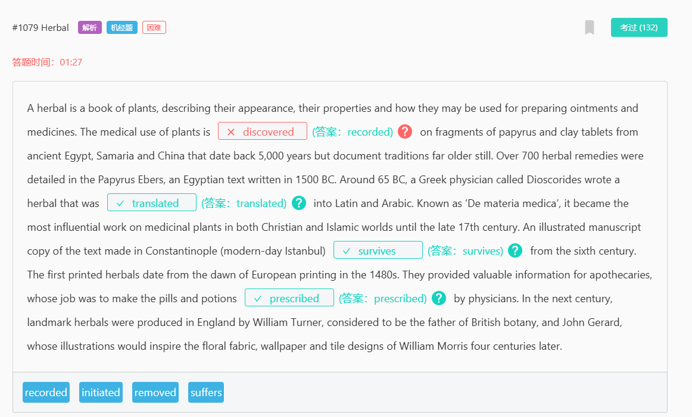
草药是一本植物的书，描述了它们的外观、特性以及如何用它们来制作药膏和药物。古埃及、撒玛利亚和中国的莎草纸和泥板碎片【记录recorded】了植物的医疗用途，这些碎片可以追溯到5000年前，但文献记载的传统要古老得多。公元前1500年的埃及文本《埃伯斯纸莎草》详细记载了700多种草药。大约公元前65年，一位名叫迪奥斯科里迪斯的希腊医生写了一种草药，并【被翻译be translated to】成拉丁语和阿拉伯语。这本书被称为《本草论》，直到17世纪晚期，它都是基督教和伊斯兰世界最具影响力的药用植物著作。在君士坦丁堡(今天的伊斯坦布尔)制作的一份有插图的抄本从六世纪【流传survives】下来。第一批印刷的草药可以追溯到14世纪80年代欧洲印刷的曙光。它们为药剂师提供了有价值的信息，药剂师的工作是制作医生【开处方prescribed】的药片和药水。在接下来的一个世纪里，被认为是英国植物学之父的威廉·特纳(William Turner)和约翰·杰拉德(John Gerard)在英国生产了具有里程碑意义的草药，他的插图为四个世纪后威廉·莫里斯(William Morris)的花织物、壁纸和瓷砖设计提供了灵感。
860
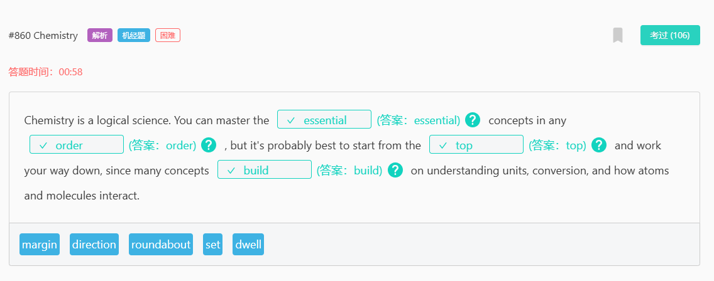
学是一门逻辑科学。你可以掌握【essential 基本的】概念按任何【in any order 顺序】，但从【top 顶部】开始并往下学习可能是最好的，因为许多概念都是基于对单位、转换以及原子和分子如何相互作用的理解来【build 构建】的。
452
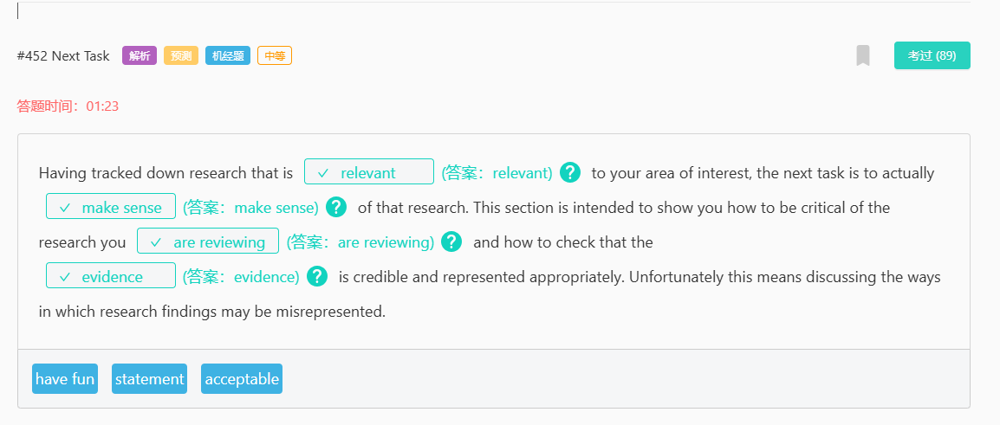
在追踪了与你感兴趣的领域【❌相关relevant】的研究之后，下一个任务是真正【弄清楚make sense of】这些研究的意义。本节旨在向您展示如何对您【正在审查are reviewing】的研究提出批评，以及如何检查【证据evidence】是否可信和是否适当。不幸的是，这意味着讨论研究结果可能被歪曲的方式。
451
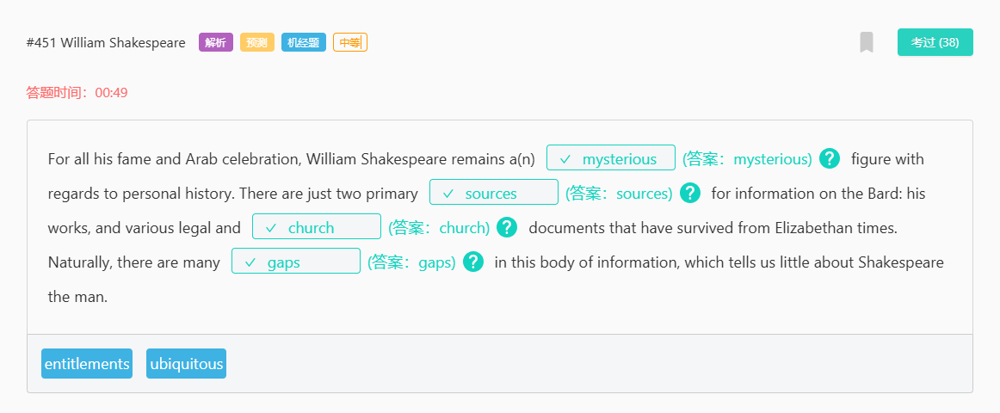
尽管威廉·莎士比亚声名鹊起，在阿拉伯人的庆祝活动中，他在个人历史上仍然是一个神秘的【mysterious】人物。关于这位吟游诗人的信息只有两个主要来源【sources】：他的作品，以及伊丽莎白时代幸存下来的各种法律和教会【church】文件。当然，在这些信息中有许多空白【gaps】，很少告诉我们莎士比亚这个人。
385
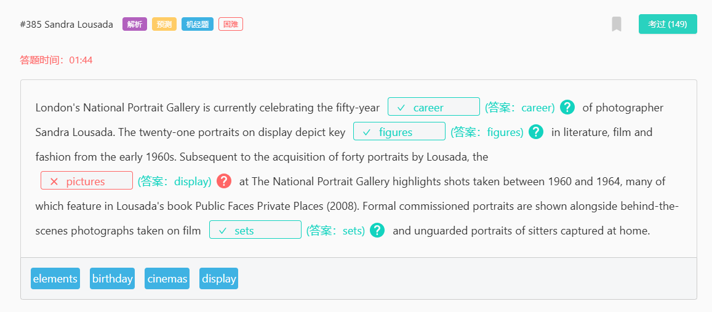
伦敦国家肖像馆目前正在庆祝卢萨达五十年的 【职业生涯 career】。展出的21幅肖像画描绘了关键【人物 figures】，【继 subsequent】收购了卢萨达的40幅肖像画之后，国家肖像馆的【展示 display】了他拍摄的照片，其中许多照片在卢萨达的《公共场所的脸》一书中有所【体现 feature】。与电影【场景 sets】中拍摄的幕后照片一起展出。
342
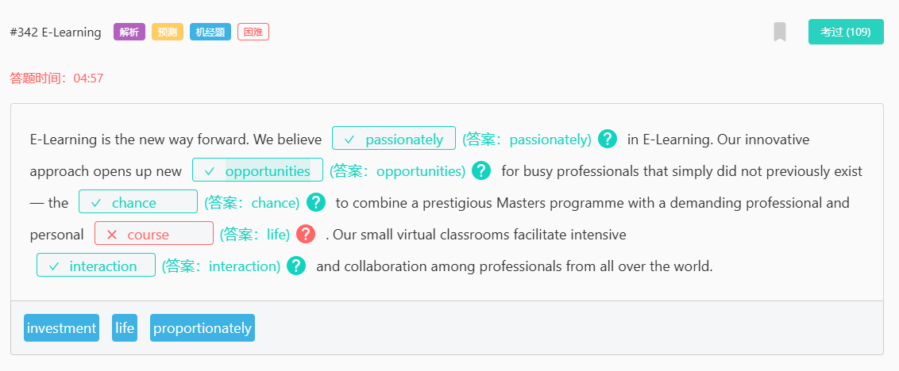
我们对电子学习充满【热情 passionately】。我们的创新方法为专业人士提供了以前不存在的【机会opportunities】,将著名的硕士课程与苛刻的工作和【生活life】相结合的【机会chance】。我们的小型虚拟教室促进了来自世界各地的专业人员之间的【密切互动 intensive interaction】和协作。
332
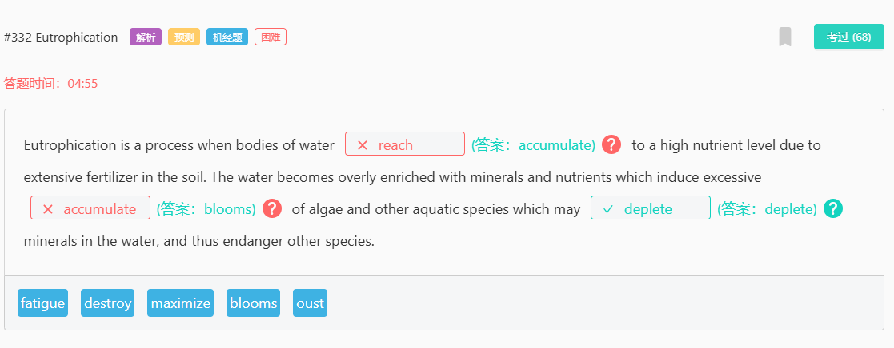
富营养化是水体由于土壤中大量施肥而【accumulate to 积累到】高营养水平的过程。水中的矿物质和营养物质变得过度丰富，导致藻类和其他水生物种【excessive blooms 过度繁殖】，这可能会【deplete 10456 minerals 耗尽矿物质】水中的，从而危及其他物种。
323
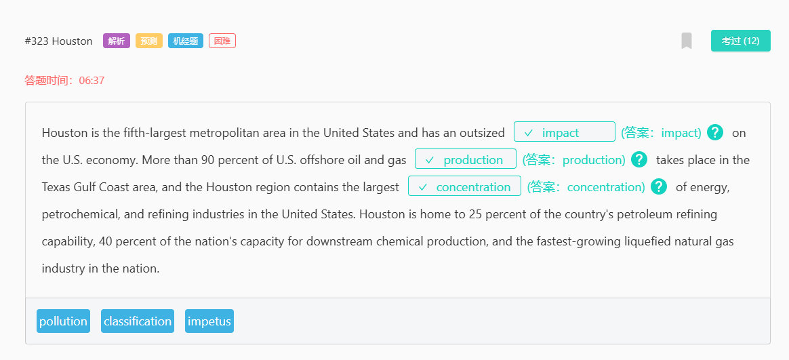
休斯顿是美国第五大城市，对美国的经济有特大【影响 impact】。90% 的近海石油和天然气【生产 production】都在 得克萨斯州 沿岸地区进行，休斯顿地区是美国能源，石化和炼油工业最【集中的 concentration 】地区。
316
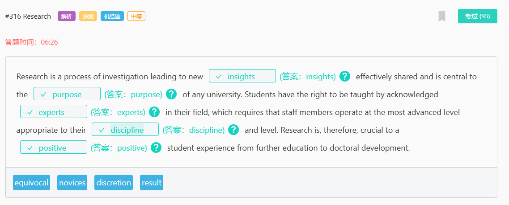
研究是一个调查的过程，导致新的【见解insights】有效地分享，是任何大学的核心【目的purpose】。学生有权在他们的领域被公认的【专家experts】教授，这要求工作人员在适合他们的【学科discipline】和水平的最先进的水平上操作。因此，研究对于学生从继续教育到博士发展的【积极的positive】经历至关重要。
303
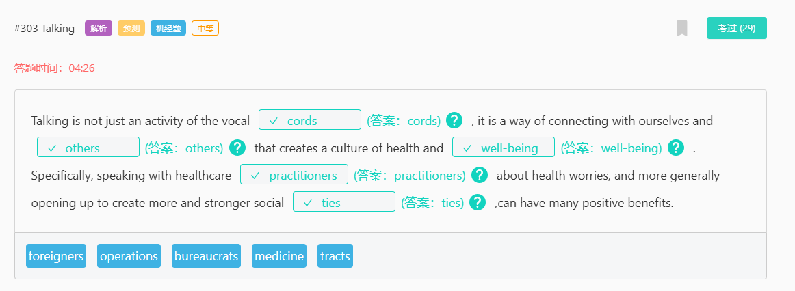
说话不仅仅是【vocal cords 声带】的一种活动，它也是一种与【我们自己和他人ourselves and others】建立联系的方式，从而创造了一种健康和【幸福 well-being】的文化。具体来说，与【医疗保健从业者healthcare practitioners】谈论健康担忧，以及更广泛地说，开放以创造更多和更强大的【社会联系 social ties】可以有许多积极的好处。
300
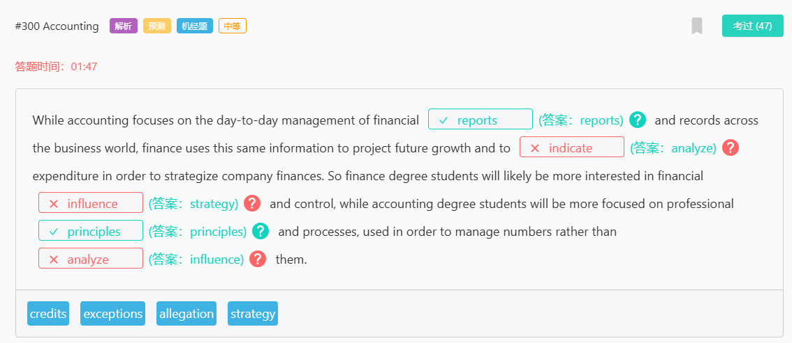
会计侧重于财务的日常管理【reports 报告】和记录 records在整个商业世界中，财务部门使用相同的信息来预测未来的增长，并to【analyze 分析】支出，以便制定公司财务战略。因此，金融学位学生可能会对金融更感兴趣【strategy 战略】和控制control，而会计学位的学生将更专注于专业【principles 原则】和processes流程，用于管理数字而不是【influence 影响】他们。
299
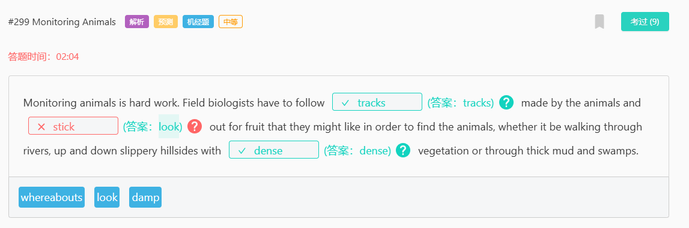
野外生物学家必须沿着动物留下的【足迹 tracks】并且【找出 look out】他们可能喜欢的果实以便找到这些动物，无论是在河流中行走，还是在草木【茂密的 dense】湿滑山坡上走来走去
273
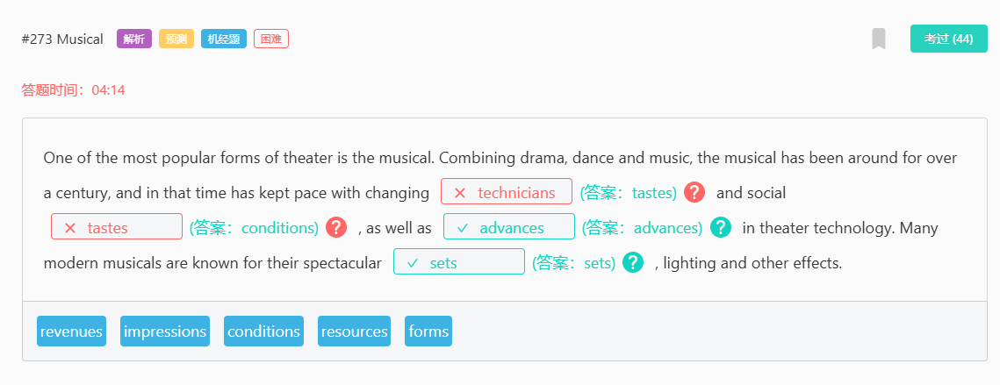
音乐剧是最流行的戏剧形式之一。音乐剧集戏剧，舞蹈和音乐于一身，已经有一个多世纪的历史了，在这段时间里，音乐剧随着人们【不断变化的口味changing tastes】 和【社会条件social conditions】的变化，以及【戏剧技术的进步advances in theater technology】而不断发展。许多现代音乐剧以其【壮观的布景spectacular sets】 ，灯光和其他效果而闻名。
270
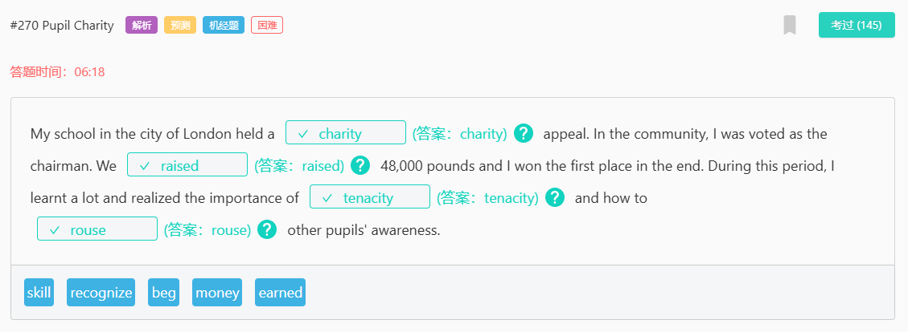
我在伦敦金融城的学校举行了一次【慈善charity】呼吁。我们【筹集raised】了48,000英镑，我意识到【坚韧tenacity】的重要性以及如何【唤醒rouse】其他学生的意识。
264
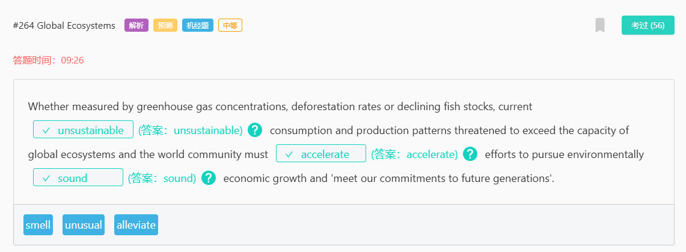
目前【unsustainable不可持续的】消费和生产模式都有可能超过全球生态系统的能力，国际社会必须【accelerate加快】努力，追求【sound无害】环境的经济增长，并“履行我们对子孙后代的承诺”。

189
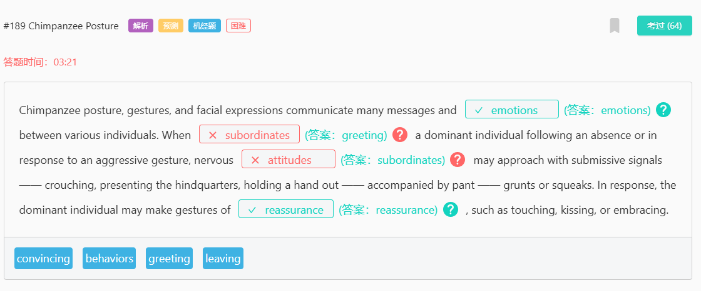
猩猩很容易emo【emotions】，当打招呼时【greeting】它会和sb【subordinate】一样，别人也只好顺着他【reassurance】

黑猩猩的姿势、手势和面部表情在不同的个体之间传递着许多信息和【情感 emotions】。当【问候 greeting】一个占主导地位的大猩猩却被无视或者是回应挑战的姿势时, 紧张的【低等级 subordinates】大猩猩可能会向它发出顺从的信号蹲下, 露出臀部, 伸出手来, 伴随着喘息声或吱吱声。

作为回应，占主导地位的个体可能会做出【reassurance 安慰】的手势，比如触摸、亲吻或拥抱。

252
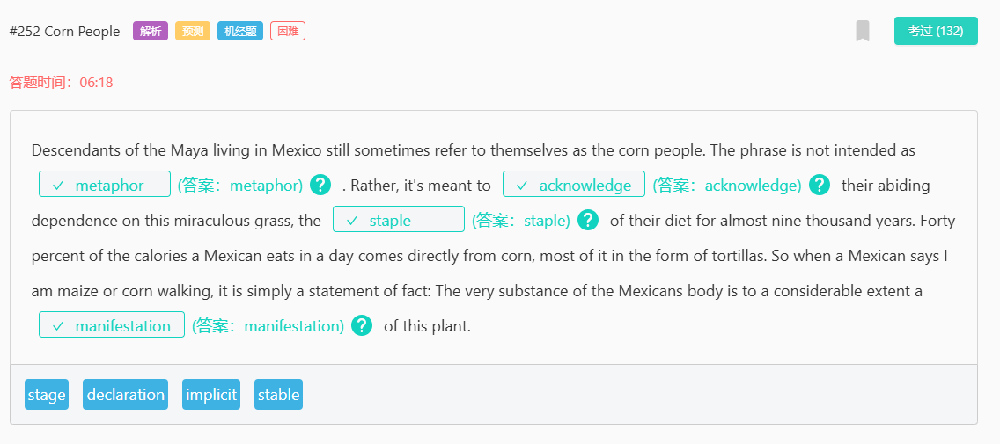
生活在墨西哥的玛雅后裔有时仍然自称为玉米人。这个短语不是用来比喻的【metaphor】。相反，这意味着承认【acknowledge】这是他们近九千年来的主要【staple】食物。墨西哥人身体的本质在相当大的程度上是这种植物的表现【manifestation】。

248
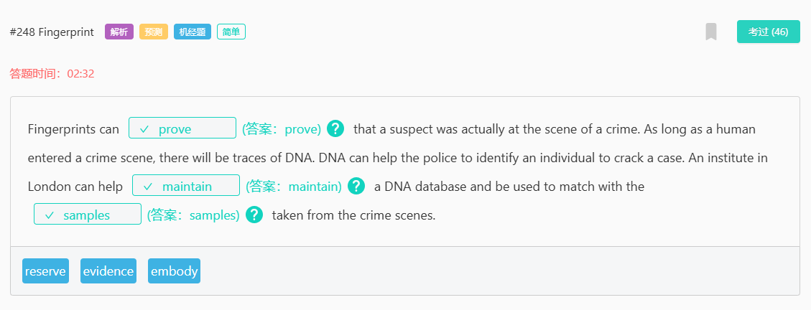
指纹可以【证明 prove】嫌疑犯确实在犯罪现场.只要有人进入犯罪现场，就会有DNA的痕迹。DNA可以帮助【识别 identify】要破案的个人.伦敦的一个研究所可以帮助help【保存 preserve】DNA/help【保存maintain】a DNA database，并用于与从犯罪现场采集的【样本samples】进行比对.

244
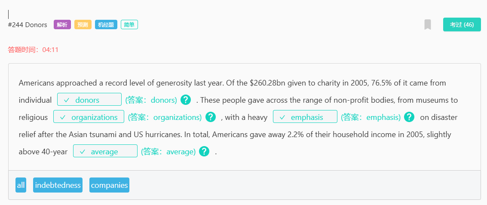
在2005年捐赠给慈善机构的2602.8亿美元中，76.5%来自个人【捐赠者 donors】。这些人通过从博物馆到宗教【组织 organizations】的各种非营利机构进行了捐赠，【重点是 emphasis on】在亚洲海啸和美国飓风之后的救灾工作。2005年，美国人总共捐出了家庭收入的2.2%，略高于40年来2.1%的【平均 average】水平。

230
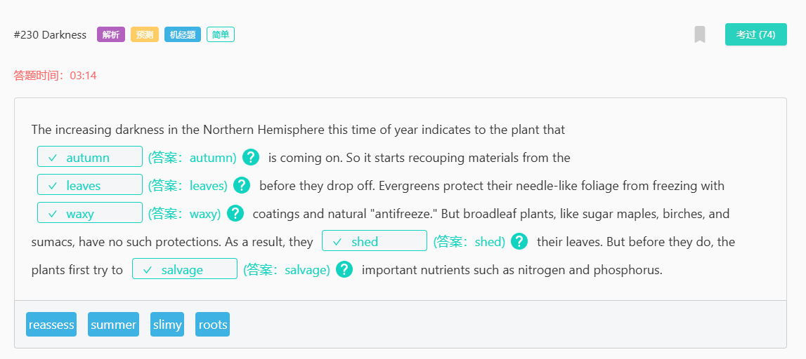
每年的这个时候，北半球越来越暗，这对植物来说意味着【秋天即将来临 fall is coming on】。所以它在树叶掉落之前就开始从【树叶 leaves】中回收材料。常青树用 【蜡质涂层 waxy coatings】和天然的“防冻剂”保护针叶免受冻害。但是阔叶植物，如糖枫，桦木和相思，没有这样的保护。结果，他们【落叶shed】了。但在此之前，这些植物首先要设法 【抢救 salvage】氮和磷等重要营养物质。
90
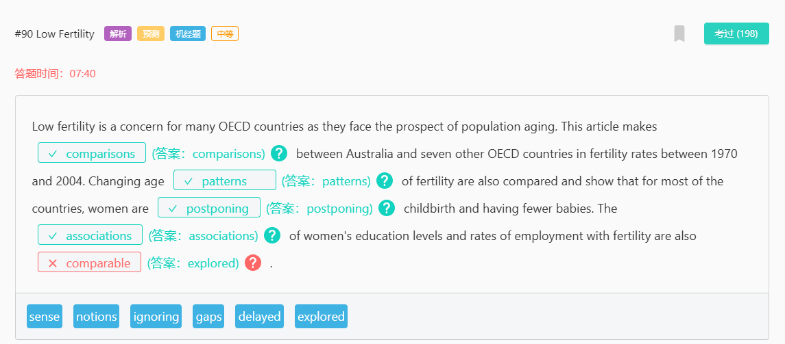
低生育率是许多经合组织国家关注的问题，因为它们面临着人口老龄化的前景。本文【comparisons比较】了1970年至2004年间澳大利亚与其他七个经合组织国家的生育率。对生育年龄【patterns模式】的变化也进行了比较，结果表明，对大多数国家来说，妇女【postponing推迟】生育，生的孩子更少。妇女的教育水平和就业率与生育率之间的【associations关系】还被【explored探讨了】。
200
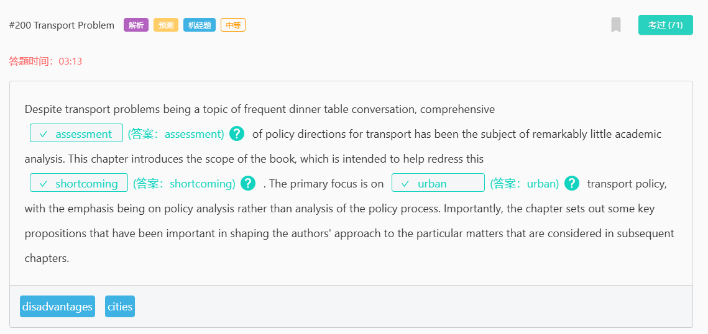
尽管交通问题是餐桌上经常讨论的话题，但对交通政策方向的全面【评估assessment】却极少受到学术分析的关注。本章介绍了该书的范围，旨在帮助纠正这一【缺陷shortcoming】。主要重点是【城市urban 】交通政策，重点是政策分析，而不是政策进程分析。重要的是，这一章提出了一些重要的主张，这些主张对制定作者处理随后各章所审议的具体问题的方法十分重要。

194
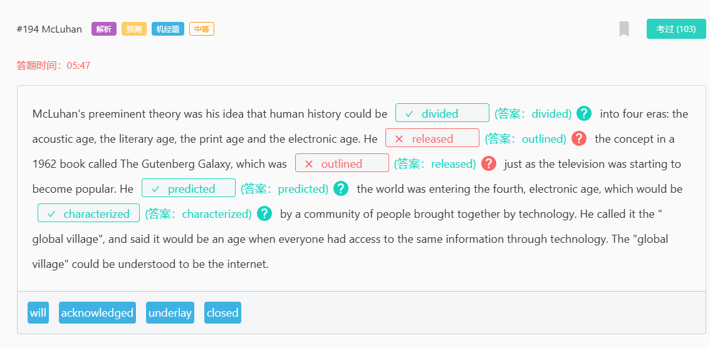
麦克卢汉的卓越理论是他认为人类历史可以【分为divided】四个时代：声学时代，文学时代，印刷时代和电子时代。他在1962年出版的一本名为“古腾堡星系”的书中【概述outlined】了这一概念，该书是在电视开始流行的时候【发行released】的。他【预测 predicted】，世界将进入第四个电子时代，其特点(characterized）将是一个由技术聚集在一起的人组成的社会。他称其为“地球村”，并说这将是一个人人都能通过技术获得相同信息的时代，“地球村”可以理解为互联网。

136
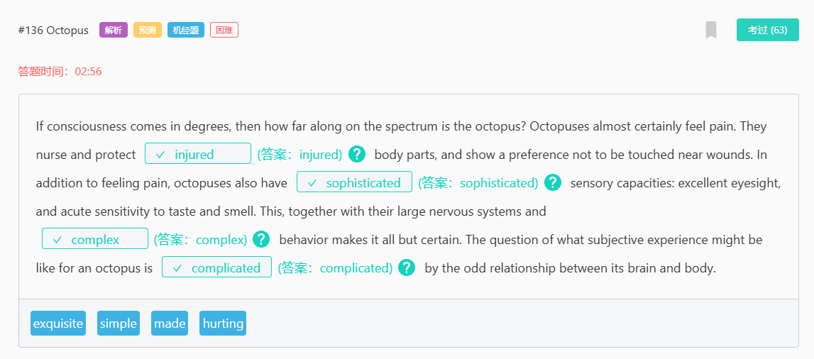
如果意识以度为单位，那么章鱼在光谱上有多远？章鱼几乎肯定会感到疼痛。他们护理和保护【受伤 injured】的身体部位，并体现出不触碰靠近伤口部位的倾向。章鱼除了能感觉到疼痛外，还具有复杂的感官能力【sophisticated sensory capabilities】:视力极佳，对味觉和嗅觉非常敏感。这一点，再加上它们庞大的神经系统和复杂的行为【complex behavior】。关于章鱼的主观体验可能是什么样的问题，由于其大脑与身体之间奇特的关系relationship而变得复杂【complicated】。

164
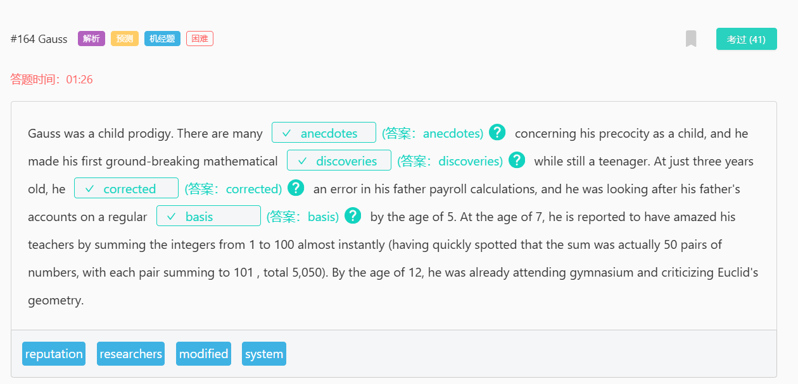
高斯是个神童。有很多关于他早熟的【轶事 anecdotes】，他在十几岁的时候就有了第一次突破性的数学【发现 discoveries】。三岁时，他【纠正了 corrected】父亲工资计算中的一个错误，5岁时，他就开始【定期 on a regular basis】管理父亲的账目。据报道，7岁时，他几乎立刻就把整数从1加到100，这让他的老师们大吃一惊（他很快发现，这个和实际上是50对数字，每对加到101，总共是5050）。12岁的时候，他就已经在体育馆学习了，并开始批评欧几里得的几何学。

143
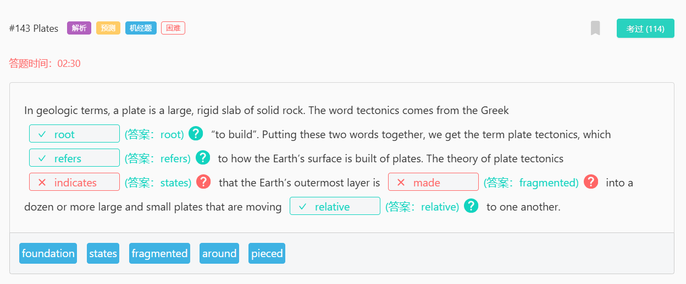
从地质学角度来说，板块是由坚硬的岩石组成的大而坚硬的板块。构造学 tectonics 来自希腊【词根root】“建筑 to build”。把这两个词放在一起，我们得到 板块构造 这个术语。他【指的 refer to】是地球的表面是由板块构成。板块构造的理论【阐述 states v.陈述 n.州，国家】地球外层被【分割 fragmented】成许多大大小小碎片，他们彼此【相对 relative to】运动。
146
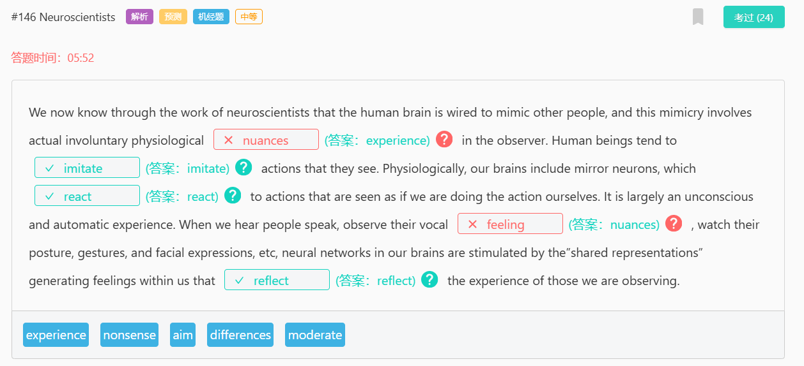
FIBRW 同题同空，那边题目叫 Human Brain。

通过神经科学家的研究，我们现在知道，人类的大脑会模仿他人，而这种模仿涉及到观察者实际不自觉的【生理体验 physiological experience】。人类倾向于【模仿 imitate】他们看到的行为。从生理学上讲，我们的大脑包括镜像神经元，它们对我们自己所做的动作【react 做出反应】。这在很大程度上是一种无意识和自动的体验。当我们听到别人说话，观察他们的声音【细微差别 nuances】，观察他们的姿势、手势和面部表情等，我们大脑中的神经网络会受到“共享表征”的刺激，在我们内部产生感受【反映 reflect】我们正在观察的人的经验。
128
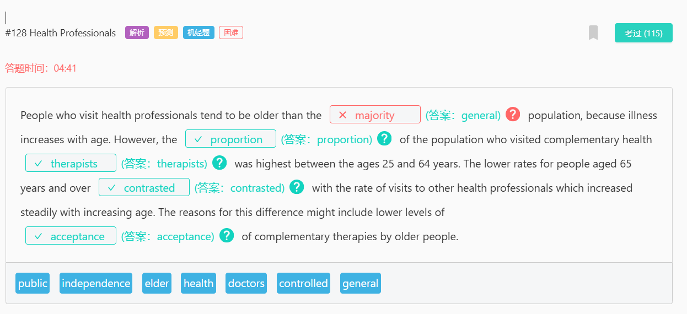
访问健康专业人士的人往往比【一般的 general】人群年龄要大，因为疾病的发生率会随着年龄的增长而增加。然而，在25至64岁之间的人群中，访问补充健康【治疗师therapists】的【比例proportion】最高。65岁及以上人群的较低比例【相比较contrasted】其他健康专业人士的访问率形成了鲜明对比，后者随着年龄的增长而稳步上升。造成这种差异的原因可能包括老年人对补充疗法的【接受度 acceptance】较低。另外，老年人可能有着与年轻人不同的治疗优先级，因为他们的健康状况通常较差，同时收入也普遍较低。
127
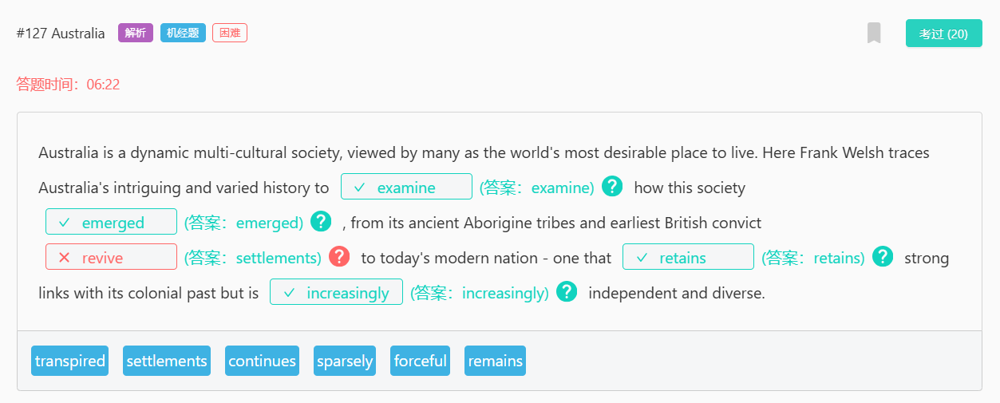
澳大利亚是一个充满活力的多元文化社会，被许多人视为世界上最理想的居住地。在这里，弗兰克·威尔士追溯了澳大利亚有趣而多样的历史，【考察examine】这个社会是如何【形成的emerged】，从古老的土著部落和最早的英国罪犯【定居点settlements】到今天的现代国家——一个与殖民历史【保持着retains】紧密联系，但【日益increasingly】独立和多样化的国家
95
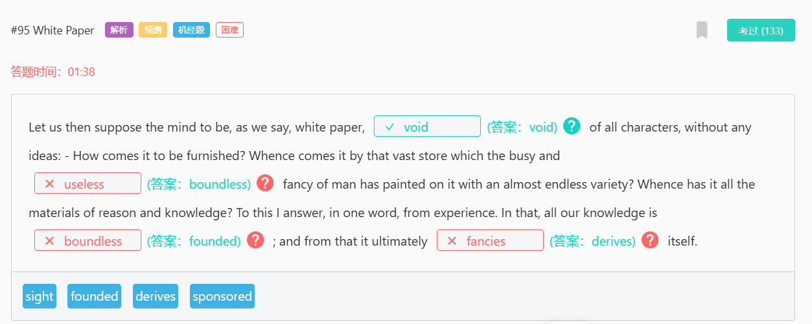
让我们假设心灵就像一张白纸，没有任何特征【void character】，也没有任何观念：那么，它是如何被填充的呢？那幅繁忙而【boundless无边无际】的人类想象所绘制的几乎无穷无尽的画面，又是从何而来的呢？它所有推理和知识的素材，又是从哪里获取的呢？对此，我用一个词回答：经验。我们的一切知识都【founded被建立】在经验之上，并最终【derives from来源于】经验本身。
93
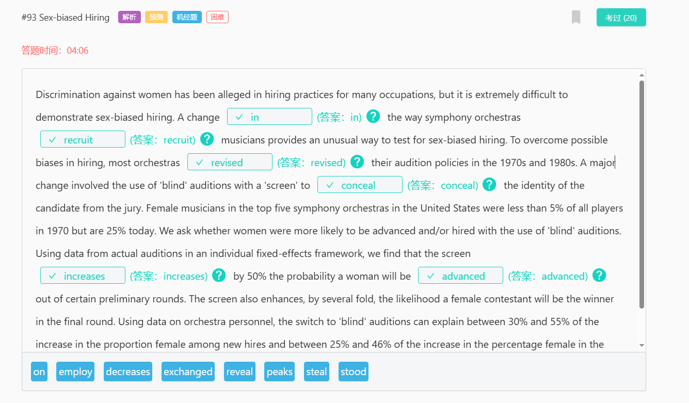
FIBRW 同题，那边的标题叫 Discrimination against Women，两边空不太一样，合在一起如下：

许多职业的招聘实践中都有歧视妇女的指控，但很难证明有性别偏见的招聘。交响乐团招聘音乐家方式的【改变 a change in the way】为测试性别偏见【招聘 recruit】提供了一种不同寻常的方式。为了克服招聘中可能存在的偏见，大多数管弦乐队在20世纪70年代和80年代【修改了 revised】试听政策。一个主要的变化是使用带有“屏幕”的“盲”试镜来向陪审团【隐瞒 to conceal】候选人的身份。1970年，美国五大交响乐团中的女性音乐家不到所有演奏者的5%，但今天却是25%。我们询问女性是否更有可能通过“盲试”获得晋升和/或聘用。使用个人固定效果框架中的实际试镜数据，我们发现屏幕【增加了 increases】50%的女性从某些预赛中【晋级 will be advanced】的概率。屏幕还增加了几倍的可能性，女性选手将在最后一轮获胜。使用管弦乐队人员的数据，转向“盲”试镜可以解释自1970年以来新员工中女性比例【增加 increase】30%至55%，以及管弦乐队中女性比例增加25%至46%。
80
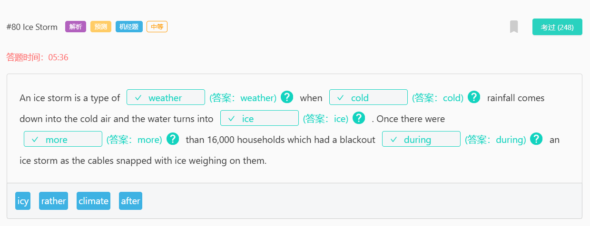
冰暴是一种【天气weather✅】，当【寒冷cold】的降雨进入冷空气，水变成【冰ice✅】。曾经有16000 【多more✅】户家庭在冰暴 【期间during】停电blackout（主谓宾都有所以选择一个介词），因为电缆被冰压断了。
96
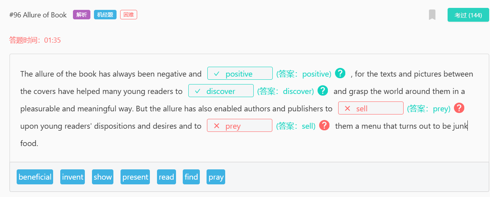
这本书的魅力一直是消极和【积极的 positive】，因为封面之间的文字和图片帮助许多年轻读者【发现 discover】和掌握他们周围的世界以一种愉快和有意义的方式。但这种诱惑也使作者和出版商能够【掠夺 prey】年轻读者的性格和欲望，向他们【出售 sell】一份最终被证明是垃圾食品的菜单。

102
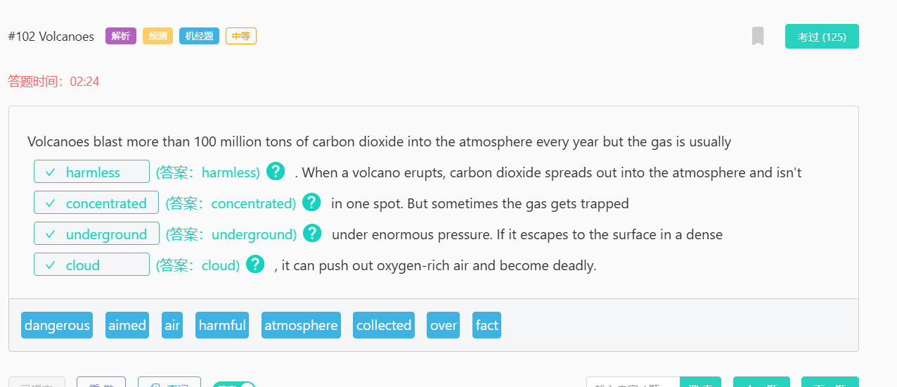
火山每年向大气中喷发超过1亿吨的二氧化碳，但这种气体通常是【harmless 无害的】。当火山爆发时，二氧化碳会散布到大气中，并不会【concentrated 集中在】一个地方。但有时这种气体会在巨大的压力下被【underground 困在地下】。如果它以密集的【cloud 云】形式逸出到地表，它可以排挤富含氧气的空气，变得致命。

