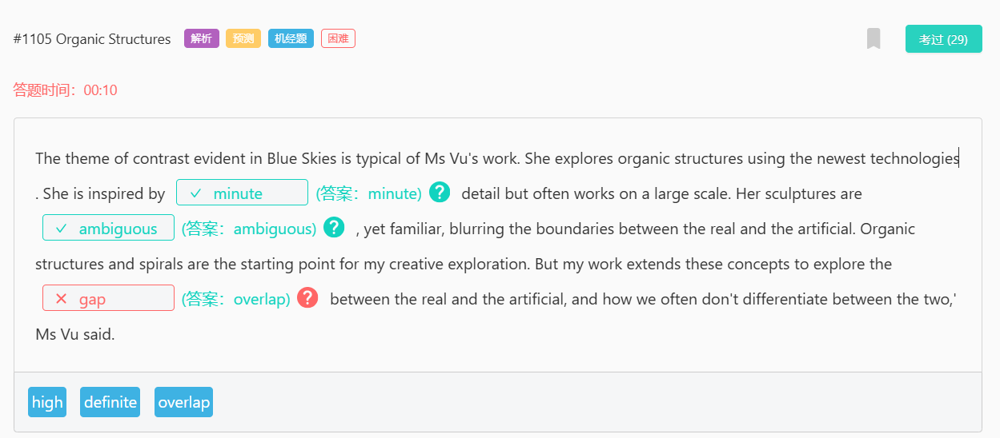

1105

蓝天中明显的对比主题是武女士作品的典型主题。她利用最新技术探索有机结构。她从微小的【细节 minute】中获得灵感，但经常大规模工作。她的雕塑【模棱两可 ambiguous】，却又熟悉，模糊了真实与人工之间的界限。有机结构和螺旋是我创造性探索的起点。但我的工作扩展了这些概念，以探索真实和人工之间的【重叠 overlap】，以及我们如何经常无法区分两者，”Vu女士说。

300

当会计关注于整个商业世界的财务【报告 reports】和记录的日常管理时，财务使用同样的信息来预测未来的增长和【分析 analyze】支出，以制定公司财务战略。因此，金融学位的学生可能对财务【战略 strategy】和控制更感兴趣，而会计学位的学生将更专注于专业原则和过程，用于管理数字，而不是【影响 influence】数字。

194

麦克卢汉的卓越理论是他认为人类历史可以【分为divided】四个时代：声学时代，文学时代，印刷时代和电子时代。他在1962年出版的一本名为“古腾堡星系”的书中【概述outlined】了这一概念，该书是在电视开始流行的时候【发行released】的。他【预测 predicted】，世界将进入第四个电子时代，其特点(characterized）将是一个由技术聚集在一起的人组成的社会。他称其为“地球村”，并说这将是一个人人都能通过技术获得相同信息的时代，“地球村”可以理解为互联网。

143

从地质学角度来说，板块是由坚硬的岩石组成的大而坚硬的板块。构造学 tectonics 来自希腊【词根root】“建筑 to build”。把这两个词放在一起，我们得到 板块构造 这个术语。他【指的 refer to】是地球的表面是由板块构成。板块构造的理论【阐述 states v.陈述 n.州，国家】地球外层被【分割 fragmented】成许多大大小小碎片，他们彼此【相对 relative to】运动。

128

访问健康专业人士的人往往比【一般的 general】人群年龄要大，因为疾病的发生率会随着年龄的增长而增加。然而，在25至64岁之间的人群中，访问补充健康【治疗师therapists】的【比例proportion】最高。65岁及以上人群的较低比例【相比较contrasted】其他健康专业人士的访问率形成了鲜明对比，后者随着年龄的增长而稳步上升。造成这种差异的原因可能包括老年人对补充疗法的【接受度 acceptance】较低。另外，老年人可能有着与年轻人不同的治疗优先级，因为他们的健康状况通常较差，同时收入也普遍较低。

96

积极的一面（positive）：书中的文字和图片帮助许多年轻读者发现（discover）和理解周围的世界，使他们以愉悦且有意义的方式学习和成长。
消极的一面：这种吸引力也使得一些作者和出版商能够利用（prey upon）年轻读者的天性和欲望，并推销（sell）给他们一些实际上是“垃圾食品”的内容（意指低质量或无益的书籍）。