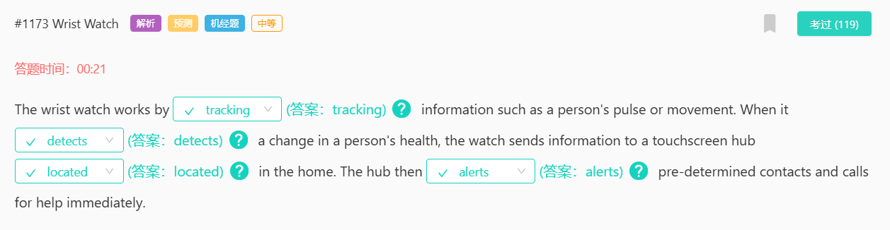
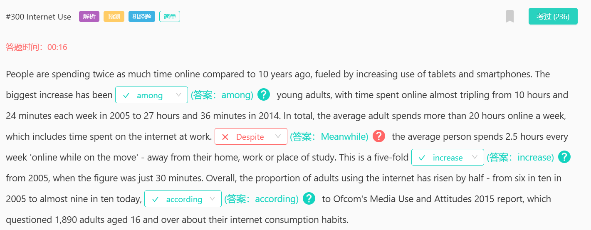
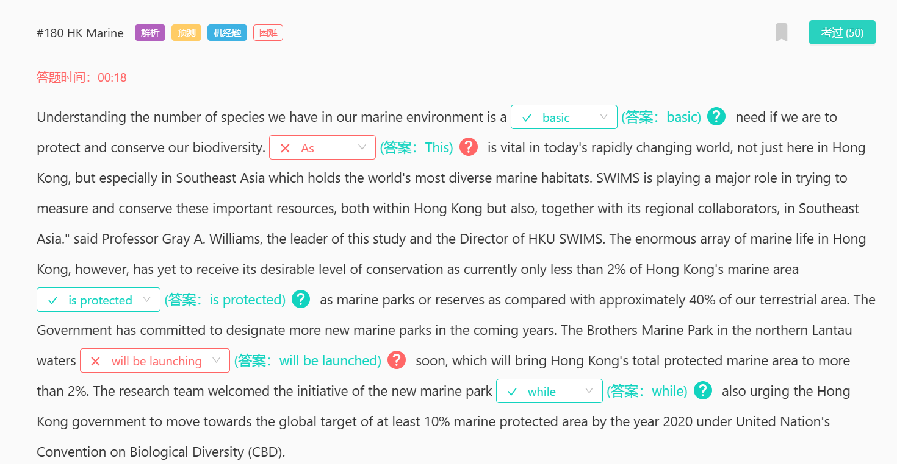
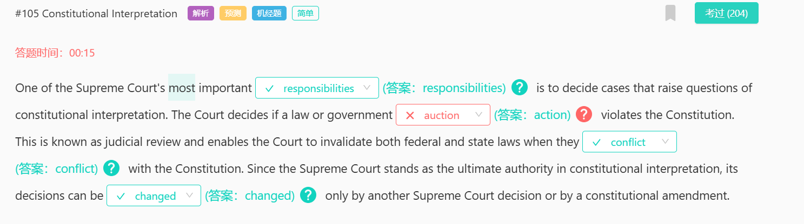
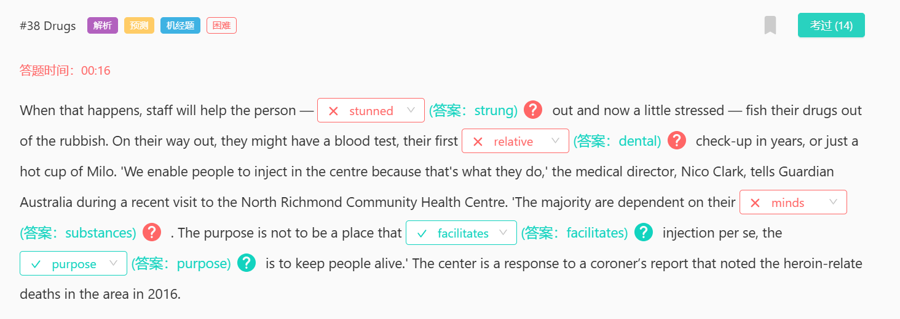
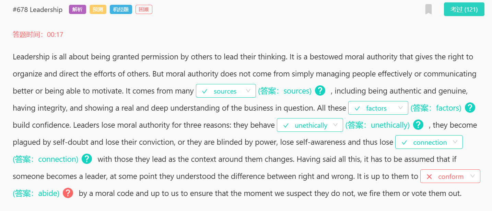

#1231 Shanghai International Studies University
disarmed
解除武装

#27 Looking Trustworthy
in truth
the implication is that
correlate
overlap
cooperate
diverge

#18 Wholeness of Thought
wholeness
There is little difficulty in
innumerable
cue
intrude 闯入；侵入；打扰；扰乱
cut in 打断
tone 音调、语气或者情感色彩
tune 音乐曲调

#110 When to Revise?
effort 努力
concern 关心；忧虑；涉及；影响；牵涉；与…有关
put out 熄灭，发布
put off 推迟

#90 Great Engineers
conviction 坚信；深信；定罪；判罪
solution to ……的解决方案
arduous 12805 艰苦的；艰难的

#78 Native Species in North America
be native to 原产于……；源于……的
residential 适合居住的；住宅的
champion 冠军；捍卫者；拥护者；冠军；捍卫者；拥护者；

#95 DNA Sequence
mammoth 11288 庞然大物；【动】猛玛(象) 
speculation 猜测，推测，推断
worship 崇拜或尊敬
behemoth 13657 [adj] 巨大的
contradict 反驳，否认；相抵触，相矛盾
censure 15975 严厉批评，谴责
molecular 分子的
driving force 推动力

#68 MBA Programs
unravel
the majority of
criteria 
standard 

#99 Women in Labour Force
attendance 参加或出席，参加某一特定活动或事件
participation 参与或参加
worship 崇拜

#736 Amazon Basin
division 分割、部门
diversification 多元化、多样化经营
diversify 使多样化
dump 倾倒、丢弃
reservoir 水库，蓄水池；储藏，蓄积
territory  领地、领域、境内
run counter to 违反；与……背道而驰
myth 广为流传但并非事实的故事或观念
origin 起源

#734 Guilt and Responsibility
capability 能力；才能；性能；容量
culpability 可责；有罪；有罪性
prosecution 诉讼；原告；实施；从事
persecution 困扰；苛求；迫害；残害
adjudication 裁决；裁定；裁判
characterize 以...为特征
legitimacy 合法性、正当性

#728 Computer
state of mind 心态
shape or form 以任何方式
basis 基础；基准；基点；方式
pedagogical 11393教育学的；教师的
subject to 受到...的限制或条件
attain 达到，实现
obtain 获得，得到
retain 保持，保留；保存，储存
nor 也不（通常与 neither 连用）； （用于肯定动词前，表示同意刚提及的否定命题）也不
fluctuate 13035

#725 Sigmund Freud
fluctuate 13035
v.
波动，起伏不定；使波动，使动摇

#724 Population Change
rear 抚养
slander 诽谤
designate /'dezɪɡneɪt/  指定；指派；
permanent  永久性；一直；坚持；不变的

#722 Interdisciplinary Centre
overlap [科技] 重叠
deluded 18196 欺骗；哄骗
advent 8282 出现，到来，问世
lightly 轻轻地；轻率地；轻柔地；轻微地
slightly 稍微，轻微地；（指某人身材）纤弱地，瘦小地

#715 Snails
在这个句子中，"as" 是用来表述在某个事件发生的同时，另一个事件也在进行。其实，“as”也可以被理解为“while”，意思是“当……时候”。

#713 SpaceX
mockup
[网络] 样机；生产模式；手板制作
orbit
是指一颗卫星或者行星等天体围绕其中心天体
track
通常用于描述地面或海面的路径
circulation
液体、气体的循环，例如血液循环或空气循环
trajectory
7885
一个物体在空间中移动的路径
contract
合同
case
用于法律或研究的情况
bid
初步的竞标阶段
retired
退役
fixed
固定或者修复

#708 History Books
considerable
[adj] 相当多（或大、重要等）的
[网络] 相当大的；值得考虑的；重要的
take pride of place
居于首要或突出的位置

#707 Platypus
cursory
[adj] 粗略的；仓促的
thereby
adv.
因此，从而
hereby
adv.
以此，特此
whereby
adv.
凭此，借以
conj.
凭此，借以，与……一致；<非正式>在……的情况下，处于……的位置

#687 Distance Learning
For those who are struggling to

#683 Film
raze
英 / reɪz / 美 / reɪz /
vt.
夷为平地；破坏；消除；拆毁

#682 Foreign Policy
element
[n] 要素；基本部分；典型部分
[n] 少量；有点；有些
exertion
英
/ ɪɡˈzɜːʃn /
美
/ ɪɡˈzɜːrʃn /
n.
费力，努力；运用，行使
formative
英
/ ˈfɔːmətɪv /
美
/ ˈfɔːrmətɪv /
形成阶段的
tranquility
15547
英
/ træŋˈkwɪləti /
美
/ træŋˈkwɪləti /
n.
宁静，安宁
allegiance
7355
allegiance
n.
（对政党、宗教、统治者的）忠诚，效忠，拥戴
adjoining
12294
adhere
6620
v.
黏附，附着；遵守，遵循（规定或协议）；拥护，持有（观点或信仰）
sovereign
8196
英
/ ˈsɒvrɪn /
美
/ ˈsɑːvrɪn /
n.
君主，元首；
sovereignty
4907
英
/ ˈsɒvrənti /
美
/ ˈsɑːvrənti /
n.
主权，最高统治权，最高权威；独立自主；主权国家，自治州
delineate
10812
英
/ dɪˈlɪnieɪt /
美
/ dɪˈlɪnieɪt /
v.
（详细地）描述，解释；标明

#678 Leadership
bestow
英
/ bɪˈstəʊ /
美
/ bɪˈstoʊ /
vt.
赠予，授予（财产、权力或荣誉）
authentic
5061
英
/ ɔːˈθentɪk /
美
/ ɔːˈθentɪk /
adj.
原作的，真迹的；传统的，正宗的；逼真的，仿真的；真实的，可靠的
genuine
[adj] 真的；名副其实的；真诚的；诚实的
integrity
英
/ ɪnˈteɡrəti /
美
/ ɪnˈteɡrəti /
n.
正直，诚实；完整，完全
outrageous
6166
英
/ aʊtˈreɪdʒəs /
美
/ aʊtˈreɪdʒəs /
adj.
骇人的，无法容忍的；反常的，令人惊讶的；极其夸张的，不可能的
plague
6742
英
/ pleɪɡ /
美
/ pleɪɡ /
n.
瘟疫，传染病；鼠疫
v.
困扰，折磨；烦扰，纠缠；使得灾祸
convection
16802
英
/ kənˈvekʃn /
美
/ kənˈvekʃ(ə)n /
n.
〔气体、液体的〕对流；传送
contempt
6373
英
/ kənˈtempt /
美
/ kənˈtempt /
n.
轻视，蔑视；忽视，不顾；藐视法庭
abide
abide by后面通常接laws、rules或者principles
8616
英
/ əˈbaɪd /
美
/ əˈbaɪd /
v.
遵守（abide by）；容忍，忍受；
conform
7067
英
/ kənˈfɔːm /
美
/ kənˈfɔːrm /
v.
遵守，符合；顺从，随潮流；一致，相吻合

#670 Student-run Restaurant
quality 质量
quantity 数量
qualification 资格
quantification 量化
relatively
英
/ ˈrelətɪvli /
美
/ ˈrelətɪvli /
adv.
相当地，相对地
cuisine 
6498
英
/ kwɪˈziːn /
美
/ kwɪˈziːn /
指的是某一地区或国家的所有菜肴，
utensil
13019
英
/ juːˈtens(ə)l /
美
/ juːˈtens(ə)l /
指的是烹饪工具

#665 Ironbridge Gorge
overturned 6822 the fascinating image
fuse a 5km width of 融合了5公里宽的
incorporate a 5km length of 包含一个5公里长的
add a finishing touch to 添加画龙点睛之笔
conventional woods and stuff 传统的木材和材料

#644 Emperor Penguin
icon
4404
英
/ ˈaɪkɒn /
美
/ ˈaɪkɑːn /
n.
图标；
iconic
12673
英
/ aɪˈkɒnɪk /
美
/ aɪˈkɑːnɪk /
[adj] 符号的；图标的；图符的；偶像的
brighten
v.
使明亮，使鲜艳；开颜，高兴；（使）好转，
brighten up 让某物变得更加明亮或更加生动
fledge
13167
英
/ fledʒ /
美
/ fledʒ /
vi.
长羽毛

#629 Corn People
staple
7118
英
/ ˈsteɪp(ə)l /
美
/ ˈsteɪp(ə)l /
n.
（某国的）主要产品，支柱产品；主食；主要部份
v.
用订书钉订住；把……分级
manifestation
6686
英
/ ˌmænɪfeˈsteɪʃ(ə)n /
美
/ ˌmænɪfəˈsteɪʃ(ə)n /
简明柯林斯
n.
表现，显现；表现形式；
to a considerable extent
相当程度上：表示在很大程度上，用于强调某事物的影响或重要性

#606 Zero-gravity
deteriorate
7724
英
/ dɪˈtɪəriəreɪt /
美
/ dɪˈtɪriəreɪt /
v.
恶化，变坏

#618 Sales Jobs
hinge
8987
英
/ hɪndʒ /
美
/ hɪndʒ /
n.
铰链，合叶；枢纽，关键；铰合部
v.
给（某物）装铰链
hinge on 
取决于：由（某事物）决定或确定：依赖于（某事物）

#613 EE and AVG
sedentary
14228
英
/ ˈsed(ə)ntri /
美
/ ˈsed(ə)nteri /
adj.
（人）惯于久坐不动的；
engaged 忙于、雇佣、参加、从事
moderate-to-vigorous 中等到剧烈
whilst <英，正式>当……的时候；与…同时；然而，但是；虽然，尽管；

#581 Sales Activities
addresses
处理、讨论
stipulate
11227
英
/ ˈstɪpjuleɪt /
美
/ ˈstɪpjuleɪt /
v.
规定，明确要求

#579 Settlement
protrude
12126
英
/ prəˈtruːd /
美
/ proʊˈtruːd /
v.
伸出，突出；（动物）使（身体部位）突出
sentiment
4092
英
/ ˈsentɪmənt /
美
/ ˈsentɪmənt /
n.
观点，看法，情绪；多愁善感，伤感情绪

#576 Teen Writing
present
出现；提出；显示；提交

#559 Definition of Country
single occupancy
只有一个人居住的住宅
denounce
6070
英
/ dɪˈnaʊns /
美
/ dɪˈnaʊns /
v.
谴责，痛斥；检举，告发

#545 Social Isolation
forecasts 描述对未来的量化预测，如人口统计、经济趋势等。
prediction 更常用于个人的猜测或者不太正式的预测，而不是基于详细的数据和分析的预测

#544 Pinker
assimilate
9655
英
/ əˈsɪməleɪt /
美
/ əˈsɪməleɪt /
v.
融入，（使）同化；吸收，理解；使相似，成为相似

#570 Egg-eating Snakes
whole 这个词可以用来描述单个整体的事物
entire 通常描述的也是一组或多个事物
treatment 可以理解为特殊的处理方式或方法
supplement 补充物
stick out 突出，伸出

#267 Fire
ridge
英
/ rɪdʒ /
美
/ rɪdʒ /
n.
山脊，山脉；
rebellion
6425
英
/ rɪˈbeljən /
美
/ rɪˈbeljən /
n.
叛乱，反抗；
tricky
6485
英
/ ˈtrɪki /
美
/ ˈtrɪki /
adj.
难对付的，棘手的；狡猾的，诡计多端的

#17 Great Listeners
analogous
10475
英
/ əˈnæləɡəs /
美
/ əˈnæləɡəs /
adj.
相似的，类似的；
splat
14946
英
/ splæt /
美
/ splæt /
n.
纵长背板；啪嗒声
v.
（使）发啪嗒声
shoplift
18496
英
/ ˈʃɒplɪft /
美
/ ˈʃɑːplɪft /
v.
在商店中偷窃
horny
18041
英
/ ˈhɔːni /
美
/ ˈhɔːrni /
adj.
<非正式>（引起）性冲动的，欲火中烧的；<非正式>性感的；角制的，角质物制成的；（皮肤等）粗硬的

#33 Clown Fish
deport
11103
英
/ dɪˈpɔːt /
美
/ dɪˈpɔːrt /
v.
驱逐（非本国居民）出境
clutter
12447
英
/ ˈklʌtə(r) /
美
/ ˈklʌtər /
n.
杂乱的东西；杂乱
v.
乱堆，塞满；使（脑子里）塞满（乱七八糟的事）
potential 1266潜在的
exponential 18569 指数的
nimble 15129 敏捷的

#12 Australia and New Zealand
proximity
6690
英
/ prɒkˈsɪməti /
美
/ prɑːkˈsɪməti /
n.
（时间、空间、关系的）靠近，亲近
characteristic 特征，特点，特色
irrevocable 不能撤销的

#1 Honorary Degree
confer
7258
英
/ kənˈfɜː(r) /
美
/ kənˈfɜːr /
v.
授予，赋予；商讨，交换意见