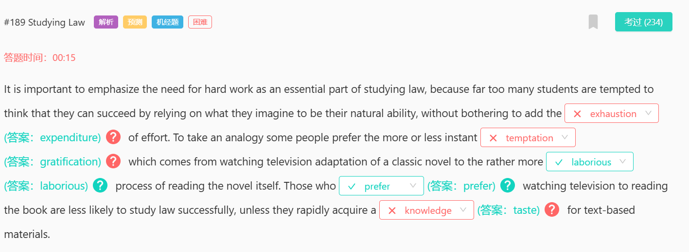

#1231 Shanghai International Studies University
disarmed
解除武装

#1226 Well-being
overview 全面审查
distorted 扭曲的
distort v. 扭曲，使失真；歪曲，曲解
span 跨度
Leisure time 休闲时间
plea n. 恳求，请求；（法庭上所作的）有罪（无罪）陈述；借口，托辞

#1224 Antarctic
ever before
whereas
span
n.
时间跨度，一段时间；（桥或拱的）墩距，跨距；宽度，翼展；范围
v.
持续，贯穿；包括（广大地区），涵盖（多项内容）；横跨，跨越

#1221 Discrimination against Women
allege
5386
英
/ əˈledʒ /
美
/ əˈledʒ /
v.
(未经证实地）宣称，指控
allergy
7343
英
/ ˈælədʒi /
美
/ ˈælərdʒi /
n.
过敏反应，过敏症；厌恶，反感

#1185 Eureka
conjure / ˈkʌndʒə(r) / 7876 召唤、变戏法
condemn / kənˈdem / 4179 谴责，严厉指责；宣判，
confess 3987 承认

#1182 Durkheim
juggle 9809 玩杂耍（连续向空中抛接多个物体）；力图使平衡，尽力应付
flick through 快速浏览
flick
6955
英
/ flɪk /
美
/ flɪk /
v.
（尤指用手指或手快速地）轻击，轻弹；
be down to 由（某人）负责；由……引起
remain modest 保持谦虚

#1178 Avid Readers
avid
英
/ ˈævɪd /
美
/ ˈævɪd /
adj.
热心的，热衷的；渴望的，渴求的

#1175 Mercury
disinfectant
英
/ ˌdɪsɪnˈfektənt /
美
/ ˌdɪsɪnˈfektənt /
n.
消毒剂
adj.
消毒的

thermometer
英
/ θəˈmɒmɪtə(r) /
美
/ θərˈmɑːmɪtər /
n.
温度计，寒暑表，体温计

depict
英
/ dɪˈpɪkt /
美
/ dɪˈpɪkt /
v.
描述，描绘
注意音标

regulate 控制，管理；调节，调整；监控，监管；校准，对准

#1174 Modern Technology
hideous
11205
英
/ ˈhɪdiəs /
美
/ ˈhɪdiəs /
adj.
极丑的，面目狰狞的；非常可怕的，令人难以忍受的

with enthusiasm / ɪnˈθjuːziæzəm / 充满热情地

#1170 Freud's Theory
prolific
英
/ prəˈlɪfɪk /
美
/ prəˈlɪfɪk /
adj.
多产的，多育的；作品丰富的，多产的；

deviation
英
/ ˌdiːviˈeɪʃn /
美
/ ˌdiːviˈeɪʃ(ə)n /
n.
偏离，违背；离差，偏差

one-sided
13151
英
/ ˌwʌn ˈsaɪdɪd /
美
/ ˌwʌn ˈsaɪdɪd /
adj.
片面的，单方面的；不公正的

#1168 UK Universities
prescribe / prɪˈskraɪb / 开药方、开处方

summon
5771
英
/ ˈsʌmən /
美
/ ˈsʌmən /
v.
召唤；召集（会议）；传唤，传讯（出庭）；
注意音标

collective 集体的
predictable 可预见的
collateral 附属的
expenditure /ɪk'spendɪtʃə(r)/[n] 开支；费用；消费；消耗

preferential
12384
英
/ ˌprefəˈrenʃ(ə)l /
美
/ ˌprefəˈrenʃ(ə)l /
adj.
优先的，优待的，优惠的；

ratification
14585
英
/ ˌrætɪfɪˈkeɪʃ(ə)n /
美
/ ˌrætɪfɪˈkeɪʃ(ə)n /
n.
批准，认可

annexation
15800
英
/ ˌænekˈseɪʃn /
美
/ ˌænekˈseɪʃn /
n.
合并，吞并；吞并物，附加物

benevolence
19645
英
/ bəˈnevələns /
美
/ bəˈnevələns /
n.
慈善，仁慈

#1167 UK Drivers

#1165 Pop Art
revolt 反抗；叛逆；违抗

reckon on
期望，指望：指对某事物的发生有所期待或计划。
依赖，依靠：指依赖某人或某事物来实现预期的结果。

muster up
鼓起勇气，集中精力：

#1164 Bentham
as regards 关于
dissect v. 解剖（人或动物的尸体）；剖析，详细评论（某事物）；把（田地）分成小块
the aim of ……的目的/目标：
some 约莫，大约

#1158 Willful Blindness
thereby 因此，从而
Thereafter 其后，此后

#880 Coral Reefs
coral reef 珊瑚礁：
curb
v.
控制，抑制；勒住（马）
n.
控制，抑制；<美>路缘，马路牙子；
specifically
英
/ spəˈsɪfɪkli /
美
/ spəˈsɪfɪkli /
adv.
特意，专门地；明确地，具体地；具体来说，确切地说
countdown
英
/ ˈkaʊntdaʊn /
美
/ ˈkaʊntdaʊn /
n.
倒计时，倒数读秒；
unravel
英
/ ʌnˈræv(ə)l /
美
/ ʌnˈræv(ə)l /
v.
（使）解开，（使）松开；

#878 Dinosaurs
partially
英
/ ˈpɑːʃəli /
美
/ ˈpɑːrʃəli /
adv.
不完全地，部分地；
excessively
英
/ ɪkˈsesɪvli /
美
/ ɪkˈsesɪvli /
adv.
过分地，过量地；极度

#876 World Map of Happiness
mechanically
14378
英
/ məˈkænɪkli /
美
/ məˈkænɪkli /
adv.
机械地；呆板地；物理上地
juggle 同时处理多个事务
opt 选择
embodiment
英
/ ɪmˈbɒdimənt /
美
/ ɪmˈbɑːdimənt /
n.
体现，化身；象征
vanity 虚荣
execution 执行，实施
cite 引用，援引；引证，引以为例；传唤，传讯

#874 Spanish
commodity
英
/ kəˈmɒdəti /
美
/ kəˈmɑːdəti /
n.
商品，货物；有用的东西，必需品

encroach 15920 侵入、越界
initiate 3557 发起、开始

breach
英
/ briːtʃ /
美
/ briːtʃ /
n.
违反，破坏；（关系）中断，终止；缺口
v.
违反，破坏；

binge
13046
英
/ bɪndʒ /
美
/ bɪndʒ /
n.
狂欢作乐，大吃大喝
v.
放纵，大吃大喝

#866 Kathryn Mewes
pledge 保证；抵押；诺言；誓约
consultant 咨询顾问；咨询者；商议者

#862 Dance
plot 情节 2992
prowess / ˈpraʊəs / 11339 英勇；超凡技术；勇猛
roundabout 环岛

encumber 妨碍
level v.使平整；推倒，夷平
crumple 12132 弄皱

#861 Teenage Daughter
for the time being 暂时
as ever 像往常一样
in good time 及时

enumerate
英
/ ɪˈnjuːməreɪt /
美
/ ɪˈnuːməreɪt /
vt.
列举；枚举；计算

adult 成年的
ample 充足的
adulthood 成年期

enrichment 丰富
adoration 崇拜

resonance 共振；回声；反响；回响

#514 Digital Media
detrimental
11121
英
/ ˌdetrɪˈment(ə)l /
美
/ ˌdetrɪˈment(ə)l /
adj.
有害的，不利的
n.
有害的人（或物）

equate
英
/ ɪˈkweɪt /
美
/ ɪˈkweɪt /
8162
v.
（使）等同；使（两个或两个以上事物）相等，使平衡

grapple
8513
英
/ ˈɡræpl /
美
/ ˈɡræpl /
v.
扭打，搏斗；努力解决问题

compel
4499
英
/ kəmˈpel /
美
/ kəmˈpel /
v.
强迫，迫使；使发生，促使

#447 Lionfish
questionable 值得怀疑的，不确定的
somehow 以某种方式
invasive 扩散性的，侵入的

#444 Sound Speed
form on 在……上形成
diverge from 偏离

#158 Facial Appearance
stereotype
4990
英
/ ˈsteriətaɪp /
美
/ ˈsteriətaɪp /
n.
模式化的思想，老一套；公式化人物；铅版，铅版浇铸，铅版印刷
v.
对……形成刻板的看法，（尤指）对……有成见；使用铅版

whereby 通过，靠
notwithstanding 尽管，虽然

prophecy
9633
英
/ ˈprɒfəsi /
美
/ ˈprɑːfəsi /
n.
预言；预言能力

stipulation
16681
英
/ ˌstɪpjuˈleɪʃ(ə)n /
美
/ ˌstɪpjuˈleɪʃn /
n.
条款，约定（规定）的条件

scant
9349
英
/ skænt /
美
/ skænt /
adj.
不足的，缺乏的

#438 Panic-striken Climate
purely 纯粹地
disproportionately 不成比例地
firmly 坚定地

#421 Tokyo Skytree
mural 壁画
immensely 非常；极端地；极大地
subject to 受到……的影响或制约
along with 并列、伴随
further afield 在更远的地方、脱离主题
out of 由于、出于
employ 使用；雇用；运用；应用

#397 Flowers and Bees
irresistible 不可抗拒的、令人无法抗拒的
contour / ˈkɒntʊə(r) / [科技] 轮廓、边界线、 外形、 等位线
leash / liːʃ / 11156 拴住，牵狗；（喻）约束；狗绳
unleash / ʌnˈliːʃ / v. 释放出，发泄（力量、感情等）；解开皮带放开（动物）；

#395 Giant Exoplanets
characteristic 2049 / ˌkærəktəˈrɪstɪk / n.特征，特点，特色
extrasolar 太阳系外的
proximity  /prɒk'sɪməti/ 6690  [n] 邻近
denounce 谴责
deflect 偏转
depict 偏转

#389 Selfies
selfie / ˈselfi / 自拍照
combed 7459 梳；搜寻；仔细搜索；梳理；梳子
along with 伴随着
demographic [adj] 人口的；人口学的[n] 人口统计数据；同类客户群体

#388 Shrimp Farm
conserve 保护，保存；节省，节约；使（量，如能量、质量）守恒；
convert （使）转变，（使）转换；（使）改变信仰
aggregation 总和或聚集
augment / ɔːɡˈment / v. 增加，增大；加强，补充
immediate / ɪˈmiːdiət / 立刻的，即时的；目前的，紧迫的；附近的，紧接的
retain 保留；保持；持有；继续拥有

#300 Internet Use
tablet / ˈtæblət / 片剂；药片；碑；丸；平板电脑；平板装置；平板计算机
five-fold 五倍地
prominence 8595/ ˈprɒmɪnəns / n.重要，著名；突起，凸出；
roughly 2680 / ˈrʌfli / 大致

#115 Speech of Alchemy
wholesome / ˈhəʊlsəm / adj. 有益健康的；有益身心健康的，增进身心健康的；（显得）健康的，朝气蓬勃的

#259 Genius
inextricably 15126 / ˌɪnɪkˈstrɪkəbli / adv. 不可分开地，密不可分地；逃不掉地；解不开地，解决不了地
be inclined to
倾向于
culminate 7829 / ˈkʌlmɪneɪt /（以……）结束，告终；到达顶点，达到高潮；
junction 13607 / ˈdʒʌŋkʃ(ə)n / n.交叉口，岔道口；汇合处，交叉点；
inferiority 15714 / ɪnˌfɪəriˈɒrəti / n. 低等，劣等；自卑
authority / ɔːˈθɒrəti / n. 专家，权威人士；行政机构；权利，权限；权威，威信；
supremacy / suːˈpreməsi; sjuːˈpreməsi / n.霸权，至高无上；优势
adept / əˈdept / adj. 熟练的，擅长的 n. 能手，内行
cleric / ˈklerɪk / n.（基督教的）教牧人员；（任一宗教的）牧师
clerk / klɑːk / / klɜːrk / n. 办事员，职员；售货员，店员；（宾馆）接待员
offender 罪犯、冒犯者

#243 Cell
magnifies 放大；扩大；增强；夸大

#235 Ancient Superhighway
volume / ˈvɒljuːm / 体积，容积；总数，总量；音量，响度
column / ˈkɒləm / 圆柱，纪念柱；柱状物；（报纸、杂志上的）栏
facet / ˈfæsɪt / 部分，方面；（宝石的）琢面，刻面； 注意音标
obscure
[n] 朦胧；黑夜
[adj] 无名的；鲜为人知的；费解的；难以理解的
[v] 使模糊；使隐晦；使费解

#230 Health and Fitness
portion
2197
n.（某物的）一部分；（尤指餐馆中食物的）一份，一客；（责任、过失、职责等的）一份，一部分；<法律>（根据法律赠与或遗留给继承人的）一份财产
v.分配；

confiscate
10815
英
/ ˈkɒnfɪskeɪt /
v.
没收，查抄（某人的财产）；充公，罚没（某物，尤指土地）
con 共同+fisc 钱包，引申为"国库”+ate使→都放到国库里→充公→confiscatev.充公

#222 Feature Films
prehistoric / ˌpriːhɪˈstɒrɪk / adj. 史前的，有文字记载以前的
harsh / hɑːʃ / adj.（环境）恶劣的，艰苦的；严厉的，残酷的；刺耳的，难听的；
sheer 4238 / ʃɪə(r) / 纯粹的
spare 4639 多余的、节省、备用的、空闲的
abide 8616 忍受、遵守、容忍、坚持
conform 7067 v.遵守，符合；顺从

#220 Dark-silvery Rock
by accident
diffuse 弥漫；漫射；传播；散布
toil 
13410
/ tɔɪl /
（长时间地）苦干，辛勤劳作；艰难缓慢地移动，跋涉
（尤指体力上的）苦工，苦活；网，捕捉野兽的陷阱
sickle / ˈsɪkl / 镰刀

#205 Human Brain
nuance 9313 / ˈnuːɑːns / n. 细微差别

#203 Sandra Lousada
gadget 9305/ ˈɡædʒɪt / n. 小器具，小玩意儿
genre 4547/ ˈʒɒnrə / n. 体裁，类型；风俗画
aisle 4535 / aɪl / n. 走廊，过道；（教堂）耳堂，侧堂

#192 Gauss 
denial
4797
n. 否认；拒绝接受，拒不承认；剥夺，拒绝给予

#190 Physical Activity
immortality 13284 / ˌɪmɔːˈtæləti / n. 不朽；不朽的声名；不灭
denote 9959 / dɪˈnəʊt / v. 标志，预示；表示，意指
defy / dɪˈfaɪ / v. 违抗，不服从；挑战

#189 Studying Law
expenditure 5240 / ɪkˈspendɪtʃə(r) / n.经费，支出额；（时间、金钱、精力等的）消耗，花费
exhaustion 8307 / ɪɡˈzɔːstʃən / n. 筋疲力尽；耗尽，枯竭
gratification 12676 / ˌɡrætɪfɪˈkeɪʃ(ə)n / n. 满足，令人喜悦的事物
gratitude 7175 / ˈɡrætɪtuːd / n. 感激之情，感谢
obsession 5628 / əbˈseʃn / n. 痴迷，困扰；令人着迷的人（或事物）
motivation 3151 / ˌmoʊtɪˈveɪʃ(ə)n / n. 动力，诱因；积极性，干劲；

#180 HK Marine
far-fetched 牵强的，难以置信的
residual / rɪˈzɪdjuəl / 残留的；（数量）剩余的；
designate
/ ˈdezɪɡneɪt /
design（指定）+ate（做）→指定...做→指派→designatev.指定，指派；命名；指明，标明
注意音标

#171 Colour Preference
hue / hjuː / n. 颜色，色调，色度
overlay / ˌəʊvəˈleɪ / v. 覆盖
whatsoever 6190 任何，无论什么
divergences 15140 / daɪˈvɜːdʒəns / n. 差异，不同；

#170 Sun and Moon
wane 10269/ weɪn / / weɪn / v.（月亮）缺，亏；衰落 注意音标
millennium 5733 / mɪˈleniəm / n. 一千年；千周年纪念日，千禧年
millennia / mɪˈleniə / n. 千年期；千周年纪念日
distort 6724 / dɪˈstɔːrt / v. 扭曲，使失真；歪曲，曲解

#165 Omniscience
typeset  / ˈtaɪpset / v. 为……排字（或排版）
fabrication 11795/ ˌfæbrɪˈkeɪʃ(ə)n / n. 捏造的故事，虚构的信息
contributory  / kənˈtrɪbjətɔːri / adj. 捐助的；贡献的；有助于……的 n. 捐助者；贡献人 注意音标

#154 Classical Music
hut 5392  / hʌt / n. （简陋的）小屋；（花园中的）木屋
drift 3634 / / drɪft / v. 飘移，漂流
skyscraper 10892  / ˈskaɪskreɪpər / n. 摩天大楼
crater 6992  / ˈkreɪtər / n. （撞击或爆炸形成的）坑，弹坑；火山口；穴，洞；（古希腊用的）调酒碗 v. 在（地面或行星）上形成坑
looming 12213  / ˈluːmɪŋ / adj. （不希望或不愉快的事情）迫近的，逼近的 v. （突然地）出现；赫然耸现；逼近（尤用于不好或吓人的事物）（loom 的现在分词）
bluff 7989  / blʌf / v. 虚张声势，唬人 n. 虚张声势的举动，唬人
booming 9246  / ˈbuːmɪŋ / adj. 飞速发展的，繁荣的；（声音）低沉洪亮的；奋力撞击的 v. 发出巨响，轰鸣；增长，繁荣（boom 的现在分词）

#150 School-skipping
residual 7922  / rɪˈzɪdʒuəl / adj. 残留的；（数量）剩余的
flimsy 13372 / ˈflɪmzi / adj. 脆弱的；浅薄的

#144 Mechanical Engineering
in the same way that
central to 对…主要的 central to the plan 规划中最重要的部分

#143 Noble Gas
myriad 7222  / ˈmɪriəd / n. 无数，大量；（多用于古典历史剧中）一万 adj. 无数的，大量的
disproportionate 10527  / ˌdɪsprəˈpɔːrʃənət / adj. 不成比例的
regularity 12589 / ˌreɡjuˈlærəti / n. 规律性，经常性；匀称，端正；有规则的东西，有规律的事物
regulatory 3977  / ˈreɡjələtɔːri / adj. 管理的，控制的，监管的

#130 Small Lakes
plausible 7245 / ˈplɔːzəb(ə)l / / ˈplɔːzəb(ə)l / adj. 似乎是真的，貌似有理的

#27 Looking Trustworthy
in truth
the implication is that
correlate
overlap
cooperate
diverge

#18 Wholeness of Thought
wholeness
There is little difficulty in
innumerable
cue
intrude 闯入；侵入；打扰；扰乱
cut in 打断
tone 音调、语气或者情感色彩
tune 音乐曲调

#110 When to Revise?
effort 努力
concern 关心；忧虑；涉及；影响；牵涉；与…有关
put out 熄灭，发布
put off 推迟

#90 Great Engineers
conviction 坚信；深信；定罪；判罪
solution to ……的解决方案
arduous 12805 艰苦的；艰难的

#78 Native Species in North America
be native to 原产于……；源于……的
residential 适合居住的；住宅的
champion 冠军；捍卫者；拥护者；冠军；捍卫者；拥护者；

#95 DNA Sequence
mammoth 11288 庞然大物；【动】猛玛(象) 
speculation 猜测，推测，推断
worship 崇拜或尊敬
behemoth 13657 [adj] 巨大的
contradict 反驳，否认；相抵触，相矛盾
censure 15975 严厉批评，谴责
molecular 分子的
driving force 推动力

#68 MBA Programs
unravel
the majority of
criteria 
standard 

#99 Women in Labour Force
attendance 参加或出席，参加某一特定活动或事件
participation 参与或参加
worship 崇拜

#736 Amazon Basin
division 分割、部门
diversification 多元化、多样化经营
diversify 使多样化
dump 倾倒、丢弃
reservoir 水库，蓄水池；储藏，蓄积
territory  领地、领域、境内
run counter to 违反；与……背道而驰
myth 广为流传但并非事实的故事或观念
origin 起源

#734 Guilt and Responsibility
capability 能力；才能；性能；容量
culpability 可责；有罪；有罪性
prosecution 诉讼；原告；实施；从事
persecution 困扰；苛求；迫害；残害
adjudication 裁决；裁定；裁判
characterize 以...为特征
legitimacy 合法性、正当性

#728 Computer
state of mind 心态
shape or form 以任何方式
basis 基础；基准；基点；方式
pedagogical 11393教育学的；教师的
subject to 受到...的限制或条件
attain 达到，实现
obtain 获得，得到
retain 保持，保留；保存，储存
nor 也不（通常与 neither 连用）； （用于肯定动词前，表示同意刚提及的否定命题）也不
fluctuate 13035

#725 Sigmund Freud
fluctuate 13035
v.
波动，起伏不定；使波动，使动摇

#724 Population Change
rear 抚养
slander 诽谤
designate /'dezɪɡneɪt/  指定；指派；
permanent  永久性；一直；坚持；不变的

#722 Interdisciplinary Centre
overlap [科技] 重叠
deluded 18196 欺骗；哄骗
advent 8282 出现，到来，问世
lightly 轻轻地；轻率地；轻柔地；轻微地
slightly 稍微，轻微地；（指某人身材）纤弱地，瘦小地

#715 Snails
在这个句子中，"as" 是用来表述在某个事件发生的同时，另一个事件也在进行。其实，“as”也可以被理解为“while”，意思是“当……时候”。

#713 SpaceX
mockup
[网络] 样机；生产模式；手板制作
orbit
是指一颗卫星或者行星等天体围绕其中心天体
track
通常用于描述地面或海面的路径
circulation
液体、气体的循环，例如血液循环或空气循环
trajectory
7885
一个物体在空间中移动的路径
contract
合同
case
用于法律或研究的情况
bid
初步的竞标阶段
retired
退役
fixed
固定或者修复

#708 History Books
considerable
[adj] 相当多（或大、重要等）的
[网络] 相当大的；值得考虑的；重要的
take pride of place
居于首要或突出的位置

#707 Platypus
cursory
[adj] 粗略的；仓促的
thereby
adv.
因此，从而
hereby
adv.
以此，特此
whereby
adv.
凭此，借以
conj.
凭此，借以，与……一致；<非正式>在……的情况下，处于……的位置

#687 Distance Learning
For those who are struggling to

#683 Film
raze
英 / reɪz / 美 / reɪz /
vt.
夷为平地；破坏；消除；拆毁

#682 Foreign Policy
element
[n] 要素；基本部分；典型部分
[n] 少量；有点；有些
exertion
英
/ ɪɡˈzɜːʃn /
美
/ ɪɡˈzɜːrʃn /
n.
费力，努力；运用，行使
formative
英
/ ˈfɔːmətɪv /
美
/ ˈfɔːrmətɪv /
形成阶段的
tranquility
15547
英
/ træŋˈkwɪləti /
美
/ træŋˈkwɪləti /
n.
宁静，安宁
allegiance
7355
allegiance
n.
（对政党、宗教、统治者的）忠诚，效忠，拥戴
adjoining
12294
adhere
6620
v.
黏附，附着；遵守，遵循（规定或协议）；拥护，持有（观点或信仰）
sovereign
8196
英
/ ˈsɒvrɪn /
美
/ ˈsɑːvrɪn /
n.
君主，元首；
sovereignty
4907
英
/ ˈsɒvrənti /
美
/ ˈsɑːvrənti /
n.
主权，最高统治权，最高权威；独立自主；主权国家，自治州
delineate
10812
英
/ dɪˈlɪnieɪt /
美
/ dɪˈlɪnieɪt /
v.
（详细地）描述，解释；标明

#678 Leadership
bestow
英
/ bɪˈstəʊ /
美
/ bɪˈstoʊ /
vt.
赠予，授予（财产、权力或荣誉）
authentic
5061
英
/ ɔːˈθentɪk /
美
/ ɔːˈθentɪk /
adj.
原作的，真迹的；传统的，正宗的；逼真的，仿真的；真实的，可靠的
genuine
[adj] 真的；名副其实的；真诚的；诚实的
integrity
英
/ ɪnˈteɡrəti /
美
/ ɪnˈteɡrəti /
n.
正直，诚实；完整，完全
outrageous
6166
英
/ aʊtˈreɪdʒəs /
美
/ aʊtˈreɪdʒəs /
adj.
骇人的，无法容忍的；反常的，令人惊讶的；极其夸张的，不可能的
plague
6742
英
/ pleɪɡ /
美
/ pleɪɡ /
n.
瘟疫，传染病；鼠疫
v.
困扰，折磨；烦扰，纠缠；使得灾祸
convection
16802
英
/ kənˈvekʃn /
美
/ kənˈvekʃ(ə)n /
n.
〔气体、液体的〕对流；传送
contempt
6373
英
/ kənˈtempt /
美
/ kənˈtempt /
n.
轻视，蔑视；忽视，不顾；藐视法庭
abide
abide by后面通常接laws、rules或者principles
8616
英
/ əˈbaɪd /
美
/ əˈbaɪd /
v.
遵守（abide by）；容忍，忍受；
conform
7067
英
/ kənˈfɔːm /
美
/ kənˈfɔːrm /
v.
遵守，符合；顺从，随潮流；一致，相吻合

#670 Student-run Restaurant
quality 质量
quantity 数量
qualification 资格
quantification 量化
relatively
英
/ ˈrelətɪvli /
美
/ ˈrelətɪvli /
adv.
相当地，相对地
cuisine 
6498
英
/ kwɪˈziːn /
美
/ kwɪˈziːn /
指的是某一地区或国家的所有菜肴，
utensil
13019
英
/ juːˈtens(ə)l /
美
/ juːˈtens(ə)l /
指的是烹饪工具

#665 Ironbridge Gorge
overturned 6822 the fascinating image
fuse a 5km width of 融合了5公里宽的
incorporate a 5km length of 包含一个5公里长的
add a finishing touch to 添加画龙点睛之笔
conventional woods and stuff 传统的木材和材料

#644 Emperor Penguin
icon
4404
英
/ ˈaɪkɒn /
美
/ ˈaɪkɑːn /
n.
图标；
iconic
12673
英
/ aɪˈkɒnɪk /
美
/ aɪˈkɑːnɪk /
[adj] 符号的；图标的；图符的；偶像的
brighten
v.
使明亮，使鲜艳；开颜，高兴；（使）好转，
brighten up 让某物变得更加明亮或更加生动
fledge
13167
英
/ fledʒ /
美
/ fledʒ /
vi.
长羽毛

#629 Corn People
staple
7118
英
/ ˈsteɪp(ə)l /
美
/ ˈsteɪp(ə)l /
n.
（某国的）主要产品，支柱产品；主食；主要部份
v.
用订书钉订住；把……分级
manifestation
6686
英
/ ˌmænɪfeˈsteɪʃ(ə)n /
美
/ ˌmænɪfəˈsteɪʃ(ə)n /
简明柯林斯
n.
表现，显现；表现形式；
to a considerable extent
相当程度上：表示在很大程度上，用于强调某事物的影响或重要性

#606 Zero-gravity
deteriorate
7724
英
/ dɪˈtɪəriəreɪt /
美
/ dɪˈtɪriəreɪt /
v.
恶化，变坏

#618 Sales Jobs
hinge
8987
英
/ hɪndʒ /
美
/ hɪndʒ /
n.
铰链，合叶；枢纽，关键；铰合部
v.
给（某物）装铰链
hinge on 
取决于：由（某事物）决定或确定：依赖于（某事物）

#613 EE and AVG
sedentary
14228
英
/ ˈsed(ə)ntri /
美
/ ˈsed(ə)nteri /
adj.
（人）惯于久坐不动的；
engaged 忙于、雇佣、参加、从事
moderate-to-vigorous 中等到剧烈
whilst <英，正式>当……的时候；与…同时；然而，但是；虽然，尽管；

#581 Sales Activities
addresses
处理、讨论
stipulate
11227
英
/ ˈstɪpjuleɪt /
美
/ ˈstɪpjuleɪt /
v.
规定，明确要求

#579 Settlement
protrude
12126
英
/ prəˈtruːd /
美
/ proʊˈtruːd /
v.
伸出，突出；（动物）使（身体部位）突出
sentiment
4092
英
/ ˈsentɪmənt /
美
/ ˈsentɪmənt /
n.
观点，看法，情绪；多愁善感，伤感情绪

#576 Teen Writing
present
出现；提出；显示；提交

#559 Definition of Country
single occupancy
只有一个人居住的住宅
denounce
6070
英
/ dɪˈnaʊns /
美
/ dɪˈnaʊns /
v.
谴责，痛斥；检举，告发

#545 Social Isolation
forecasts 描述对未来的量化预测，如人口统计、经济趋势等。
prediction 更常用于个人的猜测或者不太正式的预测，而不是基于详细的数据和分析的预测

#544 Pinker
assimilate
9655
英
/ əˈsɪməleɪt /
美
/ əˈsɪməleɪt /
v.
融入，（使）同化；吸收，理解；使相似，成为相似

#570 Egg-eating Snakes
whole 这个词可以用来描述单个整体的事物
entire 通常描述的也是一组或多个事物
treatment 可以理解为特殊的处理方式或方法
supplement 补充物
stick out 突出，伸出

#267 Fire
ridge
英
/ rɪdʒ /
美
/ rɪdʒ /
n.
山脊，山脉；
rebellion
6425
英
/ rɪˈbeljən /
美
/ rɪˈbeljən /
n.
叛乱，反抗；
tricky
6485
英
/ ˈtrɪki /
美
/ ˈtrɪki /
adj.
难对付的，棘手的；狡猾的，诡计多端的

#17 Great Listeners
analogous
10475
英
/ əˈnæləɡəs /
美
/ əˈnæləɡəs /
adj.
相似的，类似的；
splat
14946
英
/ splæt /
美
/ splæt /
n.
纵长背板；啪嗒声
v.
（使）发啪嗒声
shoplift
18496
英
/ ˈʃɒplɪft /
美
/ ˈʃɑːplɪft /
v.
在商店中偷窃
horny
18041
英
/ ˈhɔːni /
美
/ ˈhɔːrni /
adj.
<非正式>（引起）性冲动的，欲火中烧的；<非正式>性感的；角制的，角质物制成的；（皮肤等）粗硬的

#33 Clown Fish
deport
11103
英
/ dɪˈpɔːt /
美
/ dɪˈpɔːrt /
v.
驱逐（非本国居民）出境
clutter
12447
英
/ ˈklʌtə(r) /
美
/ ˈklʌtər /
n.
杂乱的东西；杂乱
v.
乱堆，塞满；使（脑子里）塞满（乱七八糟的事）
potential 1266潜在的
exponential 18569 指数的
nimble 15129 敏捷的

#12 Australia and New Zealand
proximity
6690
英
/ prɒkˈsɪməti /
美
/ prɑːkˈsɪməti /
n.
（时间、空间、关系的）靠近，亲近
characteristic 特征，特点，特色
irrevocable 不能撤销的

#1 Honorary Degree
confer
7258
英
/ kənˈfɜː(r) /
美
/ kənˈfɜːr /
v.
授予，赋予；商讨，交换意见