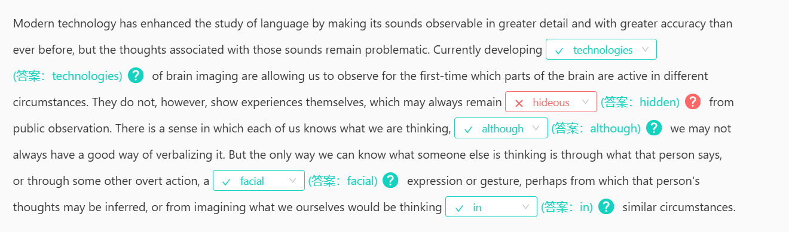
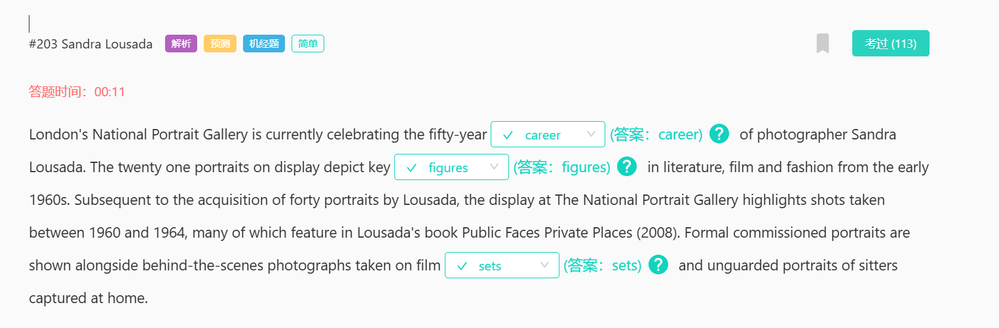

#27 Looking Trustworthy
in truth
the implication is that
correlate
overlap
cooperate
diverge

#18 Wholeness of Thought
wholeness
There is little difficulty in
innumerable
cue
intrude 闯入；侵入；打扰；扰乱
cut in 打断
tone 音调、语气或者情感色彩
tune 音乐曲调

#110 When to Revise?
effort 努力
concern 关心；忧虑；涉及；影响；牵涉；与…有关
put out 熄灭，发布
put off 推迟

#90 Great Engineers
conviction 坚信；深信；定罪；判罪
solution to ……的解决方案
arduous 12805 艰苦的；艰难的

#78 Native Species in North America
be native to 原产于……；源于……的
residential 适合居住的；住宅的
champion 冠军；捍卫者；拥护者；冠军；捍卫者；拥护者；

#95 DNA Sequence
mammoth 11288 庞然大物；【动】猛玛(象) 
speculation 猜测，推测，推断
worship 崇拜或尊敬
behemoth 13657 [adj] 巨大的
contradict 反驳，否认；相抵触，相矛盾
censure 15975 严厉批评，谴责
molecular 分子的
driving force 推动力

#68 MBA Programs
unravel
the majority of
criteria 
standard 

#99 Women in Labour Force
attendance 参加或出席，参加某一特定活动或事件
participation 参与或参加
worship 崇拜

#736 Amazon Basin
division 分割、部门
diversification 多元化、多样化经营
diversify 使多样化
dump 倾倒、丢弃
reservoir 水库，蓄水池；储藏，蓄积
territory  领地、领域、境内
run counter to 违反；与……背道而驰
myth 广为流传但并非事实的故事或观念
origin 起源

#734 Guilt and Responsibility
capability 能力；才能；性能；容量
culpability 可责；有罪；有罪性
prosecution 诉讼；原告；实施；从事
persecution 困扰；苛求；迫害；残害
adjudication 裁决；裁定；裁判
characterize 以...为特征
legitimacy 合法性、正当性

#728 Computer
state of mind 心态
shape or form 以任何方式
basis 基础；基准；基点；方式
pedagogical 11393教育学的；教师的
subject to 受到...的限制或条件
attain 达到，实现
obtain 获得，得到
retain 保持，保留；保存，储存
nor 也不（通常与 neither 连用）； （用于肯定动词前，表示同意刚提及的否定命题）也不
fluctuate 13035

#724 Population Change
rear 抚养
slander 诽谤
designate /'dezɪɡneɪt/  指定；指派；
permanent  永久性；一直；坚持；不变的

#722 Interdisciplinary Centre
overlap [科技] 重叠
deluded 18196 欺骗；哄骗
advent 8282 出现，到来，问世
lightly 轻轻地；轻率地；轻柔地；轻微地
slightly 稍微，轻微地；（指某人身材）纤弱地，瘦小地

