1224
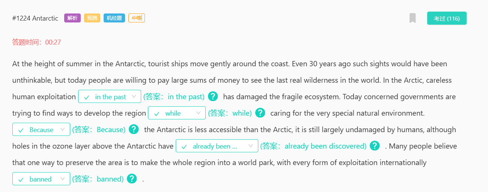
在南极盛夏时节，旅游船在海岸上缓缓移动。即使在30年前这样的景象也是不可想象的，但今天人们却愿意花重金去看世界上最后一片真正的荒野。在北极，人类【过去in the past】粗心大意的开发破坏了脆弱的生态系统。今天，有关政府正在努力寻找方法发展该地区，【同时 while】照顾非常特殊的自然环境。【因为Because】南极比北极更难到达，所以它在很大程度上仍然没有受到人类的破坏，尽管南极上空臭氧层上的空洞【已经被have already been】发现。许多人认为，保护该地区的一个方法是将整个地区变成一个世界公园，【禁止banned】各国以任何形式进行开发。

1175

最常见的【包含contain】汞产品是电池、大功率户外灯、消毒剂和温度计，它们用于【测量measure】我们身体的温度。它还可以在气压计和恒温器中找到，气压计用于测量气压和显示天气【变化change】，恒温器【调节regulate】建筑物的温度，打印机和复印机的墨粉中也可以找到汞。
contrast
contour

1168
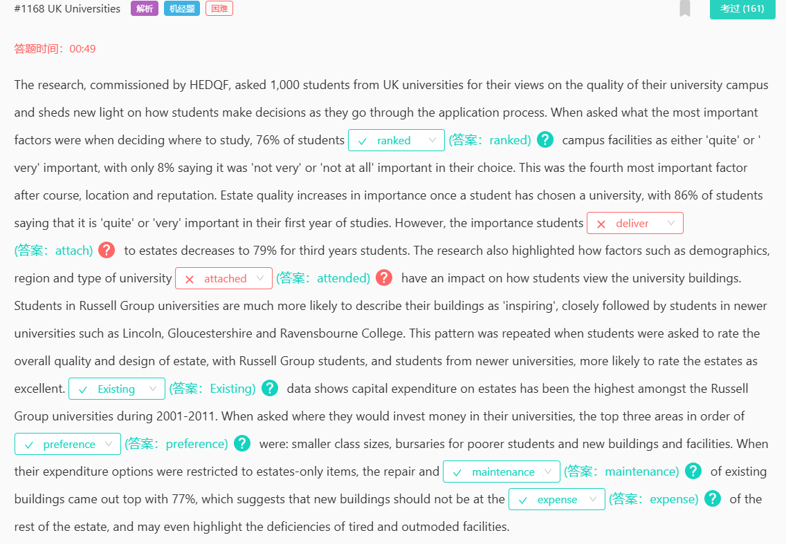
76%的学生认为校园设施【ranks…as】“相当”或“非常”重要。一旦选择大学，房地产质量的重要性【增加 increases】到86%。【然而 however】，三年级学生对房地产的【重视 attach】程度下降至79%。研究还强调了人口统计、地区和【attended 就读】大学类型等因素。按【偏好 preference】排列，前三个领域是：小班教学、建筑物维修【repair】和【保养 maintenance】。这表明新建筑不应以牺牲其他设施为【代价 the expense of】。

长难，得背
1164

happen没有被动语态
866
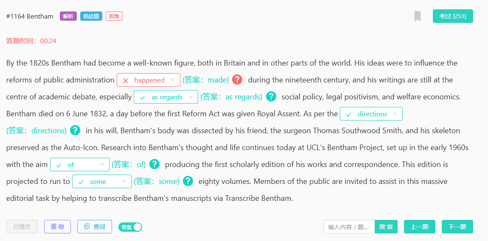
他的思想在19世纪公共行政的改革的【made 完成】，他的著作至今仍是学术辩论的中心，特别是在【关于 as regard】社会政策、法律实证主义和福利经济学方面。根据边沁遗嘱中的【指示 directions】该项目于20世纪60年代初成立，【旨在 the aim of 】出版他的著作和通信的首个学术版。预计这一版将达到【大约 some】80卷。

447
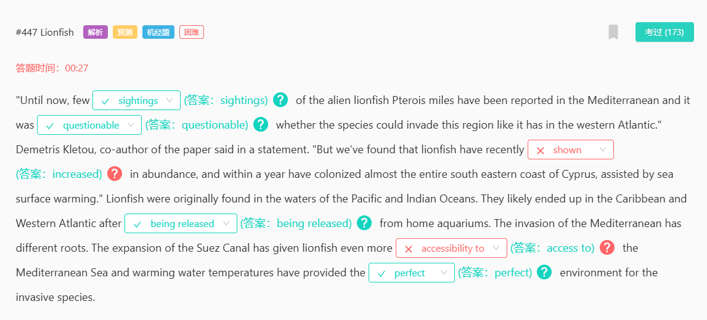
狮子鱼在地中海的数量从过去极少的【sightings 发现】,过去人们曾经【questionable 质疑】它是否能入侵地中海。如今数量大量【increased 增加】，这一现象得益于海水表面升温和苏伊士运河的扩建。【另一个 another】原因是，狮子鱼从家用水族馆【being released 被释放】后扩散到了加勒比和西大西洋。【perfect 完美】的环境让这一入侵物种在地中海得以迅速扩展。
sighting 看见，目睹
accessible to"对...可进入的；对...可使用的"”
accessibility to "对..的可进入性；对...的可使用性"，
access to 进入...的通道
158
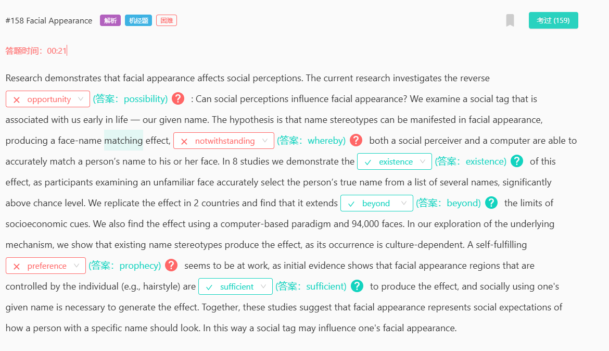
目前的研究调查了相反的【可能性 likelihood】社会观念会影响面部外观吗?【由此 whereby】社会感知者和计算机都能够准确地将一个人的名字与他或她的脸相匹配。在8项研究中，我们证明了这种效应的【存在 existence】。发现它【超出 beyond】了社会经济线索的限制。一种自我实现的【预言 prophecy】似乎在起作用，由个人控制的面部外观区域(例如发型)【足以 sufficient】产生这种效果。
直接背
438
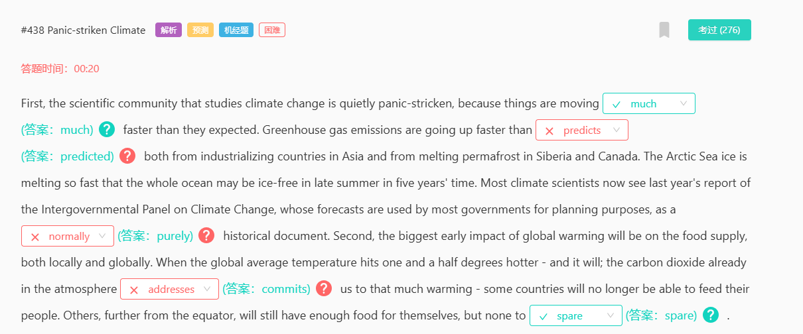
发展速度要快得【多much】，超过【预期predicted】，【纯粹purely】的历史文件，【使commit】我们面临变暖，食物足够，但没有【多余spare】的.
背
421
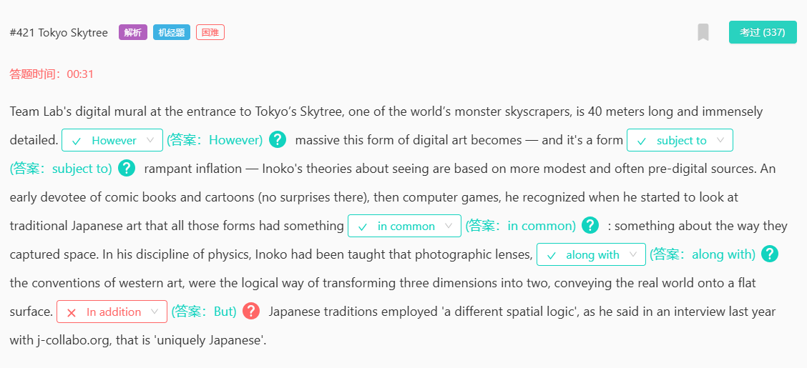
背
【无论however】这种形式变得多么庞大，它都会【受到subject to】通货膨胀的影响，这些形式都有一些【共同点 in common】，和西方艺术的惯例【一样along with】，【但but】有日本的特点。
259
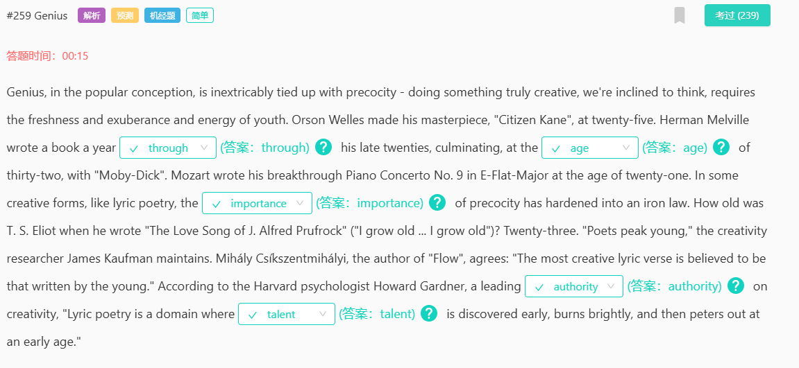
赫尔曼·梅尔维尔在二十多岁【through his late twenties】的时候每年写一本书，到三十二岁【age】时以《白鲸》达到顶峰。早熟的重要性【importance of】已经变成了铁一般的法则（iron law）。哈佛大学心理学家一个创造力的权威【authority】，表示："抒情诗是一个早期显露才华【talent】、然后年龄早早就开始衰退的领域（domain）。
243
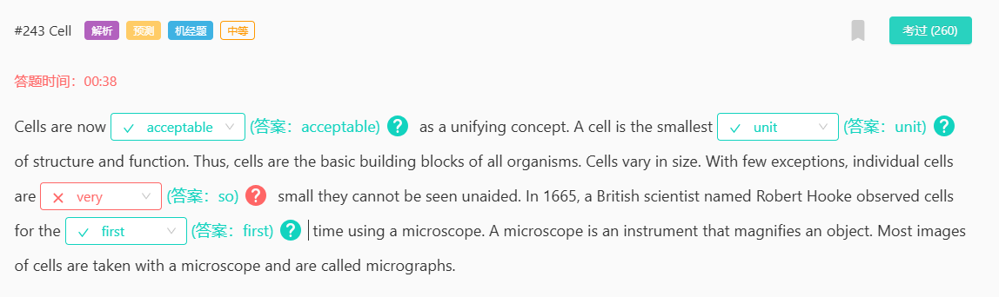
细胞被【接受acceptable】最小的【单位unit】,【如此so】小以至于【首次first】是用显微镜发现.
230
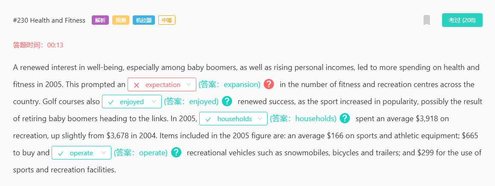
娱乐中心数量【扩张expansion】，让高尔夫【获得enjoyed成功】,并且【家庭household】也在娱乐上支出如购买和【运营operate】交通工具
205
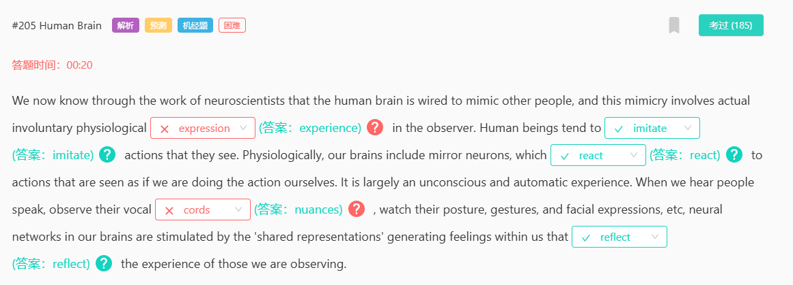
人脑的模仿涉及到无意识生理【体验experience】,人类倾向于【模仿 imitate 】他们看到的动作,我们大脑神经元对行为做出【反应react】,观察人们声音的【细微差别nuances】【反映reflect】被观察人的经验感觉
背
189
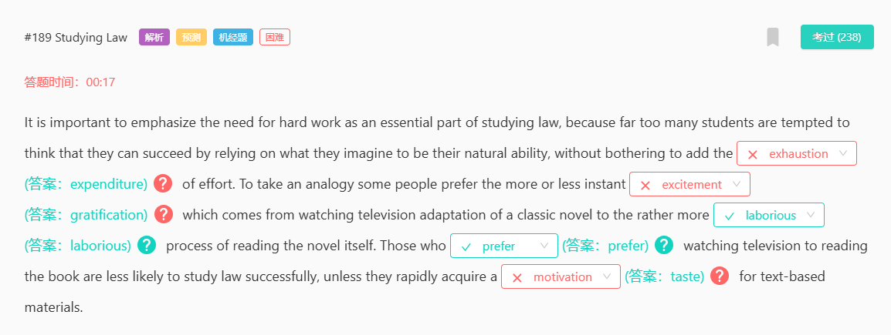
太多学生只想获得成功但是不想支出expenditure,只想获得快感gratification，而不是更费力的laborious过程。【更喜欢prefer】看电视的人除非对文本材料产生【兴趣taste】,否则不会成功
背
180
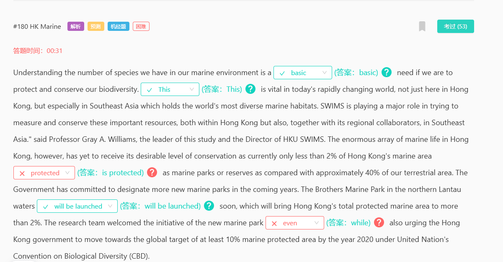
了解海洋中的物种数量是一项【基本basic】需要。在当今瞬息万变的世界，【这点this】至为重要，尤其是在东南亚。但是大量海洋生物没达到保育水平，因为只有2%被保护【is protected as】了，所以兄弟海岸公园即将启用【will be launched】，【while并】促请香港政府。
165
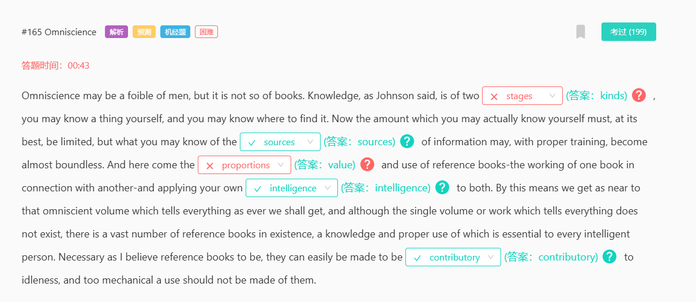
知识是两种【类型kinds】，信息的【来源sources】就像参数书的【价值value】一样，将自己的【才智intelligence】应用到其中，但参考书可能【促成contributory】变得懒惰
150
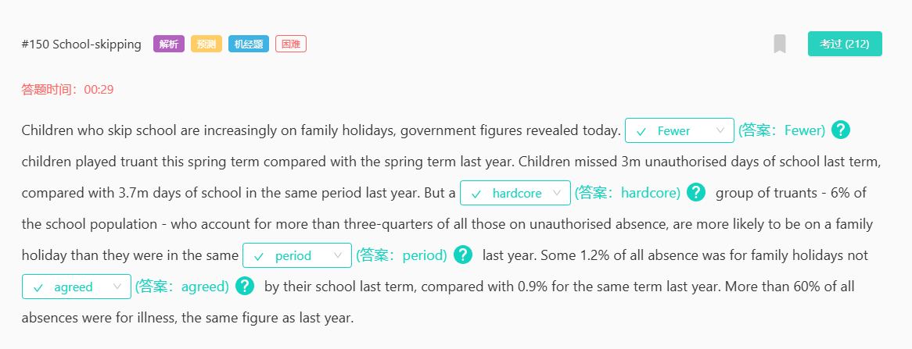
虽然逃学的学生少了【Fewer】，但还是有【硬骨头Hardcore】，在同一【时期Period】里继续度假，即使没被学校【批准Agreed】
144

科学管理就像工程师分析和控制机器【一样in the same way that】。泰勒体系【的to】核心是使技术合理化,【追踪pursuing】个人目标.【毫无疑问Undoubtedly】这是消极的
背
130
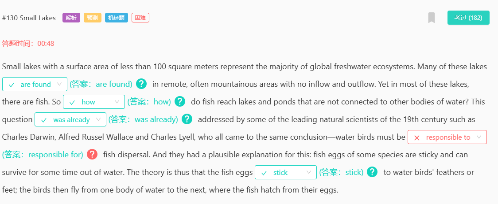
许多小湖泊【被发现are found】在偏远地区,但是里面的鱼是【如何how】达到的,这个问题【已经was already】被解决,水鸟对此【负责responsible for】,鱼卵【粘stick】在鸟身上被带过来
125
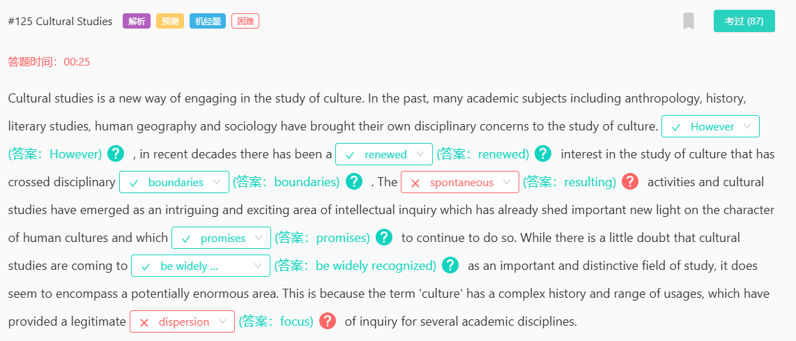
【然而However】，人们对文化的研究的兴趣发生了新的【变化renewed】，已经跨越了学科的【界限boundaries】,结果就是更多人期望继续这样做,虽然【被广泛认可be widely recognized】仍然存疑,但是多个学科已经找到了【关注focus】点
renewed resulting promises focus
59
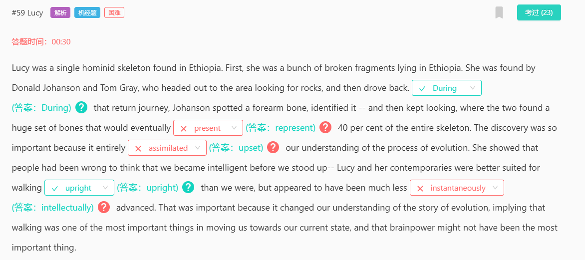
在返回途中【在……中During】，【构成represent】整个骨架的百分之四十，【颠覆upset】我们的理解，【直立uprigh】行走，但他们的【智力intellectually】似乎要低得多。
38
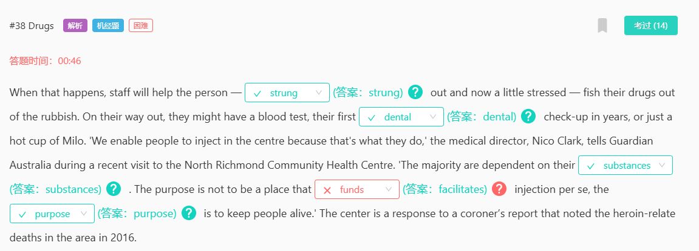
【be毒瘾缠身strung out】正处于紧张中，他们多年来的第一次【牙齿dental】检查，他们大多数人依赖他们的【毒品substances】，开设中心目的不是成为一个【方便facilitates】注射的地方，【目的purpose】是让人们活着。
27
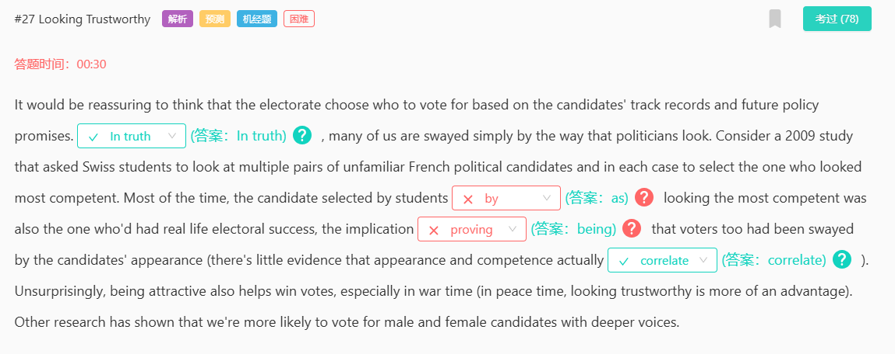
【事实上In truth】，学生们选出的 【看起来as】 最有能力的候选人，【 这意味着the implication being 】，几乎没有证据表明外貌和能力确实【相关correlate】。
18
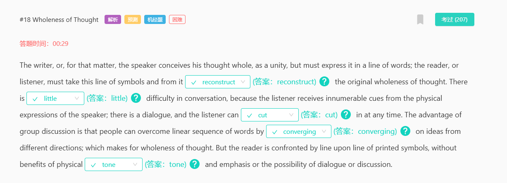
并从中【重建 reconstruct】最初的整体思想，这在对话中【几乎没有 little】困难，在对话中，听者可以随时【插话 cut in】，人们可以从不同的方向【汇聚 converging on】观点，没有体态【语气 tone】和强调的好处，也没有对话或讨论的可能。
110
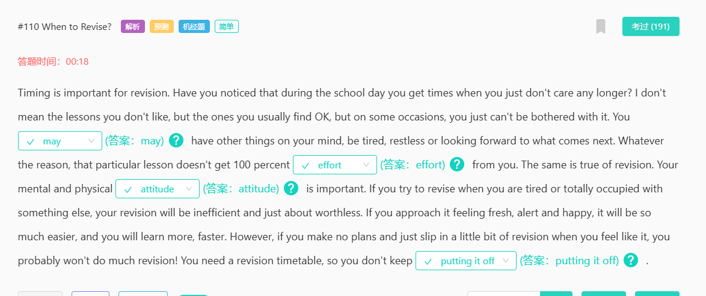
考PTE可能会（may）让你感到累，因为这个课让你付出100%的努力（effort），当然态度（attitude）也很重要，不然你会一直拖延（put it off）考pte，就会遇上805换题季
90
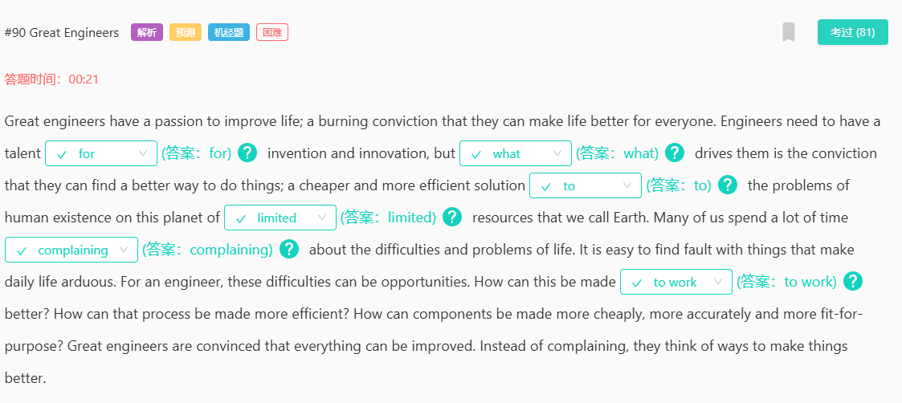
工程师需要有发明和创新【的for】天赋.是什么what驱动他们找到方法去【to】解决人类问题,在这个资源【有限limited】的星球上,许多人【抱怨complaining】困难和问题,却没想过如何使其更好地【发挥作用to work 】?
68
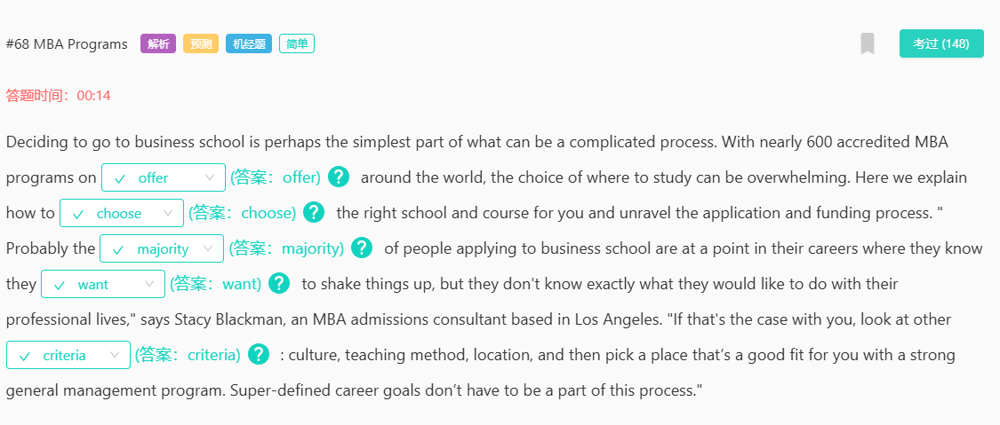
全球有近600个MBA课程【可提供offer】，如何【选择choose】学校和课程，【大多数majority】人【想要want】改变现状，看看其他的【标准criteria】来选择。

----marking----
736

换空了，文章变短了,只有source和reservious两个空不变，后面要选两个介词，一共四个空。 多了两空，itself和study from 可能的空是第四排：within the tropical forest【itself】

734

728
首先从理论【point of view 角度】考虑，然后描述【using 使用】，【subject to 受制于】一个非常重要的警告， 换句话说，如果计算机模拟【integrated 整合】，那么它们只能【attain 发挥】全部潜力

724
北京新世纪，没有第二空have，剩下都一样
722

宇宙学中心是多部门【合作collaborate】研究他们【重叠overlap】部分,【揭示revealed】了暗物质存在并将宇宙作为【实验室laboratory】,它的【出现advent】是激动人心的

645
渐进式增强为弱浏览器【设计designing for】 ,【逐渐增强progressively enhance】外观和行为,【不需要花费Instead of spending】大量时间研究,【最大的挑战biggest challenge】是开发人员
715
没有finding和make这两个空，剩下的一样
713
spacex发射了搭载【样机mockup】的火箭,他们认为这是太空的有【希望的promising】发展,如果飞入【轨道orbit】会为spacex赢得NASA【合同contract】,因为他们之前的计划已经【退役retired】
X发射了太空模型mockup

这玩意很有前途啊promising

一旦玩意儿到达轨道orbit

咱就能跟NASA签合同啦contract

合同都签了，人老员工可不得退休吗（retired）

708

687

682
边界的重要性存在少量真实【element因素】。在外交关系【formative形成】时期，尤其是在没有【settled稳定的】边界的情况下。征服临国获得【allegiance忠诚】，并在【adjoining紧挨】边境地区【delineated划界】建立缓冲国的概念
680
对某些东西过敏时，你的免疫系统【错误地 mistakenly】认为这种物质对你的身体有害。为了【保护 protect】身体 ，这些抗体会导致体内某些细胞向血液中【释放 release】化学物质，其中一种是组胺。组胺【作用于 acts on】 眼睛、鼻子、未来接触相同的过敏原将再次触发这种【抗体 antibody】。
670
644
有四个空 前两个一样 后两个 不一样 第三个空是 (so that) the chicks can fledge in the later summer season 第四个空记不清楚了 但是没有 covered 了

前两个空有，第一个空选项有on，off，up还有个忘了，第二个空seeing，have seen，had seen和seen好像是这个。第三个空的选项有个while，第四个不是cover，忘记是啥了。

帝企鹅是企鹅界的巨人，南极洲最具代表性的鸟类，耳朵和胸口的金色斑点【照亮 brighten up】黑色脑袋，极少【见到 seen】于亚南极水域。冬季繁殖，气温低至-50°C，风速【高达 up to】200公里每小时，跋涉50-120公里至繁殖地。雌性5月产卵交给雄性孵化，【当 whilst】她出海觅食，雄性禁食9周，体重减少45%，将蛋平衡在脚上，【覆盖着 covered】厚厚的皮肤和羽毛，蛋温比外界高70°C。

639
本文讲述了图坦卡蒙木乃伊首次公开展出的过程，描述了木乃伊从石棺中被抬出，转移到新的展示柜中的过程。

1、【tranguiity 宁静】前面 Instead of，表示相反，后面a hive of actity繁忙喧闹，得出 tranguiity-宁静

2、the first time 【discovered】首次被发现了

3、【accompanied】后面都是人，by four Eqyptologists,two restorers and three workmen,选accompanied，表示陪伴

4、【transported 】尸体被放到担架上，然后被“送到“新家，根据前面的 was placed被动，选transported 被运送。
618
613
579
576
545
544
570
33
12