1164
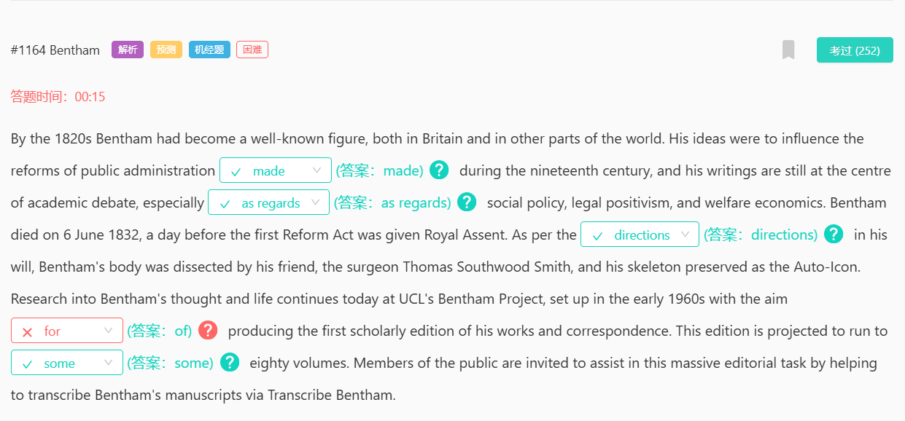
到19世纪20年代，边沁已成为英国乃至世界各地知名的人物。他的思想【影响 influence】了19世纪公共行政的改革的【made 完成】，他的著作至今仍是学术辩论的中心，特别是在【关于 as regard】社会政策、法律实证主义和福利经济学方面。边沁于1832年6月6日去世，就在第一部《改革法案》获得皇室批准的前一天。根据边沁遗嘱中的【指示 directions】，他的朋友外科医生托马斯·索思伍德·史密斯解剖了他的遗体，并将其骨骼【保存 preserved 】为自动雕像。对边沁思想和生活的研究至今仍在UCL的边沁项目中继续，该项目于20世纪60年代初成立，【旨在 the aim of 】出版他的著作和通信的首个学术版。预计这一版将【达到 run to】【大约 some】80卷。公众被邀请通过“【转录 transcribe 】边沁”协助这项庞大的编辑工作，帮助转录边沁的手稿。
aim作名词后面跟of, aim作动词倒是at/for都可以跟

447
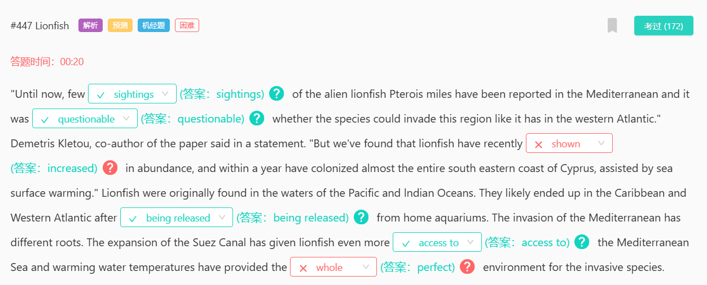
狮子鱼在地中海的数量从过去极少的【sightings 发现】,过去人们曾经【questionable 质疑】它是否能入侵地中海。如今数量大量【increased 增加】，这一现象得益于海水表面升温和苏伊士运河的扩建。【另一个 another】原因是，狮子鱼从家用水族馆【being released 被释放】后扩散到了加勒比和西大西洋。苏伊士运河的扩建给了狮子鱼更多进入【even more access to更多进入】地中海的机会，变暖的水温为入侵物种提供了完美【perfect 完美】的环境。

158
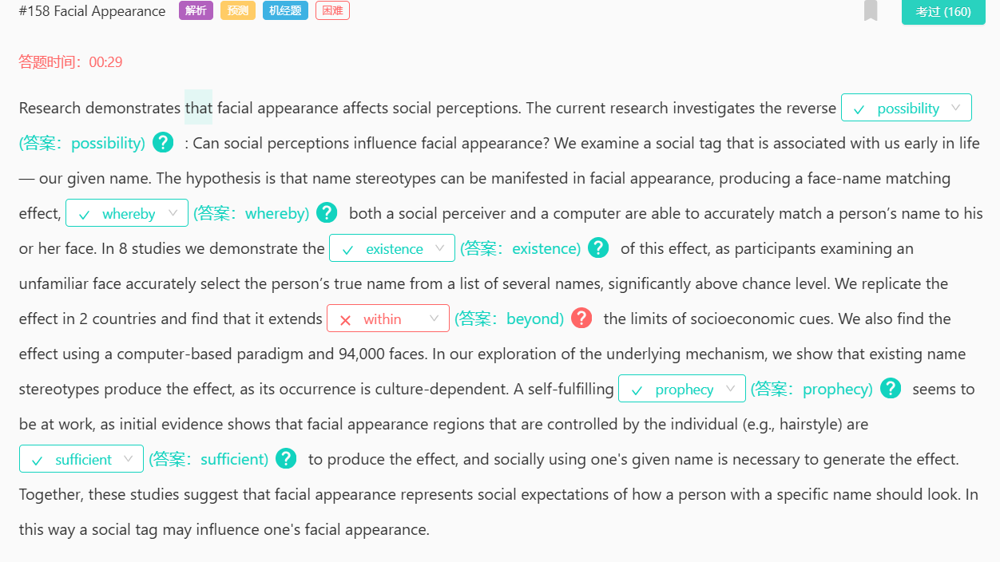
目前的研究调查了相反的【可能性 possibility】社会观念会影响面部外观吗?【由此 whereby】社会感知者和计算机都能够准确地将一个人的名字与他或她的脸相匹配。在8项研究中，我们证明了这种效应的【存在 existence】。我们在两个国家复制了这一效应，发现它【超出 beyond】了社会经济线索的限制。一种自我实现的【预言 prophecy】似乎在起作用，由个人控制的面部外观区域(例如发型)【足以 sufficient】产生这种效果。

421
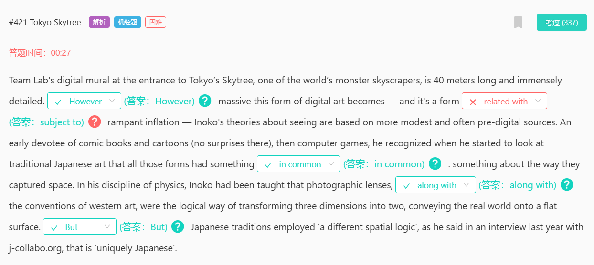
eam Lab的数字壁画位于世界上最大的摩天大楼之一东京Skytree的入口处，长40米，非常详细。【however然而】，这种形式的数字艺术变得多么庞大，而且它是一种容易【subject to受到】猖獗通货膨胀影响的形式——Inoko关于观看的理论是基于更温和的、通常是前数字来源。作为漫画书和漫画的早期爱好者（这并不奇怪），然后是电脑游戏，当他开始研究日本传统艺术时，他意识到所有这些形式都有一些【in common共同点】：它们捕捉空间的方式。在他的物理学学科中，Inoko被教导摄影镜头，【和...一样 along with】西方艺术的惯例是将三维转化为二维，将真实世界传达到平面上的合乎逻辑的方式。【but但是】正如他去年在接受j-collabo.org采访时所说，日本传统采用了“不同的空间逻辑”。

230

这促使全国各地健身和娱乐中心的数量增加【expansion】。高尔夫球场也获得了【enjoyed】新的成功，因为这项运动越来越受欢迎，这可能是婴儿潮一代退休后前往高尔夫球场的结果。2005年，家庭【households】在【娱乐recreation】上的平均支出为3918美元，略高于2004年的3678美元。2005年的数字包括：体育和运动器材平均166美元；665美元购买和驾驶【operate】雪地摩托、自行车和拖车等休闲交通工具；及运动及康乐设施的使用费为299元。

189

强调刻苦学习是学习法律的一个重要部分是很重要的，因为有太多的学生被诱惑，认为他们可以通过依靠他们想象的天生的能力而获得成功，而不必费心增加努力的【支出 expenditure】。打个比方，有些人更喜欢看电视剧改编的经典小说所带来的或多或少的即时【快感gratification】，而不是阅读小说本身的【更费力的 laborious】过程。那些【更喜欢 prefer】看电视而不是阅读这本书的人不太可能成功地学习法律，除非他们迅速地对以文本为基础的材料产生【兴趣taste】

180
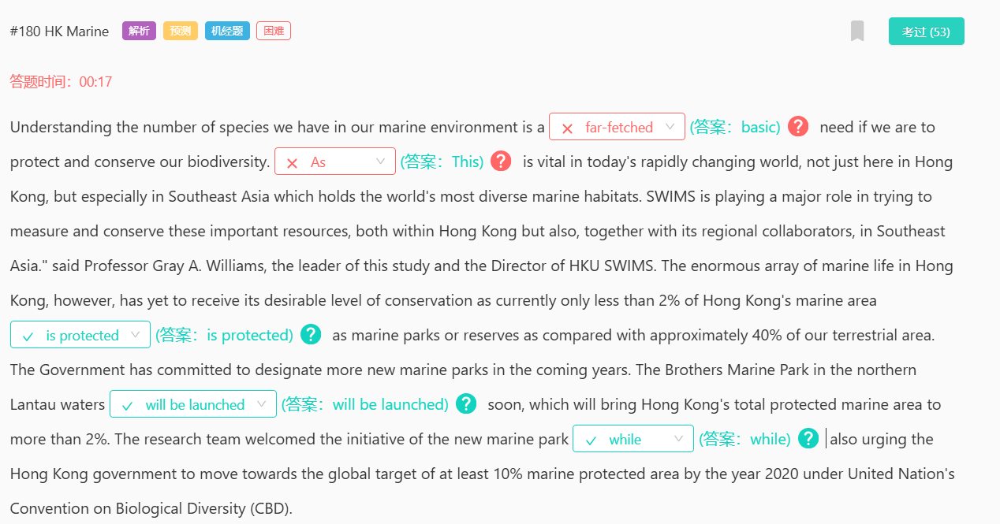
如果我们要保护和养护我们的生物多样性，了解我们海洋环境中的物种数量是一项【基本需求 basic need】。在现今瞬息万变的世界中，【这一点 this】至为重要，不单止在香港，尤其是在拥有世界上最多元化海洋生境的东南亚。SWIMS 在努力测量和保护这些重要资源方面发挥着重要作用，无论是在香港，还是与其区域合作者一起，在东南亚。”这项研究的负责人兼香港大学SWIMS主任Gray A.Williams教授说。然而，本港种类繁多的海洋生物仍未获得理想的保育水平，因为现时本港只有不到2%的海洋面积受到海岸公园或保护区的【保护 is protected】，而我们的陆地面积则约占40%。政府已承诺在未来数年指定更多新的海岸公园。位于大屿山北部水域的兄弟海岸公园【即将启用 will be launched】，使香港受保护的海洋总面积达到2%以上。研究小组对新海岸公园的倡议表示欢迎，【同时 while also】亦促请香港政府根据联合国生物多样性公约（CBD），朝着到2020年至少10%海洋保护区的全球目标迈进。

165

全知可能是人的弱点，但并非书籍的。正如约翰逊所说，知识有两种【kinds 类型】，你可以自己知道一件事，也可以知道在哪里找到它。现在你实际上自己可以知道的量，即使在最好的情况下，也必须是有限的，但你对信息【sources 来源】的了解，通过适当的培训，几乎可以变得无限。而这里就体现了参考书的【value 价值】和用途——一个书籍与另一个书籍的联系运作，并将你自己的【intelligence 智慧】应用到两者之上。通过这种方式，我们尽可能接近那本能告诉一切的全知卷册，虽然不存在能告诉一切的单一卷册或作品，但存在大量的参考书，了解和正确使用这些书对每个有智慧的人来说是必不可少的。尽管我认为参考书是必需的，但它们很容易被使成为【contributory 促成】懒惰的工具，因此不应过于机械地使用它们。

130
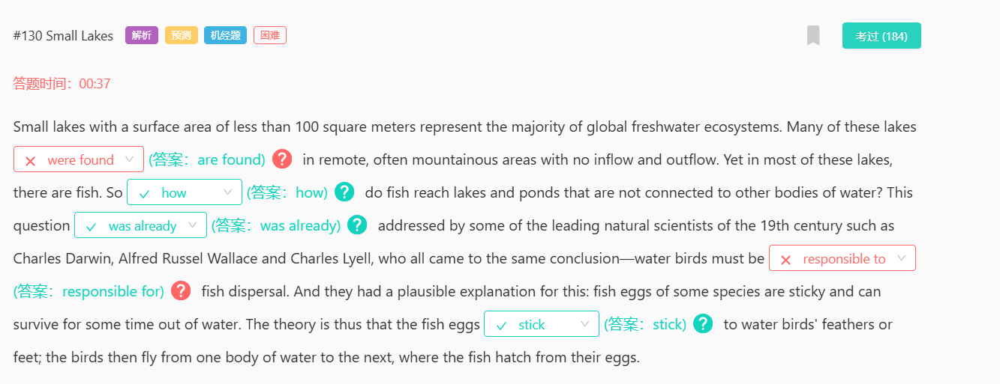
表面积小于100平方米的小湖泊代表了全球淡水生态系统的大多数。这些湖泊中有许多【是在 are found】偏远区域，往往是山区，并没有水的流入和流出。然而，在这些湖泊中，大多数都有鱼。那么鱼是【如何 how】到达与其他水体不相连的湖泊和池塘的呢？19世纪的一些主要的自然科学家，如查尔斯达尔文、阿尔弗雷德拉塞尔华莱士和查尔斯莱尔，【已经 was already】提出了这个问题，他们都得出了同样的结论——水鸟必须对鱼类的扩散【负责 responsible for】。他们对此有一个合理的解释：有些鱼卵是粘性的，可以在离开水后存活一段时间。因此，理论是鱼卵【粘在stick】水鸟的羽毛或脚上；然后鸟儿从一个水域飞到另一个水域，在那里鱼从卵中孵化出来。

125
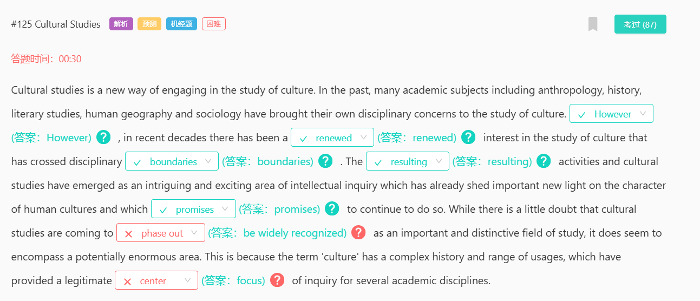
文化研究是从事文化研究的一种新方式。过去，包括人类学、历史学、文学学、人文地理学和社会学在内的许多学科都为文化研究带来了自己的学科关注点。【然而 However】近几十年来，对跨越学科【边界boundaries】的文化研究产生了【重新认识的 renewed】兴趣。【由此产生的 resulting】 活动和文化研究已成为一个有趣和令人兴奋的知识探究领域，它已经为人类文化的特征赋予了重要的新生命，并【承诺 promises】 继续这样做。虽然毫无疑问，文化研究正在【被广泛认可be widely recognized】为一个重要而独特的研究领域，但它似乎确实涵盖了一个潜在的巨大领域。这是因为“文化”一词具有复杂的历史和用法范围，这为几个学科提供了合法的“研究【焦点focus】❌”。

736
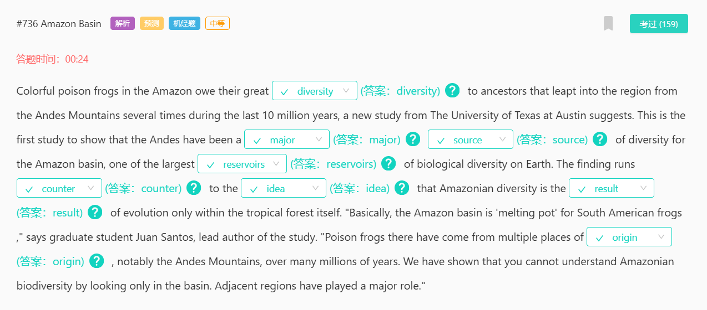
德克萨斯大学奥斯汀分校的一项新研究表明，亚马逊五颜六色的毒蛙的巨大【多样性 diversity】归功于在过去1000万年里几次从安第斯山脉跃入该地区的祖先。这是首次表明安第斯山脉一直是亚马逊盆地多样性的【主要来源 major source】，亚马逊盆地是地球上最大的生物多样性【储存库 reservoirs】之一。这一发现与亚马逊的多样性只是热带森林本身进化的【结果 result】的【观点 idea】【背道而驰 counter】。“基本上，亚马逊盆地是南美青蛙的‘熔炉'，”该研究的主要作者、研究生胡安·桑托斯说。“在数百万年的时间里，那里的毒蛙来自多个【起源 origin】地，尤其是安第斯山脉。我们已经表明，你不能仅仅通过观察流域来理解亚马逊的生物多样性。邻近地区发挥了主要作用。”

734
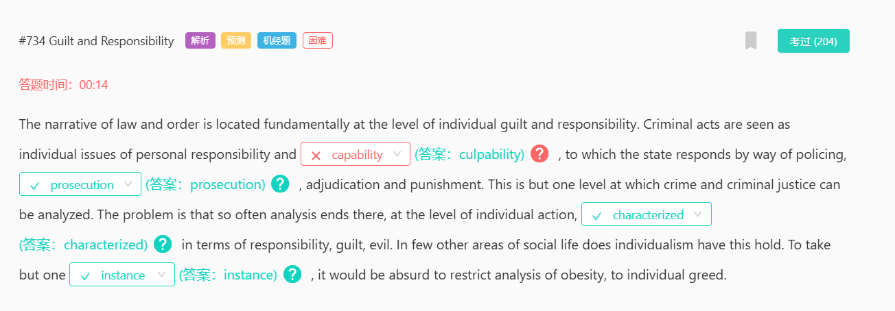
法律与秩序的叙事，从根本上说，定位于个人的【culpability 罪责】层面。犯罪行为被视为个人责任和罪责的个别问题，国家通过维持治安policing，【起诉 prosecution】，判决adjudication和惩罚punishment的方式对此作出反应。这只是可以分析犯罪和刑事司法的一个层面。问题是，分析常常在个人行动的层面上结束，其【特点 characterized】是责任，内疚和邪恶。在社会生活的其他领域，个人主义很少能有这样的影响力。仅举一个例子，把对肥胖的分析局限于个人的贪婪是【荒谬 absurd】的。

722
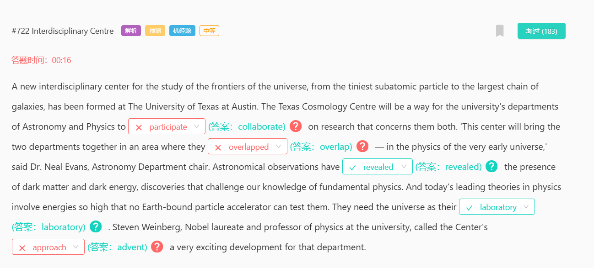
德克萨斯大学奥斯汀分校（University of Texas at Austin）成立了一个新的跨学科研究宇宙边缘的中心，从最小的亚原子粒子到最大的星系链。德克萨斯州宇宙学中心将是该大学天文学和物理学系【合作 collaborate】进行研究的一种方式，这两个学科都与德克萨斯州宇宙学中心有关。”天文学系主任尼尔·埃文斯博士说：“这个中心将把这两个部门聚集在一起，形成一个在早期宇宙物理学中相互【重叠 overlap】的领域。”天文观测【揭示了 revealed】暗物质和暗能量的存在，这些发现挑战了我们对基础物理学的认识。今天物理学的主要理论涉及的能量如此之高，以至于没有一个地球粒子加速器可以测试它们。他们需要宇宙作为他们的【实验室 laboratory】。诺贝尔奖获得者、大学物理教授史蒂文·温伯格博士称该中心的【出现 advent】是该系“一个非常令人兴奋的发展”。

715
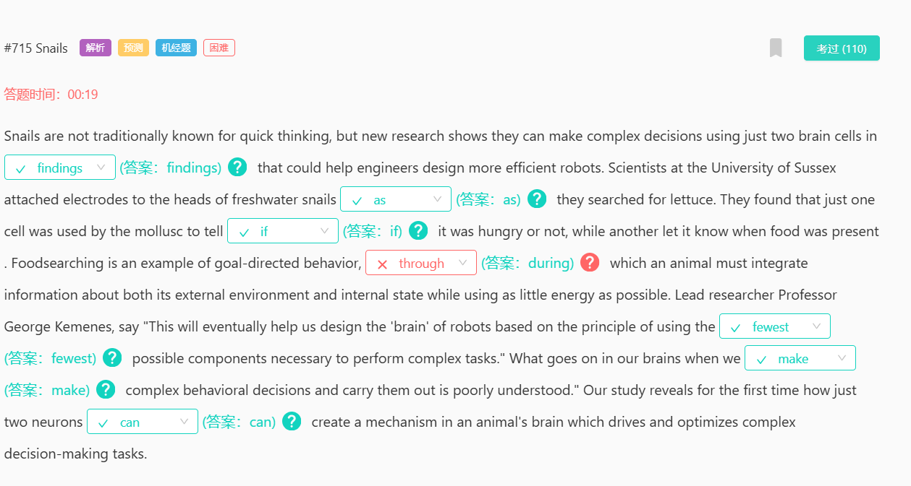
蜗牛传统上并不以思维敏捷著称，但新的研究表明，它们只需使用两个脑细胞就能做出复杂的决定，这一【发现 findings】可能有助于工程师设计更高效的机器人。苏塞克斯大学的科学家【在 as】蜗牛寻找莴苣时，将电极连接到它们的头部。他们发现，只有一个细胞被软体动物用来判断它【是否 if】饥饿，而另一个细胞让它知道什么时候有食物。食物搜索是目标导向行为的一个例子，【在 during，在...中】此过程中，动物必须整合关于其外部环境和内部状态的信息，同时使用尽可能少的能量。首席研究员George Kemenes教授说：“这将最终帮助我们设计机器人的‘大脑’，它基于使用尽可能【最少的 fewest】必要部件来完成复杂任务的原则。”当我们【做出 make，固定搭配：做决定，make decisions】复杂的行为决定并执行它们时，我们的大脑中发生了什么却知之甚少。“我们的研究首次揭示了仅仅两个神经元如何【能 can】在动物大脑中创建一种机制，驱动和优化复杂的决策任务。

708

历史书告诉我们的过去并不是发生的一切，而是经过历史学家【挑选的 have selected】。他们不能把一切都放进去：必须做出选择。同样，必须做出选择，以学校历史课的形式，将过去的哪些方面正式传授给下一代。因此，【例如 for example】，当英格兰和威尔士的国家学校课程在20世纪80年代末首次讨论时，历史课程是公众和媒体相当【感兴趣的 interest】主题。政治家们为此争论不休；人们为此给新闻界写信；当时的首相玛格丽特·撒切尔【介入了 intervened】辩论。让我们先考虑一下内容的问题。在这个问题上有两个主要的阵营：一个是认为英国历史应该占主导地位的【阵营 place】，另一个是支持所谓的“世界史”的阵营。

639
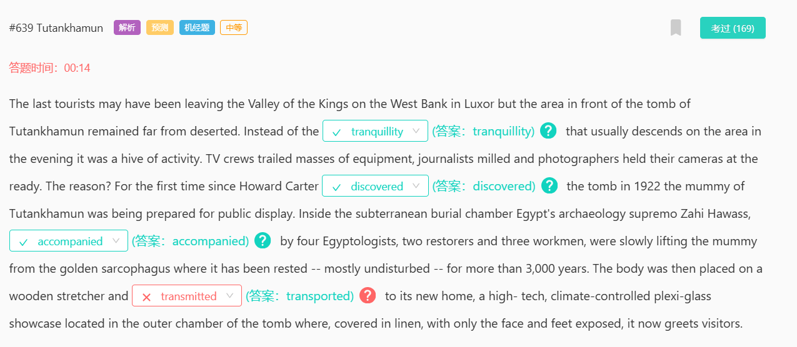
最后一批游客可能已经离开了卢克索西岸的国王谷，但Tutankhamun墓前的区域仍然远离荒芜。晚上，这片区域并不像往常那样【宁静tranquility】，而是一片繁忙的景象。电视摄制组尾随着大量设备，记者们四处走动，摄影师们拿着相机随时准备拍照。原因何在？自从霍华德·卡特在1922年【发现discovered】这座坟墓以来，Tutankhamun的木乃伊第一次准备公开展出。在地下墓室里，埃及考古学家扎希·哈瓦斯在四名埃及古物学家、两名修复者和三名工人的陪同【accompanied】下，正缓慢地将这具木乃伊从金质石棺中抬出来，这具石棺已经在那里【休憩it has been rested】了3000多年，大部分时间没有受到干扰。遗体被放在一个木制担架上，并被运送到【transported】它的新家，这是一个高科技的、可调节温度的有机玻璃陈列柜，位于墓室的外室，上面覆盖着亚麻布，只有脸和脚露在外面，现在迎接来访者参观。

613
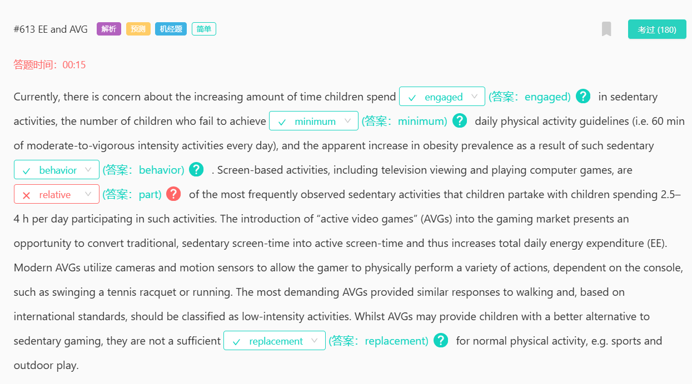
目前，人们关注的是，儿童【花在spend engaged in】久坐活动上的时间越来越多，未能达到每日【最低minimum】体力活动指南(即每天60分钟的中等至高强度活动)的儿童数量，以及这种【久坐行为sedentary behaviors】导致的 (as a result of) 肥胖患病率明显上升。以屏幕为基础的活动，包括看电视和玩电脑游戏，是【一部分part of】孩子们最常参与的久坐活动，孩子们每天花2.5-4小时参与这些活动。将“主动视频游戏”(avg)引入游戏市场，将传统的久坐屏幕时间转化为主动屏幕时间，从而增加每日总能量消耗(EE)。现代avg利用摄像头和运动传感器，让玩家能够根据主机进行各种动作【actions】，如挥动网球拍或跑步。最苛刻的平均运动强度与步行的反应相似，根据国际标准，应归类为低强度活动。虽然avg可以为儿童提供静坐游戏【gaming】的更好选择，但它们不足以成为正常的身体活动的【替代品replacement】，例如运动和户外游戏。

579
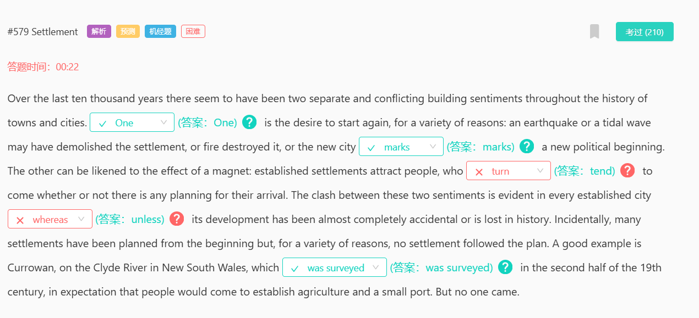
在过去的一万年里，在整个城镇历史中似乎存在两种独立且相互矛盾的建筑情绪。【一个 One】是由于各种原因重新开始的愿望：地震或潮汐可能已经拆除了定居点，或者火灾摧毁了它，或者新城市 【标志着 marks 】一个新的政治开端。另一个可以比作磁铁的效果：既定的定居点会吸引人们，人们往往会来【tend】不管他们是否有任何前来的计划。这两种情绪之间的冲突在每个已建立的城市都很明显，【除非 unless】它的发展几乎完全是偶然的或在历史中丢失。顺便提一下，许多定居点从一开始就已经计划好了，但由于种种原因，该计划没有达成和解。一个很好的例子是新南威尔士州克莱德河上的Currowan，它在19世纪下半叶 【被勘查/测量 was surveyed】，曾期望人们能够前来建立农业和小港口。但【没有人 no one came】来

576
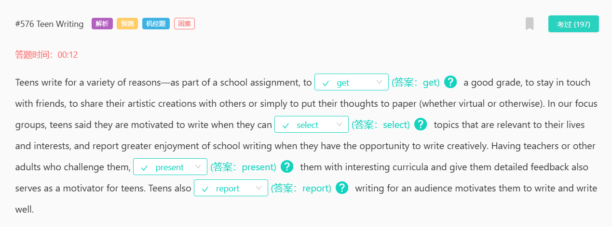
青少年写作的原因多种多样--作为学校作业的一部分，为了【取得get】好成绩，为了与朋友保持联系，为了与他人分享他们的艺术创作，或者仅仅是为了把他们的想法写在纸上（不管是虚拟的还是其他的）。在我们的焦点小组中，青少年们说，当他们能够【选择select】与他们的生活和兴趣相关的话题时，他们就会有写作的动力，当他们有机会创造性地写作时，他们就会声称从学校写作中获得了更大乐趣。教师或其他成年人向他们提出挑战，【向他们提供present them with】有趣的课程并给他们详细的反馈，也是青少年的动力。青少年还【报告report】说，为观众写作能激励他们写作和并因此写得好

544
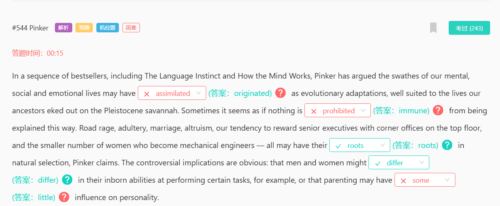
在一系列畅销书中，包括《语言本能》和《头脑如何运作》，Pinker认为，我们的精神、社会和情感生活可能【起源于 originated】进化适应，这非常契合我们祖先在更新世大草原上勉强维持的生活。有时，似乎没有什么【不能 immune】以此解释。Pinker声称，路怒、通奸、婚姻、利他主义、我们奖励高层管理人员在顶层设立角落办公室的倾向，以及成为机械工程师的较少的女性人数，所有这些都可能【源于 roots】自然选择。争议点是显而易见的：例如，男人和女人在执行某些任务时的天生能力可能【不同 differ】，或者养育子女对个性的影响可能【很小 little】。