#282 Dr. Google
expertise

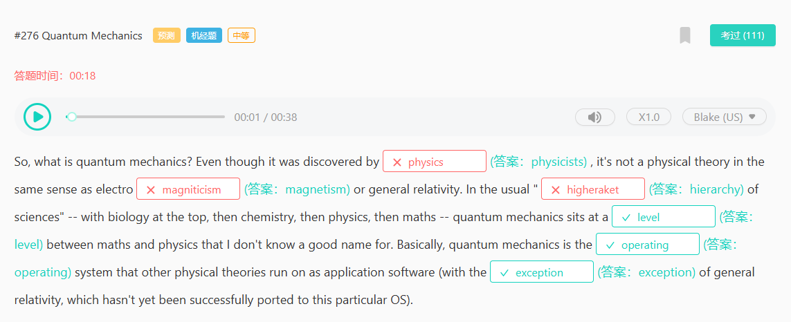
#276 Quantum Mechanics
physicists
magnetism
hierarchy
所以，什么是量子力学？尽管它是由物理学家发现的，但它并不像电磁学或广义相对论那样是一种物理理论。在通常的“科学层级”中——生物学位于顶端，接着是化学、物理学，最后是数学——量子力学处于数学和物理学之间的一个层级，我不知道该怎么准确命名这个层级。基本上，量子力学是其他物理理论运行的操作系统，就像应用软件一样（除了广义相对论，它还没有成功地移植到这个特定的操作系统上）。

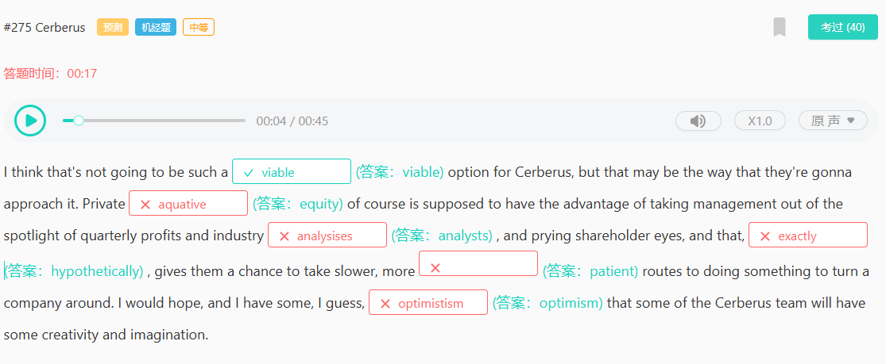
#275 Cerberus
equity
analysis
analyst
hypothetically
optimism
optimistic

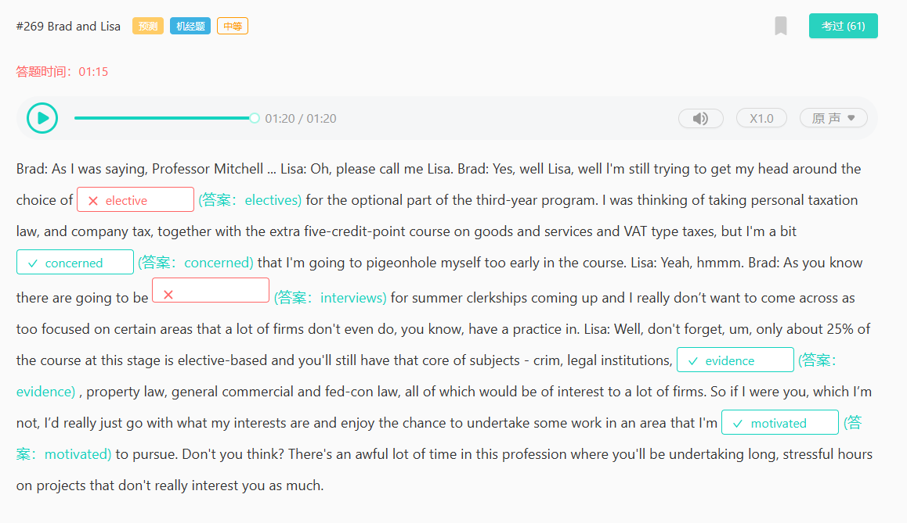
#269 Brad and Lisa

electives

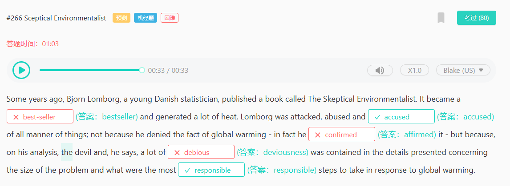
#266 Sceptical Environmentalist
bestseller
affirmed
deviousness

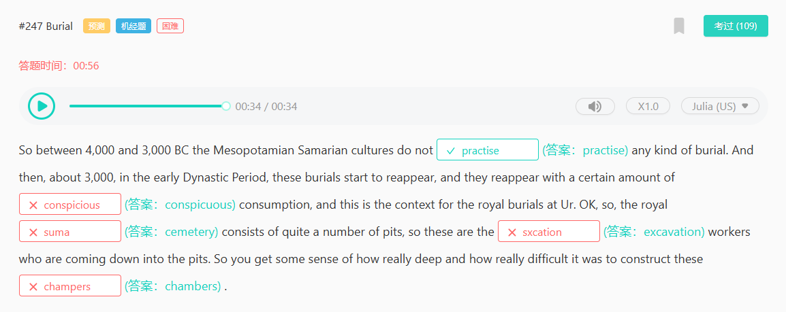
#247 Burial

conspicuous
cemetery
excavation
chambers

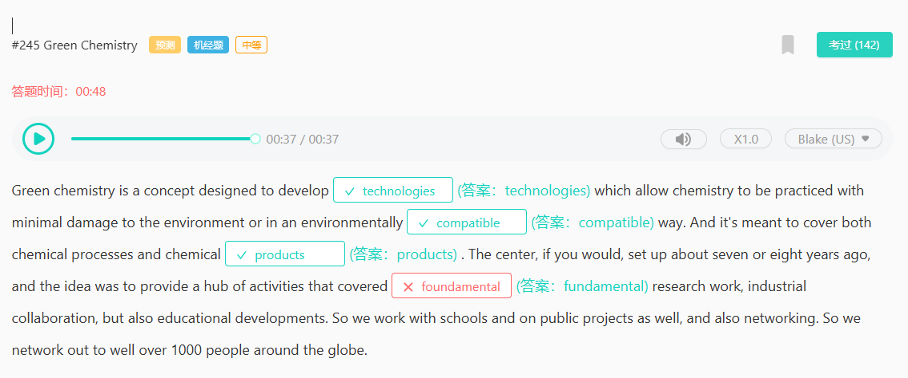
#245 Green Chemistry
compatible
fundamental

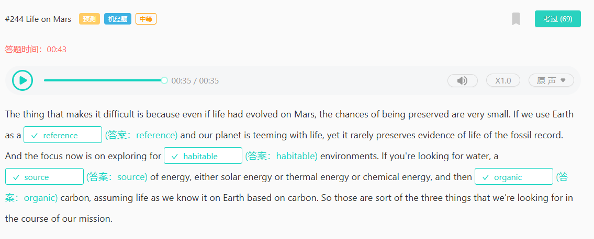
#244 Life on Mars
habitable

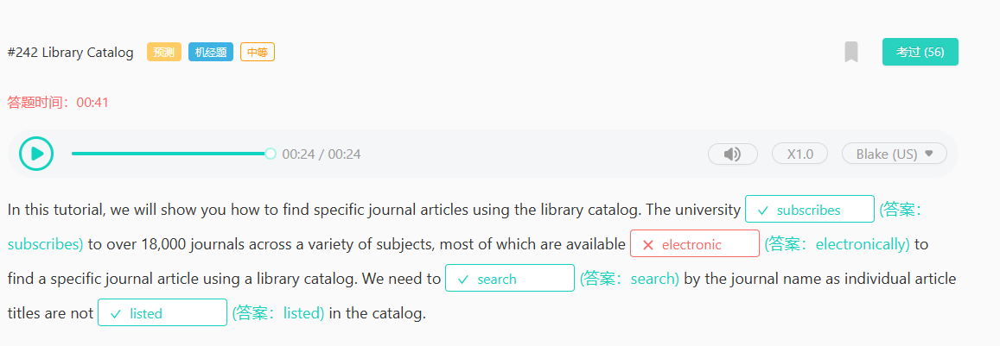
#242 Library Catalog
electronically

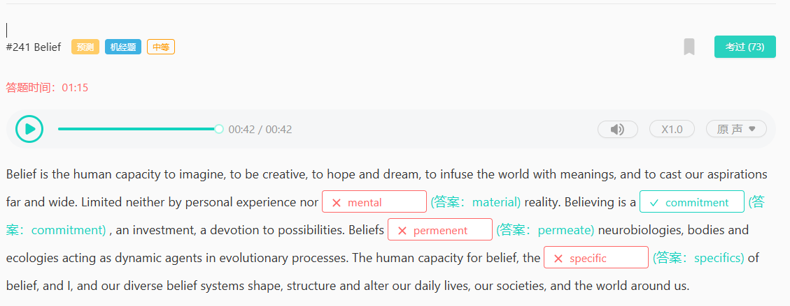
#241 Belief
permanent
permeate
material
specific

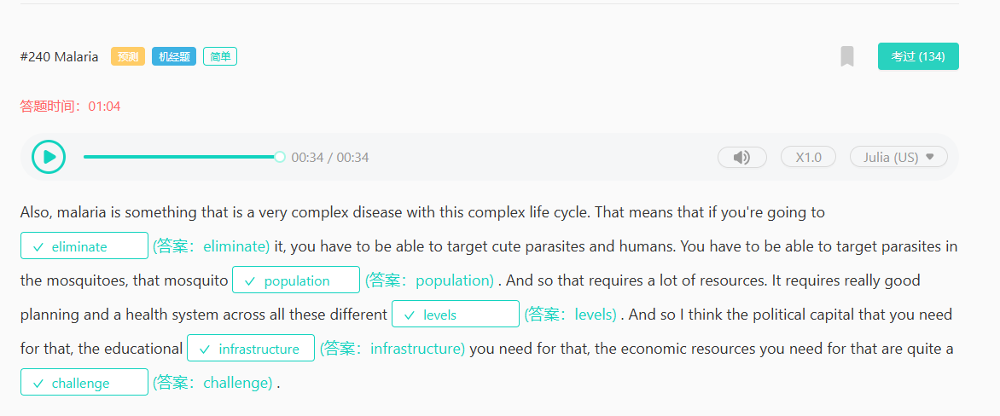
#240 Malaria
infrastructure
eliminate

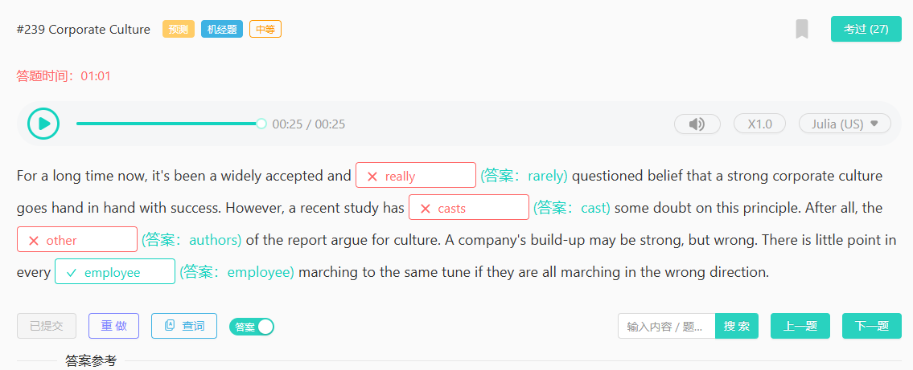
author
rarely
cast cast cast