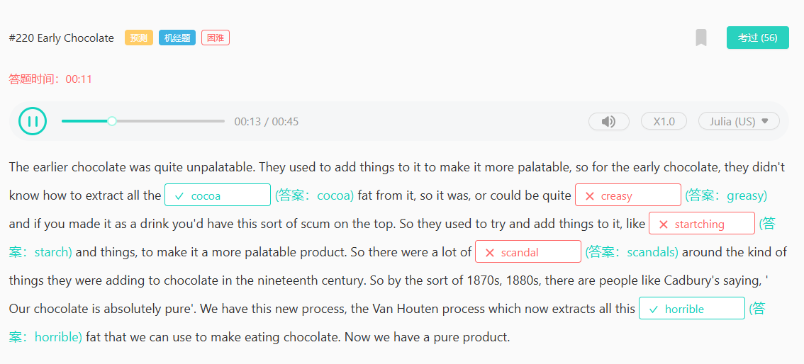
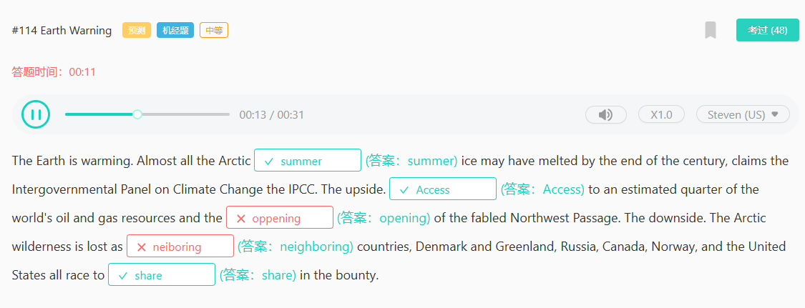

#282 Dr. Google
expertise

#276 Quantum Mechanics
physicists
magnetism
hierarchy
所以，什么是量子力学？尽管它是由物理学家发现的，但它并不像电磁学或广义相对论那样是一种物理理论。在通常的“科学层级”中——生物学位于顶端，接着是化学、物理学，最后是数学——量子力学处于数学和物理学之间的一个层级，我不知道该怎么准确命名这个层级。基本上，量子力学是其他物理理论运行的操作系统，就像应用软件一样（除了广义相对论，它还没有成功地移植到这个特定的操作系统上）。

#275 Cerberus
equity
analysis
analyst
hypothetically
optimism
optimistic

#269 Brad and Lisa

electives

#266 Sceptical Environmentalist
bestseller
affirmed
deviousness

#247 Burial

conspicuous
cemetery
excavation
chambers

#245 Green Chemistry
compatible
fundamental

#244 Life on Mars
habitable

#242 Library Catalog
electronically

#241 Belief
permanent
permeate
material
specific

#240 Malaria
infrastructure
eliminate

author
rarely
cast cast cast

#236 Locomotion
relative /ˈrelətɪv/ /ˈrelətɪv/ n. 亲戚，亲属；同类事物，亲缘动物（或植物）；（语法）关系代词，关系限定词，关系副词；（哲学）关系项；相关物；adj. 相比较而言的，比较的；相对的，相关联的

#235 Industrial Productivity

#234 Banana
tremendous /trəˈmendəs/ /trəˈmendəs/ adj. 巨大的，极大的；极好的，精彩的；令人望而生畏的，可怕的
dawn /dɔːn/ /dɑːn/ v. 变得明朗，开始清楚；破晓，开始；n. 拂晓，黎明；曙光，开端

#227 Memory
perception /pəˈsepʃ(ə)n/ /pərˈsepʃ(ə)n/ n. 看法，认识；感觉，感知；洞察力

#226 Banana
spray /spreɪ/ /spreɪ/ n. 喷雾液体，喷剂；喷雾器；喷，喷涂；喷雾状物；浪花，飞沫；v. 喷，喷洒（液体）；（使）飞溅，（使）飞散；喷农药
respiration /ˌrespəˈreɪʃ(ə)n/ /ˌrespəˈreɪʃ(ə)n/ n. 呼吸；（医）一次呼吸

#225 Adidas
segment /ˈseɡmənt/ /ˈseɡmənt/ n. 部分，片段；（市场）细分的部分
opportunity /ˌɒpəˈtjuːnəti/ /ˌɑːpərˈtuːnəti/ n. 时机，机会

#224 Medical Care
determinant /dɪˈtɜːmɪnənt/ /dɪˈtɜːrmɪnənt/ n. 决定性因素，决定条件；决定子，因子；行列式，方阵；adj. 决定性的
determination /dɪˌtɜːmɪˈneɪʃ(ə)n/ /dɪˌtɜːrmɪˈneɪʃ(ə)n/ n. 决心，坚定；决定，裁定；测定，确定
executive /ɪɡˈzekjətɪv/ /ɪɡˈzekjətɪv/ adj. 行政的，有执行权的；高档的，豪华的；供主管人员使用的；（有关）经营管理的，领导的；n. 主管，经理；行政部门，执行委员会
audacity /ɔːˈdæsəti/ /ɔːˈdæsəti/ n. 大胆；厚颜无耻

#223 Technology and Business
convergence /kənˈvɜːdʒəns/ /kənˈvɜːrdʒəns/ n. 趋同；汇集，相交

#222 Age

#221 Lead-in Time

#220 Early Chocolate
greasy /ˈɡriːsi/ /ˈɡriːsi/ adj. 沾油脂的，油污的；含脂肪的，油腻的；油性的；滑的
starch /stɑːtʃ/ /stɑːrtʃ/ n. 淀粉，含淀粉的食物；（浆衣服的）浆粉，淀粉浆
scandal /ˈskænd(ə)l/ /ˈskænd(ə)l/ n. 丑行，丑闻；流言蜚语，谣言
horrible /ˈhɒrəb(ə)l/ /ˈhɔːrəb(ə)l/ adj. 可怕的，令人恐惧的；糟糕的，讨厌的

#219 Palm Oil
devastation /ˌdevəˈsteɪʃn/ /ˌdevəˈsteɪʃn/ n. 毁坏，破坏；荒废
deforestation /ˌdiːˌfɒrɪˈsteɪʃn/ /ˌdiːˌfɔːrɪˈsteɪʃ(ə)n/ n. 毁林，滥伐森林

#217 Loose Them
biologic /ˌbaɪəʊˈlɒdʒɪk/ /ˌbaɪəˈlɑːdʒɪk/ adj. 生物的；生物学的
biological /ˌbaɪəˈlɒdʒɪk(ə)l/ /ˌbaɪəˈlɑːdʒɪk(ə)l/ adj. 生物的，生物学的，生命的
molecule /ˈmɒlɪkjuːl/ /ˈmɑːlɪkjuːl/ n. 分子，摩尔；少量，一点儿
matter /ˈmætə(r)/ /ˈmætər/ n. 事情，问题；事态，情况；困境，麻烦（the matter）；物质；材料，物品，东西

我们决定为这门课程采用一个宽松的生物学主题，这样你可以看到化学和生物学之间的联系，以及你未来可能考虑做的事情。我们希望你思考与你的身体相关的分子、在你体内发生的进程、正在进行的化学反应，以及能量如何在其中发挥作用。我们将课程分为四个部分，每个部分结束后会有一个期中考试。第一部分是关于物质的。

#216 Seminal Difference
bias /ˈbaɪəs/ /ˈbaɪəs/ n. 偏见，成见；偏好，天赋；倾向；v. 使有偏见，使偏心
hamper /ˈhæmpə(r)/ /ˈhæmpər/ v. 阻碍，妨碍
coalition /ˌkəʊəˈlɪʃ(ə)n/ /ˌkoʊəˈlɪʃ(ə)n/ n. 联合政府；联合体，联盟；联合，结合
separate /ˈseprət/ /ˈseprət/ adj. 单独的，分开的；不同的，不相关的；v. （使）分离；（把……）分成不同部分
commercialize /kəˈmɜːʃəlaɪz/ /kəˈmɜːrʃəlaɪz/ v. 使商业化；使商品化

#208 Well-being

#166 Cultural Heritage
threat /θret/ /θret/ n. 威胁，恐吓；构成威胁的人
threaten /ˈθret(ə)n/ /ˈθret(ə)n/ v. 威胁，恐吓；危及，对……构成威胁

#165 Cavemen
inaccurate /ɪnˈækjərət/ /ɪnˈækjərət/ adj. 不精确的，不准确的
analyze /ˈænəlaɪz/ /ˈænəlaɪz/ vt. 对……进行分析，分解（等于 analyse）

#164 Dogs
hygiene /ˈhaɪdʒiːn/ /ˈhaɪdʒiːn/ n. 卫生；卫生学，保健学
respiratory /rəˈspɪrət(ə)ri/ /ˈrespərətɔːri/ adj. 呼吸的

#141 Bees
vampire /ˈvæmpaɪə(r)/ /ˈvæmpaɪər/ n. （故事中的）吸血鬼；（喻）无情掠夺者，吸血鬼
disappear /ˌdɪsəˈpɪə(r)/ /ˌdɪsəˈpɪr/ v. 消失，不见；失踪，丢失；不复存在，灭绝

#139 Benefits

#135 Pharmaceutical Industry
prescribe /prɪˈskraɪb/ /prɪˈskraɪb/ v. 给……开（药），让……采用（疗法）；开处方；规定，命令

#134 Almonds
cardiologist /ˌkɑːdiˈɒlədʒɪst/ /ˌkɑːrdiˈɑːlədʒɪst/ n. 心脏病学家；心脏病科医师
confection /kənˈfekʃn/ /kənˈfekʃn/ n. 糖果，蜜饯；调制；糖膏（剂）；精制工艺品
legitimate /lɪˈdʒɪtɪmət/ /lɪˈdʒɪtɪmət/ adj. 正当的，合理的；合法的，依法的；合法婚姻所生的；（君主）有合法王位继承权的；v. <美>使合法化，使正当化

#133 Share Prices
plunge /plʌndʒ/ /plʌndʒ/ v. （使）突然向前倒下（跌落）；猛推，猛插；投入（液体中以使淹没）；（价值）猛跌

#130 Arts and Humanities

#129 New Epidemic
symptom /ˈsɪmptəm/ /ˈsɪmptəm/ n. （医）症状；（大问题的）迹象，征兆，征候

#125 Cars in America
sleek /sliːk/ /sliːk/ adj. 光滑的，光亮的；线条流畅的，造型优美的；时髦阔气的；油嘴滑舌的；v. 使平整光亮；掩盖；打扮整洁
hydrogen /ˈhaɪdrədʒən/ /ˈhaɪdrədʒən/ n. 氢，氢气

#119 Green Chemistry
compatible /kəmˈpætəb(ə)l/ /kəmˈpætəb(ə)l/ adj. 兼容的；可共存的；可和睦相处的；与……一致的；n. 兼容性（计算机）
compatibility /kəmˌpætəˈbɪləti/ /kəmˌpætəˈbɪləti/ n. 共存；和睦相处；（计算机设备的）兼容性

#118 Weather Change
temperature /ˈtemprətʃə(r)/ /ˈtemprətʃər; ˈtemprətʃʊr/ n. 温度，气温；体温

#114 Earth Warning
neighboring /ˈneɪbərɪŋ/ /ˈneɪbərɪŋ/ adj. 邻近的；附近的（等于 neighbouring）；v. 与……为邻；位于附近（neighbor 的 ing 形式）

#110 Sunflowers
depiction /dɪˈpɪkʃn/ /dɪˈpɪkʃ(ə)n/ n. 描述，描绘
repetition /ˌrepəˈtɪʃ(ə)n/ /ˌrepəˈtɪʃ(ə)n/ n. 重复，重说，重做；重做的事，重说的话；重复的事物，复制品
curious /ˈkjʊəriəs/ /ˈkjʊriəs/ adj. 好奇的，求知欲强的；稀奇的，不寻常的；爱挑剔的
extensive /ɪkˈstensɪv/ /ɪkˈstensɪv/ adj. 广阔的；广泛的；巨大的，大量的
original /əˈrɪdʒən(ə)l/ /əˈrɪdʒən(ə)l/ adj. 起初的，原先的；原作的，真迹的；新创作的，未发表的；独创的，新颖的；有独到见解的，有独创性的；n. （艺术作品或文件的）原件，原稿；（文学作品中人物或地点的）原型；原版书

#109 Tax Increases
insurance /ɪnˈʃʊərəns/ /ɪnˈʃʊrəns/ n. 保险；保险费；保险业；保险赔偿金，保险金；保险单

#105 Entrepreneurs
recession /rɪˈseʃ(ə)n/ /rɪˈseʃ(ə)n/ n. （经济的）衰退（期）；<正式>退后，撤回
frontier /ˈfrʌntɪə(r)/ /frʌnˈtɪr/ n. 边境，国界；(常sing.) 西部边疆，边远地区；（尤指知识的）前沿，新领域；adj. 边境的，边疆的

#99 Nanotechnology
macromolecular /ˌmækrəʊməˈlekjʊlə(r)/ /ˌmækrəʊməˈlekjʊlər/ adj. [化学] 大分子的
loosely /ˈluːsli/ /ˈluːsli/ adv. 宽松地；放荡地；轻率地

#96 Financial Markets
radically /ˈrædɪkli/ /ˈrædɪkli/ adv. 根本上，彻底地
oceanographer /ˌəʊʃəˈnɒɡrəfə(r)/ /ˌoʊʃəˈnɑːɡrəfər/ n. 海洋学家；海洋研究者

#95 Oceanographer
habitant /ˈhæbɪtənt/ /ˈhæbɪtənt/ n. 居民，居住者
habitat /ˈhæbɪtæt/ /ˈhæbɪtæt/ n. （动植物的）生活环境，栖息地
unashamedly /ˌʌnəˈʃeɪmɪdli/ /ˌʌnəˈʃeɪmɪdli/ adv. 无愧地；厚颜无耻
socialize /ˈsəʊʃəlaɪz/ /ˈsoʊʃəlaɪz/ v. 交往，交际；使合群，使适应社会生活

#94 Beautiful Building

#92 CPG

#88 Water Crisis
academics /ˌækəˈdemɪks/ n. 学术水平；学术知识；专业学者
academic /ˌækəˈdemɪk/ /ˌækəˈdemɪk/ adj. 学业的，学术的；学校的，学院的；学业（成绩）优秀的，善于学习的；不切实际的，空谈的；n. 大学教师，学者；（学校或学院的）课程；大学生
academical /ˌækəˈdemɪk(ə)l/ /ˌækəˈdemɪkəl/ adj. 学院的，学术的；n. 大学制服，学位服
foreshadow /fɔːˈʃædəʊ/ /fɔːrˈʃædoʊ/ vt. 预示；成为……的前兆；n. 预兆
region /ˈriːdʒən/ /ˈriːdʒən/ n. 地区，区域；行政区；<英>（首都以外的）地方（the regions）；身体部位；领域
regional /ˈriːdʒən(ə)l/ /ˈriːdʒən(ə)l/ adj. 地区的，区域的；（与）首都以外各地（有关）的；n. （邮票、报纸等）地方版；<美>地区性体育竞赛
beleaguer /bɪˈliːɡə(r)/ /biˈliːgər; bɪˈliːgər/ v. 包围，围攻；使处于困境，困扰
predicament /prɪˈdɪkəmənt/ /prɪˈdɪkəmənt/ n. 窘况，困境；状态

#86 Shakespeare

#85 Neo-Latin
pseudo-latin
pseudocode /ˈsju:dəʊˌkəʊd/ /ˈsuːdoʊˌkoʊd/ n. 伪代码；假码；虚拟程序代码
glean /ɡliːn/ /ɡliːn/ vt. 收集（资料）；拾（落穗）；vi. 收集；拾落穗

#89 Laurence Stephen Lowry
industrial /ɪnˈdʌstriəl/ /ɪnˈdʌstriəl/ adj. 工业的，产业的；有很多产业的，工业发达的
distinctive /dɪˈstɪŋktɪv/ /dɪˈstɪŋktɪv/ adj. 独特的，与众不同的
portrait /ˈpɔːtreɪt/ /ˈpɔːrtrət/ n. （尤指只刻画脸、头和肩部的）肖像，照片，雕像；描绘，描述

#87 Warmer Ocean

#82 Public Views
planet /ˈplænɪt/ /ˈplænɪt/ n. 行星；地球（the planet）
enlarge /ɪnˈlɑːdʒ/ /ɪnˈlɑːrdʒ/ v. 扩大，增大，放大
wisdom /ˈwɪzdəm/ /ˈwɪzdəm/ n. 智慧，才智；明智；学问，知识
patriotism /ˈpætriətɪzəm; ˈpeɪtriətɪzəm/ /ˈpeɪtriətɪzəm/ n. 爱国主义，爱国精神
partial /ˈpɑːʃ(ə)l/ /ˈpɑːrʃ(ə)l/ adj. 部分的，不完全的；偏袒的，不公平的；偏爱的

#80 CEO's Duty
irrelevant /ɪˈreləvənt/ /ɪˈreləvənt/ adj. 不相关的，不相干的

#79 Dropping Out

#72 Integrated Ticketing

#71 Japanese Researchers
constant /ˈkɒnstənt/ /ˈkɑːnstənt/ adj. 持续不断的，经常发生的；恒定的，不变的；忠诚的，忠实的；n. 常数，恒量；不变的事物

#73 Online Dating
categorize /ˈkætəɡəraɪz/ /ˈkætəɡəraɪz/ v. 将……分类，把……列作
essentially /ɪˈsenʃəli/ /ɪˈsenʃəli/ adv. 本质上，根本上；大体上，基本上
realist /ˈriːəlɪst; ˈrɪəlɪst/ /ˈriːəlɪst/ n. 现实主义者；实在论者
mate /meɪt/ /meɪt/ n. <英，非正式>朋友，伙伴；同伴，同事；配偶，伴侣；配对物，一对中的一个；v. （使）交配；连接，配备

#15 Political Parties
struggle /ˈstrʌɡ(ə)l/ /ˈstrʌɡ(ə)l/ v. 奋斗，努力；搏斗，扭打，挣扎脱身；争夺，争抢；奋力前进，艰难行进；n. 奋斗，斗争；难事；搏斗，扭打
recruitment /rɪˈkruːtmənt/ /rɪˈkruːtmənt/ n. 招募，招聘；（自然种群）增长
biased /ˈbaɪəst/ /ˈbaɪəst/ adj. 有偏见的，偏袒一方的；偏向……的，偏重……的；v. 使有偏心，使偏向；加偏压于（bias 的过去式和过去分词）
originate /əˈrɪdʒɪneɪt/ /əˈrɪdʒɪneɪt/ v. 起源，产生；创始，开创
