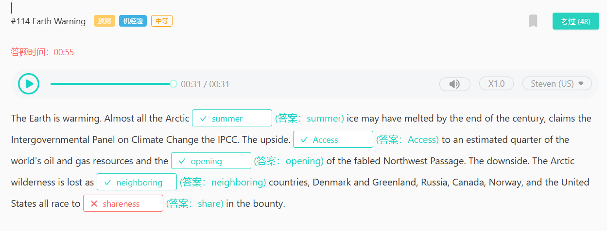
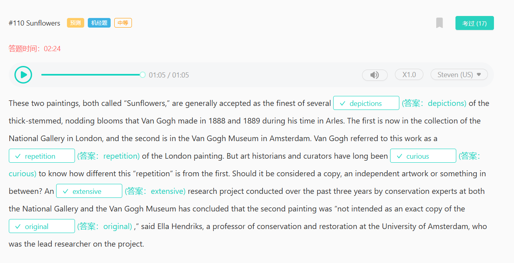
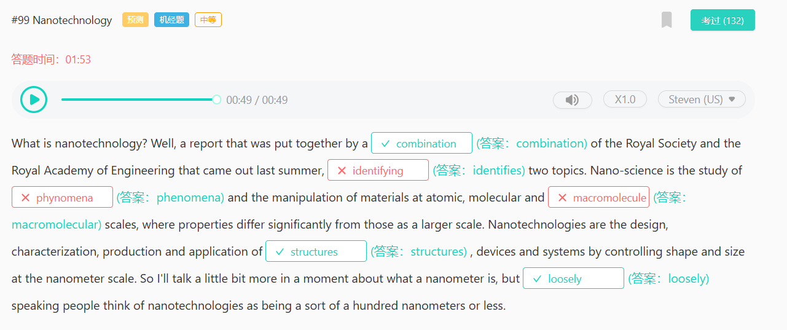
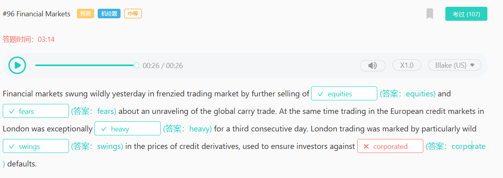
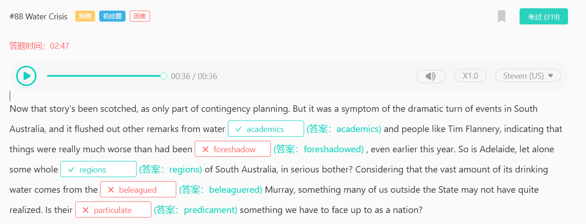
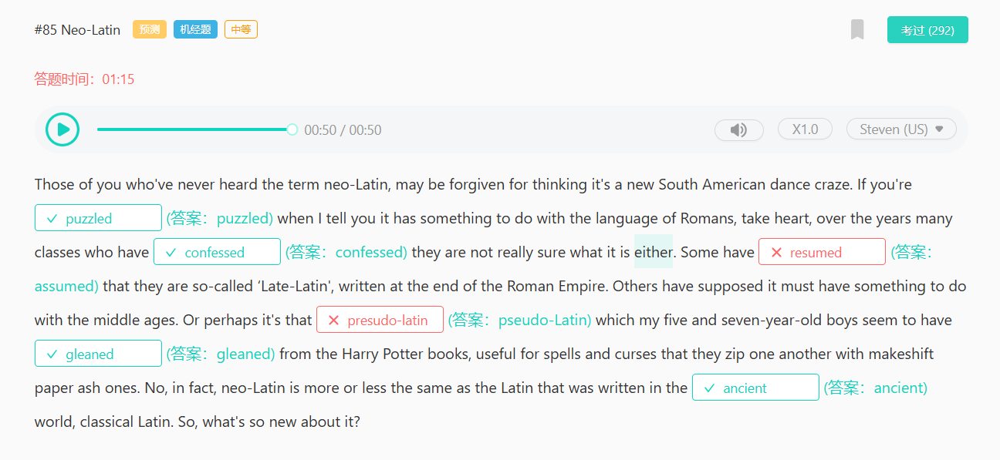
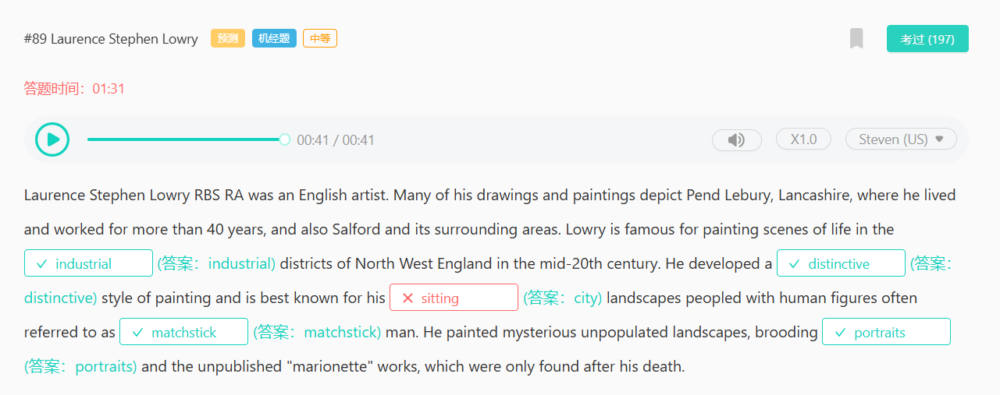
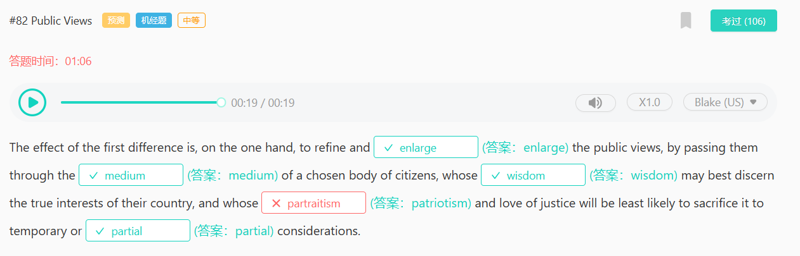
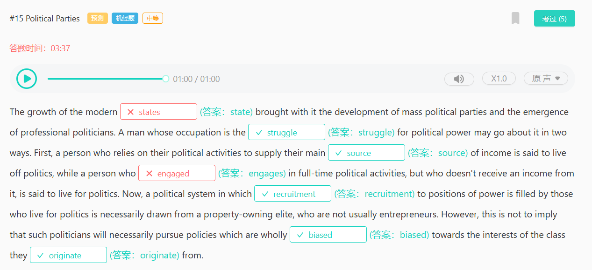

frenyliu
276

那么，什么是量子力学呢?尽管它是由【物理学家 physicists】发现的，但它不是【电磁学 magnetism】或广义相对论意义上的物理理论。在通常的“【等级制度 hierarchy】”科学中，生物学是最顶尖的，然后是化学，然后是物理，然后是数学——量子力学处于一个 √【水平 level】

在数学和物理之间，我不知道一个好名字。基本上，量子力学是其他物理理论作为应用软件运行的【操作 operating】系统(广义相对论 √【除外 exception】，它还没有成功地移植到这个特定的操作系统上)。

magnetism
physicists
hierachy

275

hypothesis
optimism

Cerberus 可能不会选择某个可行的选项（viable option），但他们可能会以这种方式来处理问题。私募股权（private equity）的优势在于，它可以使公司的管理层摆脱季度利润、行业分析师（industry analysts）和股东的压力，这样可以给他们更多的时间和空间（hypothetically）采取更慢、更耐心的方式（patient routes）来扭转公司局面。Cerberus 团队的一些乐观情绪（optimism），希望他们能够展现一些创造力和想象力来解决问题。

269

学生:我还在考虑第三年课程选修部分的【× 选修课】。

S：l'm still trying to get my head around the choice of 【electives】 for the optional part of the third-year program.

S:我在考虑选个人税法和公司税，外加那门额外的五学分的商品和服务课程，以及增值税，但我有点【担心 ed】我过早地把自己局限在这门课程上。

S：I was thinking of taking personal taxation law, and company tax, together with the extra five-credit-point course on goods and services and VAT type taxes, but I'm a bit 【concerned】that I'm going to pigeonhole myself too early in the course.

S:正如你所知道的，暑期实习就要开始【面试 s】了，我真的不想让别人觉得我太专注于某些领域，而很多公司甚至都不做这些领域，你知道，没有实践。

S:As you know there are going to be 【interviews】for summer clerkships coming up and I really don’t want to come across as too focused on certain areas that a lot of firms don't even do, you know, have a practice in.

P:别忘了，在这个阶段，只有大约 25%的课程是选修课，你仍然会有核心科目——犯罪、法律制度、【证据无 s】、物权法、一般商法和联邦法律，所有这些都会让很多公司感兴趣。

P：Well, don't forget, um, only about 25% of the course at this stage is elective-based and you'll still have that core of subjects - crim, legal institutions, 【evidence】， property law, general commercial and fed-con law, all of which would be of interest to a lot of firms.

P:如果我是你的话，我就会按照自己的兴趣去做，并享受在自己【有动力 ed】去追求的领域从事工作的机会。

P： So if I were you, which I’m not, I’d really just go with what my interests are and enjoy the chance to undertake some work in an area that I'm 【motivated】to pursue.

266

一本畅销书 （bestseller） 故弄玄虚 （deviousness），肯定（affirmed） 会被有责任感 （responsible）的人指控（accused）

deviousness
devious

247

所以在公元前 4000 年到 3000 年之间，美索不达米亚的撒马利亚文化不实行【practice】任何形式的埋葬。

然后，大约 3000 年，在王朝早期，这些墓葬开始重新出现，它们以一定的炫耀性【conspicuous】消费重新出现，这就是乌尔皇家墓葬的背景。

好的，那么，皇家公墓【cemetery】由相当多的坑组成，所以这些是正在下到坑里的挖掘【excavation】工人。

所以你会感觉到建造这些房间【chambers】有多深，有多难。

conspicious
cemetery

241

信仰是人类想象、创造、希望和梦想的能力，给世界（注入 infuse）意义，以及把我们的（愿望 aspirations）抛向远方的能力。信仰即不受个人经验或【 物质 material 】现实限制的。相信是一种【 承诺 commitment 】，一种投资，一种对可能性的奉献。信念【 渗透 permeate 】于（神经生物学 neurobiologies）、身体和生态学中，在进化过程中充当动态代理。人类信仰的（能力 capacity），信仰的【 细节 specifics 】，我，以及我们不同的信仰体系，构建和（改变 alter）我们的日常生活、我们的社会和我们周围的世界。
permeate

239

很长一段时间以来，强大的企业文化与成功密不可分，这是一个被广泛接受且【很少 rarely】受到质疑的信念。然而，最近的一项研究对这一原则【提出了一些质疑 cast some doubt on】。毕竟，该报告的【作者 authors】为文化辩护。一个公司的建立可能很强大，但却是错误的。如果所有【员工 employee】都朝着错误的方向前进，那么每个员工都以同样的调子前进是没有意义的。

235

我想说的是，我们把生产力的【tremendous 巨大】增长与工业革命【associate 联系】在一起，与其说是源于科学或【technology 技术】或新发明的变化(在这些方面，英国远非【unique 独一无二】，不如说是源于态度的变化，源于对道德、对什么是善的态度的变化。对财产的态度，早在欧洲【continent 大陆】之前，就已经在英格兰成为了个人。对政府适当角色的态度。总之【together】，这些态度构成了勒德分子所抗议的大部分内容。

associated
tremendous

226

有一天香蕉是完美的。亮黄色，坚实，有味道。但是，即使在同一天，你完全成熟的香蕉上出现褐色斑点，它的果肉也会变成糊状，它注定要被制成堆肥，或者充其量是香蕉面包。但是科学家们正在开发一种方法来【延长 extend】成熟香蕉的寿命。这是一种由壳聚糖制成的喷涂涂层，壳聚糖是一种在螃蟹和虾壳中发现的物质。这种新的凝胶可以【喷洒 sprayed】在香蕉上，以减缓长达 12 天的成熟过程。像其他水果一样，香蕉在采摘后仍然活着，实际上它还在继续呼吸。这意味着它们吸收氧气并释放二氧化碳。香蕉【呼吸 breathes】越多，成熟和腐烂的速度就越快。香蕉比大多数水果成熟得更快，因为它们在采摘后不会自然减缓【呼吸 respiration】，事实上呼吸会加快，导致香蕉变得糊状。壳聚糖不仅能杀死香蕉皮上导致腐烂的【细菌 bacteria】，还能【显著 significantly】减缓呼吸。所以香蕉不会让你发疯。

breath
respiration

224

二十年后，发生了什么变化?现在人们普遍认识到，只有 20%的健康【outcomes 结果】与医疗保健有关，而高达 70%的健康[决定因素]与健康行为和所谓的健康的社会【determinants 决定因素】有关——基本上，当我们不在医生办公室或医院的时候，【majority 绝大多数】时间发生在我们身上的一切。医疗保健【executives 主管们】现在经常提醒我们，我们的邮政编码比我们的基因密码更重要。甚至在最近，一份卫生保健出版物还【audacity 大胆地】将健康的社会决定因素描述为“年度感觉良好的流行语”。

determinant
audacity

220

早期的巧克力来说，他们不知道如何从里面提取所有的【可可 cocoa】脂肪 fat，所以它【油腻的 greasy】。所以他们曾经尝试在它里加一些东西，比如【淀粉 starch】和其他东西，让它成为一种更可口的产品。因此，在 19 世纪，关于巧克力中添加的东西有很多【丑闻 scandals】。它现在提取了所有这些【可怕的 horrible】脂肪，我们可以用来制作食用巧克力

starch

219

Palm oil is used in a wide range of 【industries】被广泛应用于各种行业

Palm oil grows in exactly the same【environment】as tropical rain forest.

然而，棕榈油行业发展迅速，不幸的是，棕榈油生长在与热带雨林完全相同的环境中

The【development】of palm oil, is leading to wide-scale deforestation.

因此，棕榈油的使用和开发，该部门的增长，导致了大规模的森林砍伐。

we can come up an【alternative】we can slow the growth of the sector and therefore stop the wide-scale【deforestation】in south Asia

我们能提出一个替代方案，我们就能减缓该部门的增长，从而阻止南亚大规模的森林砍伐

217

molecule

216

策上的一个根本分歧仍然存在;这个【coalition 联盟】没有达到工党最重要的创新承诺。这就是将创新、工业、科学和研究的责任集中在一个联邦部长之下。创新责任【currently 目前】在强大的教育和科学部门，虽然有一个【separate 单独的】工业部门，但它在内阁中几乎没有影响。这【hampered 阻碍了】政策的制定，使澳大利亚的创新政策明显带有科学和研究的【bias 偏见】。堪培拉的创新政策是科学家而不是工程师说了算，所以毫不奇怪，我们的政策都是关于促进政府资助的研究，并在随后将其成果【commercializing 商业化】
hamper

166

在全球范围内，我们文化遗产的重要部分正受到污染、忽视、 【carelessness（粗心）】 以及贪婪的 【threatened（威胁）】 。通过学习历史的重要性，我们认识到保护过去 【remains（遗迹）】 的必要性，以便后代 【generations（后代）】 能够了解他们的文化遗产。

164

狗不仅仅是人类最好的朋友。以前的研究表明，养狗的孩子不太可能患哮喘。现在，一项新的研究可能会告诉我们为什么这样，如果老鼠的试验结果适用于我们的话。这项工作在美国微生物学会的一次会议上发表。这项研究验证了所谓的【卫生 hygiene】假说。这个想法是，极端的清洁实际上可能会促进疾病的发生。研究人员从养狗的家庭中收集灰尘。他们把房子里的灰尘喂老鼠。然后，他们用一种叫做【呼吸 respiratory】道合胞病毒或 RSV 的【儿童 childhood】常见感染感染了老鼠。

hygiene
respiratory
141

戴夫·哈肯伯格（DaveHackenberg）自 1962 年以来一直是一名养蜂人，他通常只需看看蜜蜂就能知道是什么杀死了他的蜜蜂。他说，如果它们躺在蜂巢前的【ground 地】上，那很可能是死于杀虫剂。如果蜜蜂【deformed 畸形】无翅，很可能是死于 ❌【vampire 吸血】螨虫。但去年秋天，哈肯伯格看到了他从未见过的东西。他的成千上万的蜂群就这样【disappeared 消失】了。他当时在佛罗里达，从他的一些商业蜂箱上取下盖子。令他 ❌【horror 惊恐】的是，蜂箱里空空如也。

vampire
135

自从伟大的加拿大出生的医生威廉奥斯勒爵士，牛津大学的 Regius 医学教授，【complained 抱怨】制药工业对医学【profession 业界】的影响越来越大以来，大约有一百年了。现在这个行业对医生【prescribing 开处方】习惯的主导，会让他在坟墓里也无法安生。这个行业不仅直接和间接地向医生本人施压，还【鼓励 encouraging】病人们向医生索求处方，以实现对医生如何开处方的主导。

134

133
confection confection confection甜食

cardiologists cardiologists cardiologists心脏病医生

legitimate legitimate legitimate合法的

昨天股价的【sudden突然】下跌几乎是全面的，创造了市场分析师喜欢称之为买入机会。它往往会让投资者在废墟中挑选，寻找【bargains便宜货】。投资者的决定是卖方有点得意忘形，所以买方今天【lifted抬高了】所有主要指数。今天早盘，道琼斯指数、纳斯达克指数和标准普尔500指数都上涨了约半个百分点，这并不令人惊讶。抛售在一定程度上继续，【overseas海外】欧洲市场和许多亚洲市场仍然相当疲软。但你会记得，这一切都始于上海股市9%左右的大幅【plunge下跌】。中国反弹了大约4%。

plunge
114

地球正在变暖。据政府间气候变化专门委员会（IPCC）称，到本世纪末，几乎所有的北极【summer（夏季）】冰可能已经融化。好的一面是，我们可以【Access（获取）】到估计占全球四分之一的石油和天然气资源，以及传说中的西北航道的【opening（开通）】。坏的一面是，随着【neighboring（邻近的）】国家——丹麦和格陵兰、俄罗斯、加拿大、挪威和美国——都竞相【share（分享）】这一财富，北极的荒野正在消失。
110

这两幅画，都被叫做“向日葵”，被普遍认为是梵高在1888年和1889年他在阿尔勒期间创作的几幅【depictions（描绘）】粗茎、垂头花朵中最好的。第一幅现在收藏于伦敦的国家美术馆，第二幅则在阿姆斯特丹的梵高博物馆。梵高称这幅作品为伦敦画作的【repetition（重复）】。但艺术历史学家和策展人长期以来一直【curious（好奇）】想知道这个“重复”与第一幅画有何不同。它应该被视为复制品、独立艺术品还是介于两者之间的东西？由国家美术馆和梵高博物馆的保护专家在过去三年中进行的一项【extensive（广泛的）】研究项目得出结论，第二幅画“并非打算作为第一幅画的【original（原作）】的精确复制品，”阿姆斯特丹大学的保护与修复教授Ella Hendriks说，她是该项目的主要研究人员。

depiction
repetition
original

99

什么是纳米技术？嗯，一份由【combination（联合）】英国皇家学会和皇家工程院共同编制的报告去年夏天发布，【identifies（识别）】了两个主题。纳米科学是研究【phenomena（现象）】以及在原子、分子和【macromolecular（大分子）】尺度上操纵材料的科学，这些尺度上的性质与更大尺度上的性质有显著差异。纳米技术是通过控制纳米尺度上的形状和尺寸来设计、表征、生产和应用【structures（结构）】、设备和系统。所以，我稍后会详细谈谈纳米米是什么，但【loosely（粗略地）】说，人们认为纳米技术大约是一百纳米或更小。
phenomena
identifies
macromolecule
96

金融市场昨日在疯狂的交易市场中剧烈波动，投资者进一步抛售【股票 equities】，并担心欧元区解体对全球套利交易的【担忧 fears】。与此同时，伦敦欧洲信贷市场的交易量连续第三天异常【繁忙 heavy】。伦敦股市交易的特点是，用于确保投资者免受【企业 corporate】违约影响的信贷衍生品价格【波动 swings】尤其剧烈。

88

foreshadowed
beleagued
predicament

这个故事已经被删掉了，只是应急计划的一部分。但这是南澳大利亚州事态戏剧性转变的一个征兆，它冲淡了水利【学者academics】和Tim Flannery等人的其他言论，表明情况确实比预想的要【糟糕foreshadoewd】得多，甚至在今年早些时候也是如此。那么，阿德莱德，更不用说整个南澳大利亚州的一些【地区regions】，是否正处于严重的麻烦之中呢？考虑到该州大量的饮用水来自【四面楚歌beleaguered】的默里河，我们许多在该州以外的人可能还没有完全意识到这一点。他们的【困境predicament】是我们作为一个国家必须面对的吗？

85
pseudo

那些从未听说过新拉丁这个术语的人，可能会认为这是一种新的南美舞蹈热潮。如果当我告诉你它与罗马语有关时，你感到【困惑puzzled】，振作起来，多年来，许多班级【承认confessed】他们也不确定它是什么。有些人【认为assumed】它们是所谓的“晚期拉丁语”，写于罗马帝国末期。其他人认为这一定与中世纪有关。或者可能是我五岁和七岁的儿子似乎从《哈利·波特》系列丛书中【5收集gleaned】到的【4伪拉丁语pseudo-Latin】，对咒语和诅咒很有用，他们用临时的纸灰互相拉上拉链。不，事实上，新拉丁语或多或少与【古代ancient】世界书写的拉丁语相同，古典拉丁语。那么，它有什么新意呢？
89

industrial
portrait

劳伦斯·斯蒂芬·劳里 RBS RA 是一位英国艺术家。他的许多绘画和画作描绘了兰开夏郡的彭德勒伯里，他在那里生活和工作了40多年，还有萨尔福德及其周边地区。劳里以描绘20世纪中叶英格兰西北部【industrial（工业）】区的生活场景而闻名。他发展了一种【distinctive（独特的）】绘画风格，最出名的是他那【city（城市）】风景画，画中的人物通常被称为【matchstick（火柴棍）】人。他画了一些神秘的无人居住的风景画，沉思的【portraits（肖像）】以及在他去世后才被发现的未发表的“木偶”作品。
82

patriotism
patriot
portrait
portraitist

第一个差异的效果是，一方面，通过一个被选定的公民团体的【medium（媒介）】，来【enlarge（扩大）】公众的观点，这些公民以其【wisdom（智慧）】最能识别他们国家真正的利益，并且他们的【patriotism（爱国主义）】和对正义的热爱最不可能因临时或【partial（偏颇的）】考虑而牺牲这些利益。

71
For the first time, Japanese researchers have conducted a real-life experiment that shows how some traffic jams appear for no apparent reason. They placed the 22 vehicles on a 【single】 track, and asked the drivers to cruise around at a 【constant】 speed of 30 kilometers an hour. At first, traffic moves smoothly, but soon, the distance between cars started to 【vary】and vehicles clumped together at one point on the track, but the jams 【spread】 backward around the track, like a shockwave at a rate of about 20 kilometers an hour. Real-life jams move backward at about the same speed.

日本研究人员首次进行了现实生活中的实验，展示了一些交通拥堵是如何无缘无故出现的。 他们将 22 辆车放在一条【单】轨道上，并要求驾驶员以每小时 30 公里的【恒定】速度行驶。 起初，交通顺畅，但很快，汽车之间的距离开始【变化】，车辆在轨道上的某个点聚集在一起，但拥堵在轨道周围【扩散】，就像冲击波一样，速度约为 20 公里每小时。 现实生活中的拥堵以大致相同的速度向后移动。

73

布鲁赫和她的同事马克·纽曼研究了2014年1月在一个流行的在线约会平台上谁与谁交换了信息。他们使用PageRank（搜索技术背后的算法之一）根据吸引力对用户进行了【分类categorized】。【本质上Essentially】说，如果你收到了一打来自有吸引力的用户的信息，那么你一定比收到同样数量来自普通用户信息的人更有吸引力。然后他们提出了一个问题：在线约会者在追求伴侣时，往往会追求比他们高出多少“等级”的对象？“我认为人们是乐观的【现实主义者realists】。换句话说，他们发现男性和女性都倾向于追求比他们自己吸引力高出25%的伴侣。所以他们是乐观的，但他们也考虑到了自己在这个整体吸引力等级中的相对位置。”这项研究还为市场上的人们提供了一些【启示lessons】：“我认为这项研究的一个关键信息是，女性在追求【伴侣mate】时或许可以更有抱负一些。”

categorize
Essentially
15

engage

